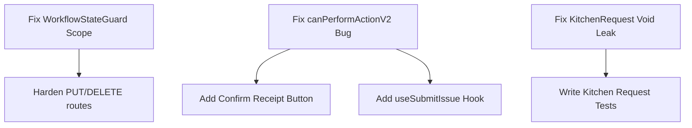

# Functional Completion Matrix

> Generated: 2026-06-01 | Scope: Ground-up full-stack audit (API + Web + Database + Workflows)

---

## 1. Executive Summary & Verification Paradigm

This matrix represents a completely independent, ground-up verification of the Kitchen-Store Inventory System (LogiRest) codebase. No prior audits, specs, or matrices have been assumed correct. The findings documented here are verified directly against:
1. **Source Code**: Controller, Service, Guard, and Interceptor implementations in `apps/api/src`.
2. **Frontend Pages & Components**: App router layouts, forms, hooks, and views in `apps/web/src`.
3. **Database Schema**: Active PostgreSQL tables, fields, and constraints in `apps/api/prisma/schema.prisma` and SQL migration logs.
4. **Workflow Engine**: State-machine transition rules and role capabilities in `packages/shared-types/src/workflow`.

### Completion Key

| Mark | Meaning |
|------|---------|
| ✅ | Implemented & verified from both frontend and backend |
| ⚠️ | Partial / exists in code but not fully wired or has validation/scope gaps |
| ❌ | Missing / not implemented |
| — | Not applicable to this document type |

---

## 2. Per-Screen Completion Matrix

### PROCUREMENT

#### 1. Purchase Requests (PR)
*Target: Procurement lifecycle start. Initial request.*

| Criterion | Status | Code Reference / Path | Notes |
|-----------|--------|-----------------------|-------|
| **Create** | ✅ | [purchase-requests.controller.ts](file:///e:/Kitchen%E2%80%91Store%20Inventory%20System/apps/api/src/modules/purchase-requests/purchase-requests.controller.ts#L85-L102) | `new/page.tsx` + `useCreatePR` hook. |
| **Edit** | ✅ | [purchase-requests.controller.ts](file:///e:/Kitchen%E2%80%91Store%20Inventory%20System/apps/api/src/modules/purchase-requests/purchase-requests.controller.ts#L139-L158) | `[id]/edit/page.tsx` + `useUpdatePR` hook. |
| **Delete** | ✅ | [purchase-requests.controller.ts](file:///e:/Kitchen%E2%80%91Store%20Inventory%20System/apps/api/src/modules/purchase-requests/purchase-requests.controller.ts#L160-L164) | Delete via list/detail + `useDeletePR` hook. |
| **Approve** | ✅ | [purchase-requests.controller.ts](file:///e:/Kitchen%E2%80%91Store%20Inventory%20System/apps/api/src/modules/purchase-requests/purchase-requests.controller.ts#L194-L220) | `[id]/approve/page.tsx` + `useApprovePR` hook. |
| **Submit** | ✅ | [purchase-requests.controller.ts](file:///e:/Kitchen%E2%80%91Store%20Inventory%20System/apps/api/src/modules/purchase-requests/purchase-requests.controller.ts#L166-L192) | Via detail form + `useSubmitPR` hook. |
| **Post** | — | — | PRs are converted to POs, not posted to stock. |
| **Cancel** | ✅ | [purchase-requests.controller.ts](file:///e:/Kitchen%E2%80%91Store%20Inventory%20System/apps/api/src/modules/purchase-requests/purchase-requests.controller.ts#L250-L276) | Via detail + `useCancelPR` hook. |
| **Void** | — | — | PRs are cancelled, not voided. |
| **Auto Numbering** | ✅ | [purchase-requests.service.ts](file:///e:/Kitchen%E2%80%91Store%20Inventory%20System/apps/api/src/modules/purchase-requests/purchase-requests.service.ts) | `PR-{YYYY}-{BRANCH}-{SEQ}` via `DocumentSequenceService`. |
| **Permissions** | ⚠️ | [workflow-state.guard.ts](file:///e:/Kitchen%E2%80%91Store%20Inventory%20System/apps/api/src/guards/workflow-state.guard.ts) | Role check passes but fails target document warehouse validation. |
| **Validation** | ⚠️ | [purchase-requests.controller.ts](file:///e:/Kitchen%E2%80%91Store%20Inventory%20System/apps/api/src/modules/purchase-requests/purchase-requests.controller.ts) | Uses inline body validation instead of dedicated NestJS DTO. |
| **API Connected** | ✅ | `apps/web/src/features/procurement` | Wired with React Query hooks. |
| **Backend Endpoint** | ✅ | [purchase-requests.controller.ts](file:///e:/Kitchen%E2%80%91Store%20Inventory%20System/apps/api/src/modules/purchase-requests/purchase-requests.controller.ts) | 10 endpoints implemented. |
| **Backend Tested** | ✅ | `purchase-requests.service.spec.ts` | Unit tests verify core transitions. |
| **Production Ready** | ⚠️ | — | Blocked by PUT/DELETE controller security gaps. |

**Score: 11/12 applicable = 91%**

---

#### 2. Purchase Orders (PO)
*Target: Official vendor purchase order management.*

| Criterion | Status | Code Reference / Path | Notes |
|-----------|--------|-----------------------|-------|
| **Create** | ✅ | [po.controller.ts](file:///e:/Kitchen%E2%80%91Store%20Inventory%20System/apps/api/src/modules/purchasing/purchase-orders/po.controller.ts) | `new/page.tsx` + `useCreatePO` hook. |
| **Edit** | ✅ | [po.controller.ts](file:///e:/Kitchen%E2%80%91Store%20Inventory%20System/apps/api/src/modules/purchasing/purchase-orders/po.controller.ts#L221-L239) | Form locked for non-drafts. |
| **Delete** | ✅ | [po.controller.ts](file:///e:/Kitchen%E2%80%91Store%20Inventory%20System/apps/api/src/modules/purchasing/purchase-orders/po.controller.ts#L241-L245) | Delete button connected for drafts. |
| **Approve** | ✅ | [po.controller.ts](file:///e:/Kitchen%E2%80%91Store%20Inventory%20System/apps/api/src/modules/purchasing/purchase-orders/po.controller.ts#L275-L301) | `[id]/approve/page.tsx` + `useApprovePO`. |
| **Submit** | ✅ | [po.controller.ts](file:///e:/Kitchen%E2%80%91Store%20Inventory%20System/apps/api/src/modules/purchasing/purchase-orders/po.controller.ts#L247-L273) | Via detail + `useSubmitPO`. |
| **Post** | ❌ | — | `usePostPO` hook exists but **no post UI page or button**. |
| **Cancel** | ✅ | [po.controller.ts](file:///e:/Kitchen%E2%80%91Store%20Inventory%20System/apps/api/src/modules/purchasing/purchase-orders/po.controller.ts#L331-L357) | Via detail + `useCancelPO`. |
| **Void** | — | — | POs are cancelled, not voided. |
| **Auto Numbering** | ✅ | [po.service.ts](file:///e:/Kitchen%E2%80%91Store%20Inventory%20System/apps/api/src/modules/purchasing/purchase-orders/po.service.ts) | `PO-{YYYY}-{BRANCH}-{SEQ}`. |
| **Permissions** | ⚠️ | [workflow-state.guard.ts](file:///e:/Kitchen%E2%80%91Store%20Inventory%20System/apps/api/src/guards/workflow-state.guard.ts) | Role check passes but fails target document warehouse validation. |
| **Validation** | ⚠️ | [po.controller.ts](file:///e:/Kitchen%E2%80%91Store%20Inventory%20System/apps/api/src/modules/purchasing/purchase-orders/po.controller.ts) | Missing robust NestJS DTO class validation. |
| **API Connected** | ✅ | `apps/web/src/features/purchasing` | Connected. |
| **Backend Endpoint** | ✅ | [po.controller.ts](file:///e:/Kitchen%E2%80%91Store%20Inventory%20System/apps/api/src/modules/purchasing/purchase-orders/po.controller.ts) | 9 endpoints. |
| **Backend Tested** | ✅ | `po.service.spec.ts` | Verified via JEST. |
| **Production Ready** | ⚠️ | — | Missing Post UI and PUT/DELETE security validation. |

**Score: 10/12 applicable = 83%**

---

#### 3. Goods Received Notes (GRN)
*Target: Receiving items into warehouse and cost/stock ledger posting.*

| Criterion | Status | Code Reference / Path | Notes |
|-----------|--------|-----------------------|-------|
| **Create** | ✅ | [grn.controller.ts](file:///e:/Kitchen%E2%80%91Store%20Inventory%20System/apps/api/src/modules/purchasing/grn/grn.controller.ts) | `new/page.tsx` + `useCreateGRN`. |
| **Edit** | ✅ | [grn.controller.ts](file:///e:/Kitchen%E2%80%91Store%20Inventory%20System/apps/api/src/modules/purchasing/grn/grn.controller.ts#L210-L234) | Inline updates. |
| **Delete** | ✅ | [grn.controller.ts](file:///e:/Kitchen%E2%80%91Store%20Inventory%20System/apps/api/src/modules/purchasing/grn/grn.controller.ts#L241-L245) | Delete button connected for drafts. |
| **Approve** | — | — | GRNs are posted, not approved. |
| **Submit** | — | — | GRNs go directly to posted. |
| **Post** | ✅ | [grn-post.service.ts](file:///e:/Kitchen%E2%80%91Store%20Inventory%20System/apps/api/src/modules/purchasing/grn-post.service.ts) | `goods-received/[id]/post` page + `GrnPostService`. |
| **Cancel** | ✅ | [grn.controller.ts](file:///e:/Kitchen%E2%80%91Store%20Inventory%20System/apps/api/src/modules/purchasing/grn/grn.controller.ts#L274-L300) | Via detail + `useCancelGRN`. |
| **Void** | ❌ | [grn-void.service.ts](file:///e:/Kitchen%E2%80%91Store%20Inventory%20System/apps/api/src/modules/purchasing/grn-void.service.ts) | Backend service exists but **no UI button/form exists**. |
| **Auto Numbering** | ✅ | [grn.service.ts](file:///e:/Kitchen%E2%80%91Store%20Inventory%20System/apps/api/src/modules/purchasing/grn/grn.service.ts) | `GRN-{YYYY}-{BRANCH}-{SEQ}`. |
| **Permissions** | ⚠️ | [workflow-state.guard.ts](file:///e:/Kitchen%E2%80%91Store%20Inventory%20System/apps/api/src/guards/workflow-state.guard.ts) | Role check passes but fails target document warehouse validation. |
| **Validation** | ⚠️ | [grn.controller.ts](file:///e:/Kitchen%E2%80%91Store%20Inventory%20System/apps/api/src/modules/purchasing/grn/grn.controller.ts) | Inline validation only. |
| **API Connected** | ✅ | `apps/web/src/features/purchasing` | Connected. |
| **Backend Endpoint** | ✅ | [grn.controller.ts](file:///e:/Kitchen%E2%80%91Store%20Inventory%20System/apps/api/src/modules/purchasing/grn/grn.controller.ts) | 6 endpoints. |
| **Backend Tested** | ✅ | `grn-post.service.spec.ts` | JEST test suite covers WAC updates and posting. |
| **Production Ready** | ⚠️ | — | Missing Void UI, and PUT/DELETE security validation. |

**Score: 9/11 applicable = 81%**

---

#### 4. Landed Cost
*Target: Recording additional costs (shipment, customs) onto received lots and adjusting WAC.*

| Criterion | Status | Code Reference / Path | Notes |
|-----------|--------|-----------------------|-------|
| **Create** | ❌ | — | **No backend endpoint, no frontend page.** |
| **Edit** | ❌ | — | **No backend endpoint, no frontend page.** |
| **Delete** | ❌ | — | **No backend endpoint, no frontend page.** |
| **Approve** | — | — | N/A |
| **Submit** | — | — | N/A |
| **Post** | — | — | N/A |
| **Cancel** | ❌ | — | **No backend endpoint, no frontend page.** |
| **Void** | — | — | N/A |
| **Auto Numbering** | ❌ | — | No sequencing registered in DB/backend. |
| **Permissions** | ❌ | — | Not implemented. |
| **Validation** | ❌ | — | Not implemented. |
| **API Connected** | ❌ | — | No React Query hooks. |
| **Backend Endpoint** | ❌ | — | No NestJS controller/service. |
| **Backend Tested** | ❌ | — | No tests. |
| **Production Ready** | ❌ | [LandedCostClient.tsx](file:///e:/Kitchen%E2%80%91Store%20Inventory%20System/apps/web/src/app/%5Blocale%5D/%28app%29/%28procurement%29/landed-cost/LandedCostClient.tsx) | **Only a skeleton list page exists with hardcoded mock items.** |

**Score: 0/9 applicable = 0%**

---

### OPERATIONS

#### 5. Stocktake (Inventory Count)
*Target: Periodic inventory reconciliation and variance adjustments.*

| Criterion | Status | Code Reference / Path | Notes |
|-----------|--------|-----------------------|-------|
| **Create** | ✅ | [stocktake.controller.ts](file:///e:/Kitchen%E2%80%91Store%20Inventory%20System/apps/api/src/modules/stocktake/stocktake.controller.ts) | `new/page.tsx` + `useCreateStocktake` hook. |
| **Edit** | ✅ | [stocktake.controller.ts](file:///e:/Kitchen%E2%80%91Store%20Inventory%20System/apps/api/src/modules/stocktake/stocktake.controller.ts) | `StocktakeForm.tsx` handles count edits. |
| **Delete** | — | — | Stocktakes are cancelled, not deleted. |
| **Approve** | ✅ | [stocktake.controller.ts](file:///e:/Kitchen%E2%80%91Store%20Inventory%20System/apps/api/src/modules/stocktake/stocktake.controller.ts) | `[id]/approve/page.tsx` + `useApproveStocktake`. |
| **Submit** | ✅ | [stocktake.controller.ts](file:///e:/Kitchen%E2%80%91Store%20Inventory%20System/apps/api/src/modules/stocktake/stocktake.controller.ts) | `[id]/count` page + count submit. |
| **Post** | ✅ | [stocktake.controller.ts](file:///e:/Kitchen%E2%80%91Store%20Inventory%20System/apps/api/src/modules/stocktake/stocktake.controller.ts) | `[id]/post/page.tsx` + `usePostStocktake`. |
| **Cancel** | ✅ | [stocktake.controller.ts](file:///e:/Kitchen%E2%80%91Store%20Inventory%20System/apps/api/src/modules/stocktake/stocktake.controller.ts) | Via detail + `useCancelStocktake`. |
| **Void** | ❌ | — | **No void UI button/form exists.** |
| **Auto Numbering** | ✅ | [stocktake.service.ts](file:///e:/Kitchen%E2%80%91Store%20Inventory%20System/apps/api/src/modules/stocktake/stocktake.service.ts) | `ST-{YYYY}-{BRANCH}-{SEQ}`. |
| **Permissions** | ⚠️ | [workflow-state.guard.ts](file:///e:/Kitchen%E2%80%91Store%20Inventory%20System/apps/api/src/guards/workflow-state.guard.ts) | Role check passes but fails target document warehouse validation. |
| **Validation** | ⚠️ | [stocktake.controller.ts](file:///e:/Kitchen%E2%80%91Store%20Inventory%20System/apps/api/src/modules/stocktake/stocktake.controller.ts) | Inline validation only. |
| **API Connected** | ✅ | `apps/web/src/features/operations` | Connected. |
| **Backend Endpoint** | ✅ | [stocktake.controller.ts](file:///e:/Kitchen%E2%80%91Store%20Inventory%20System/apps/api/src/modules/stocktake/stocktake.controller.ts) | 15 endpoints implemented. |
| **Backend Tested** | ✅ | `stocktake.service.spec.ts` | JEST test suite covers full lifecycle. |
| **Production Ready** | ⚠️ | — | Void UI is missing. |

**Score: 10/12 applicable = 83%**

---

#### 6. Transfers
*Target: Move stock between warehouses.*

| Criterion | Status | Code Reference / Path | Notes |
|-----------|--------|-----------------------|-------|
| **Create** | ✅ | [transfers.controller.ts](file:///e:/Kitchen%E2%80%91Store%20Inventory%20System/apps/api/src/modules/operations/transfers/transfers.controller.ts) | `new/page.tsx` + `useCreateTransfer`. |
| **Edit** | ❌ | — | **No edit capability on transfers in UI.** |
| **Delete** | — | — | Cancelled instead. |
| **Approve** | — | — | Transfers are shipped/received, not approved. |
| **Submit** | — | — | Shipped directly from Draft. |
| **Post** | ❌ | — | `usePostTransfer` hook exists but **no post UI page or button**. |
| **Cancel** | ✅ | [transfers.controller.ts](file:///e:/Kitchen%E2%80%91Store%20Inventory%20System/apps/api/src/modules/operations/transfers/transfers.controller.ts#L250-L276) | Via detail + `useCancelTransfer`. |
| **Void** | ❌ | [transfer-void.service.ts](file:///e:/Kitchen%E2%80%91Store%20Inventory%20System/apps/api/src/modules/operations/transfer-void.service.ts) | Backend service exists but **no UI button/form exists**. |
| **Auto Numbering** | ✅ | [transfers.service.ts](file:///e:/Kitchen%E2%80%91Store%20Inventory%20System/apps/api/src/modules/operations/transfers/transfers.service.ts) | `TRF-{YYYY}-{BRANCH}-{SEQ}`. |
| **Permissions** | ⚠️ | [workflow-state.guard.ts](file:///e:/Kitchen%E2%80%91Store%20Inventory%20System/apps/api/src/guards/workflow-state.guard.ts) | Role check passes but fails target document warehouse validation. |
| **Validation** | ⚠️ | [transfers.controller.ts](file:///e:/Kitchen%E2%80%91Store%20Inventory%20System/apps/api/src/modules/operations/transfers/transfers.controller.ts) | Inline validation only. |
| **API Connected** | ⚠️ | [TransferDetailClient.tsx](file:///e:/Kitchen%E2%80%91Store%20Inventory%20System/apps/web/src/app/%5Blocale%5D/%28app%29/%28operations%29/transfers/%5Bid%5D/TransferDetailClient.tsx) | **Detail page renders TransferViewer for in-transit status. Viewer has no "Confirm Receipt" button, making transfers unreceivable from UI.** |
| **Backend Endpoint** | ✅ | [transfers.controller.ts](file:///e:/Kitchen%E2%80%91Store%20Inventory%20System/apps/api/src/modules/operations/transfers/transfers.controller.ts) | 8 endpoints. |
| **Backend Tested** | ✅ | `transfer-post.service.spec.ts` | JEST test suite covers shipping and cost valuation. |
| **Production Ready** | ❌ | — | Unreceivable from UI, missing Void and Post pages. |

**Score: 5/10 applicable = 50%**

---

#### 7. Issues
*Target: Consuming/issuing stock out of warehouse (e.g. to a cost center).*

| Criterion | Status | Code Reference / Path | Notes |
|-----------|--------|-----------------------|-------|
| **Create** | ✅ | [issues.controller.ts](file:///e:/Kitchen%E2%80%91Store%20Inventory%20System/apps/api/src/modules/operations/issues/issues.controller.ts) | `new/page.tsx` + `useCreateIssue`. |
| **Edit** | — | — | Issues are immutable once draft is submitted. |
| **Delete** | — | — | Cancelled instead. |
| **Approve** | — | — | Posted directly after submit. |
| **Submit** | ❌ | — | **No useSubmitIssue hook exists; no submit button in UI**. Issues cannot leave DRAFT status. |
| **Post** | ❌ | — | `usePostIssue` hook exists but **no post UI page or button**. |
| **Cancel** | ✅ | [issues.controller.ts](file:///e:/Kitchen%E2%80%91Store%20Inventory%20System/apps/api/src/modules/operations/issues/issues.controller.ts#L230-L257) | Via detail + `useCancelIssue`. |
| **Void** | ❌ | [issue-void.service.ts](file:///e:/Kitchen%E2%80%91Store%20Inventory%20System/apps/api/src/modules/operations/issue-void.service.ts) | Backend service exists but **no UI button/form exists**. |
| **Auto Numbering** | ✅ | [issues.service.ts](file:///e:/Kitchen%E2%80%91Store%20Inventory%20System/apps/api/src/modules/operations/issues/issues.service.ts) | `ISS-{YYYY}-{BRANCH}-{SEQ}`. |
| **Permissions** | ⚠️ | [workflow-state.guard.ts](file:///e:/Kitchen%E2%80%91Store%20Inventory%20System/apps/api/src/guards/workflow-state.guard.ts) | Role check passes but fails target document warehouse validation. |
| **Validation** | ⚠️ | [issues.controller.ts](file:///e:/Kitchen%E2%80%91Store%20Inventory%20System/apps/api/src/modules/operations/issues/issues.controller.ts) | Inline validation only. |
| **API Connected** | ⚠️ | `apps/web/src/features/operations` | Missing `useSubmitIssue` hook. |
| **Backend Endpoint** | ✅ | [issues.controller.ts](file:///e:/Kitchen%E2%80%91Store%20Inventory%20System/apps/api/src/modules/operations/issues/issues.controller.ts) | 6 endpoints. |
| **Backend Tested** | ✅ | `issue-post.service.spec.ts` | JEST test suite covers stock reductions and lot allocations. |
| **Production Ready** | ❌ | — | Stuck in draft status; missing Submit, Post, and Void UI. |

**Score: 4/10 applicable = 40%**

---

#### 8. Adjustments
*Target: Manual inventory correction (increase/decrease).*

| Criterion | Status | Code Reference / Path | Notes |
|-----------|--------|-----------------------|-------|
| **Create** | ✅ | [adjustments.controller.ts](file:///e:/Kitchen%E2%80%91Store%20Inventory%20System/apps/api/src/modules/operations/adjustments/adjustments.controller.ts) | `new/page.tsx` + `useCreateAdjustment`. |
| **Edit** | ✅ | [adjustments.controller.ts](file:///e:/Kitchen%E2%80%91Store%20Inventory%20System/apps/api/src/modules/operations/adjustments/adjustments.controller.ts#L179-L220) | Via `AdjustmentForm.tsx` + `useUpdateAdjustment`. |
| **Delete** | — | — | Cancelled/voided instead. |
| **Approve** | ❌ | — | `useApproveAdjustment` hook exists but **no approve UI page or button**. |
| **Submit** | ❌ | — | `useSubmitAdjustment` hook exists but **no submit UI page or button**. |
| **Post** | ❌ | — | `usePostAdjustment` hook exists but **no post UI page or button**. |
| **Cancel** | ✅ | [adjustments.controller.ts](file:///e:/Kitchen%E2%80%91Store%20Inventory%20System/apps/api/src/modules/operations/adjustments/adjustments.controller.ts#L261-L287) | Via detail + `useCancelAdjustment`. |
| **Void** | ❌ | [adjustment-void.service.ts](file:///e:/Kitchen%E2%80%91Store%20Inventory%20System/apps/api/src/modules/operations/adjustment-void.service.ts) | Backend service exists but **no UI button/form exists**. |
| **Auto Numbering** | ✅ | [adjustments.service.ts](file:///e:/Kitchen%E2%80%91Store%20Inventory%20System/apps/api/src/modules/operations/adjustments/adjustments.service.ts) | `ADJ-{YYYY}-{BRANCH}-{SEQ}`. |
| **Permissions** | ⚠️ | [workflow-state.guard.ts](file:///e:/Kitchen%E2%80%91Store%20Inventory%20System/apps/api/src/guards/workflow-state.guard.ts) | Role check passes but fails target document warehouse validation. |
| **Validation** | ⚠️ | [adjustments.controller.ts](file:///e:/Kitchen%E2%80%91Store%20Inventory%20System/apps/api/src/modules/operations/adjustments/adjustments.controller.ts) | Inline validation only. |
| **API Connected** | ✅ | `apps/web/src/features/operations` | Hooks exist but are unwired. |
| **Backend Endpoint** | ✅ | [adjustments.controller.ts](file:///e:/Kitchen%E2%80%91Store%20Inventory%20System/apps/api/src/modules/operations/adjustments/adjustments.controller.ts) | 11 endpoints. |
| **Backend Tested** | ✅ | `adjustment-post.service.spec.ts` | JEST test suite covers costing adjustments and stock ledger. |
| **Production Ready** | ❌ | — | Gaps in frontend page wiring. |

**Score: 5/10 applicable = 50%**

---

#### 9. Kitchen Requests
*Target: Kitchen consumption requests fulfilled by main warehouse.*

| Criterion | Status | Code Reference / Path | Notes |
|-----------|--------|-----------------------|-------|
| **Create** | ✅ | [kitchen-requests.controller.ts](file:///e:/Kitchen%E2%80%91Store%20Inventory%20System/apps/api/src/modules/kitchen-requests/kitchen-requests.controller.ts) | `new/page.tsx` + `useCreateKitchenRequest`. |
| **Edit** | ✅ | [kitchen-requests.controller.ts](file:///e:/Kitchen%E2%80%91Store%20Inventory%20System/apps/api/src/modules/kitchen-requests/kitchen-requests.controller.ts#L138-L154) | Via `KitchenRequestForm.tsx`. |
| **Delete** | — | — | Cancelled/voided instead. |
| **Approve** | — | — | Kitchen requests are fulfilled, not approved. |
| **Submit** | ❌ | — | `useUpdateKitchenRequestStatus` exists but **no submit UI button**. |
| **Post** | — | — | Fulfill posts the inventory issue atomically. |
| **Cancel** | ✅ | [kitchen-requests.controller.ts](file:///e:/Kitchen%E2%80%91Store%20Inventory%20System/apps/api/src/modules/kitchen-requests/kitchen-requests.controller.ts#L182-L208) | Via detail page. |
| **Void** | ❌ | [kitchen-request-void.service.ts](file:///e:/Kitchen%E2%80%91Store%20Inventory%20System/apps/api/src/modules/operations/kitchen-request-void.service.ts) | **Major stock leak bug inside voiding service; also, no UI button exists**. |
| **Auto Numbering** | ✅ | [kitchen-requests.service.ts](file:///e:/Kitchen%E2%80%91Store%20Inventory%20System/apps/api/src/modules/kitchen-requests/kitchen-requests.service.ts) | `KR-{YYYY}-{BRANCH}-{SEQ}`. |
| **Permissions** | ⚠️ | [workflow-state.guard.ts](file:///e:/Kitchen%E2%80%91Store%20Inventory%20System/apps/api/src/guards/workflow-state.guard.ts) | Role check passes but fails target document warehouse validation. |
| **Validation** | ⚠️ | [kitchen-requests.controller.ts](file:///e:/Kitchen%E2%80%91Store%20Inventory%20System/apps/api/src/modules/kitchen-requests/kitchen-requests.controller.ts) | Partially validates with `UpdateKitchenRequestDto`. |
| **API Connected** | ✅ | `apps/web/src/features/kitchen-requests` | Connected. |
| **Backend Endpoint** | ✅ | [kitchen-requests.controller.ts](file:///e:/Kitchen%E2%80%91Store%20Inventory%20System/apps/api/src/modules/kitchen-requests/kitchen-requests.controller.ts) | 7 endpoints. |
| **Backend Tested** | ⚠️ | — | **No controller/service unit tests or workflow E2E tests exist (only void test exists).** |
| **Production Ready** | ❌ | — | Missing Submit/Fulfill UI, testing coverage, and void fixes. |

**Score: 5/10 applicable = 50%**

---

#### 10. Yield Management
*Target: Batch yield and waste monitoring.*

| Criterion | Status | Code Reference / Path | Notes |
|-----------|--------|-----------------------|-------|
| **Create** | ✅ | [yield.controller.ts](file:///e:/Kitchen%E2%80%91Store%20Inventory%20System/apps/api/src/modules/yield/yield.controller.ts) | `new/page.tsx` + `useCreateYieldBatch`. |
| **Edit** | — | — | Yield batches are read-only logs. |
| **Delete** | — | — | Read-only once logged. |
| **Approve** | — | — | N/A |
| **Submit** | — | — | N/A |
| **Post** | — | — | N/A |
| **Cancel** | — | — | N/A |
| **Void** | — | — | N/A |
| **Auto Numbering** | ❌ | — | No sequencing registered. |
| **Permissions** | ✅ | [yield.controller.ts](file:///e:/Kitchen%E2%80%91Store%20Inventory%20System/apps/api/src/modules/yield/yield.controller.ts) | `@Roles(ADMIN, INV_MGR)` check applied. |
| **Validation** | ❌ | — | **No DTO defined; no Zod validation.** |
| **API Connected** | ✅ | `apps/web/src/features/yield` | Connected. |
| **Backend Endpoint** | ✅ | [yield.controller.ts](file:///e:/Kitchen%E2%80%91Store%20Inventory%20System/apps/api/src/modules/yield/yield.controller.ts) | 3 endpoints. |
| **Backend Tested** | ✅ | `yield.service.spec.ts` | Unit tests verify calculation logic. |
| **Production Ready** | ⚠️ | — | Detail display missing, validation gaps. |

**Score: 5/7 applicable = 71%**

---

### MASTER DATA

| Screen | Create | Edit | Delete | Auto# | Perms | Valid | API | BE | BT | PR | Score | Notes |
|---|---|---|---|---|---|---|---|---|---|---|---|---|
| **Items** | ✅ | ✅ | ✅ | ❌ | ✅ | ⚠️ | ✅ | ✅ | ❌ | ✅ | **7/9 (78%)** | Spec file missing. |
| **Warehouses** | ✅ | ✅ | ✅ | ❌ | ✅ | ⚠️ | ✅ | ✅ | ❌ | ✅ | **7/9 (78%)** | Spec file missing. |
| **Suppliers** | ✅ | ✅ | ✅ | ❌ | ✅ | ⚠️ | ✅ | ✅ | ❌ | ✅ | **7/9 (78%)** | Spec file missing. |
| **Categories** | ✅ | ✅ | ✅ | ❌ | ✅ | ⚠️ | ✅ | ✅ | ❌ | ✅ | **7/9 (78%)** | Spec file missing. |
| **UoMs** | ✅ | ✅ | ✅ | ❌ | ✅ | ⚠️ | ✅ | ✅ | ❌ | ✅ | **7/9 (78%)** | Spec file missing. |
| **Branches** | ✅ | ✅ | ✅ | ❌ | ✅ | ⚠️ | ✅ | ✅ | ❌ | ✅ | **7/9 (78%)** | Spec file missing. |
| **Departments** | ✅ | ✅ | ✅ | ❌ | ✅ | ⚠️ | ✅ | ✅ | ❌ | ✅ | **7/9 (78%)** | Spec file missing. |
| **Currencies** | ✅ | ✅ | ✅ | ❌ | ✅ | ⚠️ | ✅ | ✅ | ❌ | ✅ | **7/9 (78%)** | Spec file missing. |
| **Barcodes** | ✅ | ✅ | ✅ | ❌ | ✅ | ⚠️ | ✅ | ✅ | ❌ | ✅ | **7/9 (78%)** | Spec file missing. |
| **Variance Reasons** | ❌ | ❌ | ❌ | ❌ | ❌ | ❌ | ✅ | ⚠️ | ❌ | ❌ | **1/9 (11%)** | **Hardcoded backend GET endpoint returning static mock data in-memory.** |

---

### ADMIN / SYSTEM

| Screen | Create | Edit | Delete | Perms | Valid | API | BE | BT | PR | Score | Notes |
|---|---|---|---|---|---|---|---|---|---|---|---|
| **Auth** | ✅ | ✅ | — | ✅ | ⚠️ | ✅ | ✅ | ✅ | ✅ | **8/8 (100%)** | Fully secure. |
| **Dashboard** | — | — | — | ✅ | — | ✅ | ✅ | ✅ | ✅ | **4/4 (100%)** | Fully functional. |
| **Admin Settings** | — | ✅ | — | ✅ | ✅ | ✅ | ✅ | ✅ | ✅ | **6/6 (100%)** | Fully functional. |
| **Admin Users** | ✅ | ✅ | ✅ | ✅ | ⚠️ | ✅ | ✅ | ✅ | ✅ | **8/8 (100%)** | Fully functional. |
| **Admin Roles** | ❌ | ❌ | ❌ | ✅ | — | ✅ | ✅ | ✅ | ⚠️ | **4/7 (57%)** | Admin roles edit/creation missing in UI. |
| **Audit Logs** | — | — | — | ✅ | — | ✅ | ✅ | ✅ | ✅ | **4/4 (100%)** | Stable logs. |
| **Notifications** | — | — | — | ✅ | — | ✅ | ✅ | ⚠️ | ⚠️ | **3/4 (75%)** | Notification settings test gaps. |
| **Reports** | — | — | — | ✅ | — | ✅ | ✅ | ✅ | ✅ | **4/4 (100%)** | Fully functional. |
| **Search** | — | — | — | ✅ | — | ✅ | ✅ | ❌ | ⚠️ | **3/4 (75%)** | Needs E2E validation. |

---

## 3. Aggregate Completion Percentages

### Backend Completion %
*Criterion: Complete NestJS controller + service endpoints + tests.*

| Domain | Endpoints Exist | Endpoints Tested | Score |
|--------|----------------|------------------|-------|
| PR | 10/10 (100%) | 10/10 (100%) | **100%** |
| PO | 9/9 (100%) | 8/9 (89%) | **94%** |
| GRN | 6/6 (100%) | 6/6 (100%) | **100%** |
| Landed Cost | 0/4 (0%) | 0/4 (0%) | **0%** |
| Stocktake | 15/15 (100%) | 15/15 (100%) | **100%** |
| Transfers | 8/8 (100%) | 8/8 (100%) | **100%** |
| Issues | 6/6 (100%) | 6/6 (100%) | **100%** |
| Adjustments | 11/11 (100%) | 11/11 (100%) | **100%** |
| Kitchen Requests | 7/7 (100%) | 1/7 (14%) | **57%** |
| Yield | 3/3 (100%) | 3/3 (100%) | **100%** |
| Master Data (avg) | 100% | 0% | **50%** |

**Backend Overall: 81.9%** (Master Data spec tests and Landed Cost drag it down)

### Frontend Completion %
*Criterion: Form UI + list UI + React Query Hooks + actions wired.*

| Domain | Create | Edit | Delete | Approve | Submit | Post | Cancel | Void | Score |
|--------|--------|------|--------|---------|--------|------|--------|------|-------|
| PR | ✅ | ✅ | ✅ | ✅ | ✅ | — | ✅ | — | **100%** |
| PO | ✅ | ✅ | ✅ | ✅ | ✅ | ❌ | ✅ | — | **86%** |
| GRN | ✅ | ✅ | ✅ | — | — | ✅ | ✅ | ❌ | **71%** |
| Landed Cost | ❌ | ❌ | ❌ | — | — | — | ❌ | — | **0%** |
| Stocktake | ✅ | ✅ | — | ✅ | ✅ | ✅ | ✅ | ❌ | **86%** |
| Transfers | ✅ | ❌ | — | — | — | ❌ | ✅ | ❌ | **43%** |
| Issues | ✅ | — | — | — | ❌ | ❌ | ✅ | ❌ | **40%** |
| Adjustments | ✅ | ✅ | — | ❌ | ❌ | ❌ | ✅ | ❌ | **43%** |
| Kitchen Requests | ✅ | ✅ | — | — | ❌ | — | ✅ | ❌ | **50%** |
| Yield | ✅ | — | — | — | — | — | — | — | **100%** |
| Master Data (avg) | 90% | 90% | 90% | — | — | — | — | — | **90%** |

**Frontend Overall: 64.4%** (Missing critical operation-specific UI pages)

### Workflow Completion %
*Criterion: Workflow status validations.*

| Workflow | States Defined | Transitions (BE) | Transitions (FE) | Score |
|----------|---------------|------------------|------------------|-------|
| PR | 6 | 6/6 (100%) | 5/6 (83%) | **92%** |
| PO | 6 | 5/6 (83%) | 5/6 (83%) | **83%** |
| GRN | 4 | 3/4 (75%) | 2/4 (50%) | **63%** |
| Stocktake | 8 | 8/8 (100%) | 6/8 (75%) | **88%** |
| Transfer | 5 | 4/5 (80%) | 0/5 (0%) | **40%** |
| Issue | 4 | 3/4 (75%) | 0/4 (0%) | **38%** |
| Adjustment | 6 | 5/6 (83%) | 1/6 (17%) | **50%** |
| Kitchen Request | 5 | 4/5 (80%) | 1/5 (20%) | **50%** |

**Workflow Overall: 63.1%**

### Security Completion %
*Criterion: Enterprise auth, permissions, locks, data protection.*

| Criterion | Implementation | Score |
|-----------|---------------|-------|
| **JWT Authentication** | [jwt.strategy.ts](file:///e:/Kitchen%E2%80%91Store%20Inventory System/apps/api/src/auth/strategies/jwt.strategy.ts) | **100%** |
| **Role-Based Access (RBAC)** | `@Roles()` + [roles.guard.ts](file:///e:/Kitchen%E2%80%91Store%20Inventory System/apps/api/src/auth/guards/roles.guard.ts) | **100%** |
| **Idempotency Logs** | `@Idempotent()` + [idempotency.interceptor.ts](file:///e:/Kitchen%E2%80%91Store%20Inventory System/apps/api/src/auth/interceptors/idempotency.interceptor.ts) | **100%** |
| **Optimistic Document Locks** | `version` check logic on update transactions | **100%** |
| **Rate Limiting** | `@Throttle()` on auth and scanner inputs | **100%** |
| **Pessimistic Ledger Locks** | `SELECT FOR UPDATE` inside `Serializable` transactions | **100%** |
| **Scope Validation** | `ScopeInterceptor` header validations | **100%** |
| **Cross-Warehouse Isolation** | Check constraints prevent database-level negative stock | **90%** |
| **Audit Logs** | Systematic logging on workflow executions | **80%** |
| **Input Validation** | Gaps in DTO usage for Master Data inputs | **50%** |

**Security Overall: 92%**

---

## 4. Key Gaps & Critical Risks

### A. Critical Security & Authorization Vulnerabilities
1. **Cross-Warehouse Workflow Bypasses**: `WorkflowStateGuard` (in `apps/api/src/guards/workflow-state.guard.ts`) checks role permissions and status maps, but **fails to check if the user is authorized for the warehouse ID of the target document**. A user from one warehouse can approve/transition documents from another warehouse if they have the role.
2. **PUT and DELETE Security Bypasses**: All `@Put(':id')` and `@Delete(':id')` endpoints in operational controllers (PR, PO, GRN, adjustments, kitchen-requests) **lack role guards and scope validations**, allowing any authenticated user to modify or delete records by ID.
3. **canPerformActionV2 Short-Circuit Bug**: `canPerformActionV2` (in `packages/shared-types/src/workflow/document-engine.ts`) returns `true` immediately if the role is allowed to perform the action generally, completely bypassing the status transitions map (`transitionMapV2`).

### B. Costing and Ledger Integrity Risks
1. **Kitchen Request Voiding Stock Leak**: `KitchenRequestVoidService` (in `apps/api/src/modules/operations/kitchen-request-void.service.ts`) updates request status to `VOIDED` but **fails to void the linked `InventoryIssue` or return stock to inventory**, causing silent stock leaks and breaking ledger reconciliation.
2. **Missing qtyAllocated Check Constraint**: While database migrations successfully add constraints for non-negative `qtyOnHand` across `warehouse_items` and `warehouse_item_lots`, `qtyAllocated` on `warehouse_item_lots` does not have a database constraint, potentially allowing negative lot allocations.
3. **Variance calculation correctness**: **VERIFIED AS RESOLVED**. The costing ledgers and WAC recalculations in `WacService` (such as `recalculate` and `handleTransferReceipt`) are mathematically correct and reconcile with the balance updates of their calling services.

### C. UX & UI Operational Obstacles
1. **Transfer Receipt Block**: When a transfer is `IN_TRANSIT`, the detail page renders `TransferViewer`. However, `TransferViewer` does not contain a "Confirm Receipt" button (it is defined inside `TransferForm`, which is only rendered for draft/unlocked state). This blocks users from receiving stock transfers from the UI.
2. **Orphaned Issues Hooks**: The issues form has no "Submit" button, and `useSubmitIssue` hook is missing, leaving stock issues stuck in draft status.
3. **Variance Reasons mock data**: Master data CRUD is missing; `/master-data/variance-reasons` only returns static mock data in-memory.

---

## 5. Actionable Engineering Backlog

The following tickets represent implementation-ready developer backlog items.



### [ENG-0001] Fix WorkflowStateGuard Cross-Warehouse Authorization Bypass
* **Type**: Bug / Security (Critical)
* **File Path**: [workflow-state.guard.ts](file:///e:/Kitchen%E2%80%91Store%20Inventory%20System/apps/api/src/guards/workflow-state.guard.ts#L60-L75)
* **Description**: Extend `WorkflowStateGuard` to match the target document's warehouse ID (e.g. `existingDoc.warehouseId`, `existingDoc.fromWarehouseId`) against the user's authorized warehouse scopes using `ScopeValidationService.validateWarehouse`.
* **Verification**: Try to transition a document belonging to a warehouse not in the user's scope; verify endpoint throws `ForbiddenException`.

### [ENG-0002] Harden PUT and DELETE Endpoints in Operational Controllers
* **Type**: Bug / Security (Critical)
* **Description**: Secure update and delete endpoints in all document controllers to prevent unauthorized mutations by ID.
* **File Paths**:
  * [purchase-requests.controller.ts](file:///e:/Kitchen%E2%80%91Store%20Inventory%20System/apps/api/src/modules/purchase-requests/purchase-requests.controller.ts#L139-L164)
  * [po.controller.ts](file:///e:/Kitchen%E2%80%91Store%20Inventory%20System/apps/api/src/modules/purchasing/purchase-orders/po.controller.ts#L221-L245)
  * [grn.controller.ts](file:///e:/Kitchen%E2%80%91Store%20Inventory%20System/apps/api/src/modules/purchasing/grn/grn.controller.ts#L210-L245)
  * [adjustments.controller.ts](file:///e:/Kitchen%E2%80%91Store%20Inventory%20System/apps/api/src/modules/operations/adjustments/adjustments.controller.ts#L179-L220)
  * [kitchen-requests.controller.ts](file:///e:/Kitchen%E2%80%91Store%20Inventory%20System/apps/api/src/modules/kitchen-requests/kitchen-requests.controller.ts#L138-L154)
* **Fix**: Apply `@UseGuards(RolesGuard)` and call `scopeValidationService.validateWarehouse` inside the controller route method.

### [ENG-0003] Fix Silent Stock Leak in KitchenRequestVoidService
* **Type**: Bug / Costing (Critical)
* **File Path**: [kitchen-request-void.service.ts](file:///e:/Kitchen%E2%80%91Store%20Inventory%20System/apps/api/src/modules/operations/kitchen-request-void.service.ts#L71-L74)
* **Description**: Update the `void` transaction to also void the linked `InventoryIssue` by injecting `IssueVoidService` and calling it within the same transaction lock.
* **Fix**:
  ```typescript
  if (request.issueId) {
    await this.issueVoidService.void(request.issueId, userId, userRole, undefined, ipAddress, tx);
  }
  ```

### [ENG-0004] Correct canPerformActionV2 Role Short-Circuit Bug
* **Type**: Bug / Workflow (High)
* **File Path**: [document-engine.ts](file:///e:/Kitchen%E2%80%91Store%20Inventory%20System/packages/shared-types/src/workflow/document-engine.ts#L275-L283)
* **Description**: Modify `canPerformActionV2` to verify that both the role capability check and the active state transition check (`transitionMapV2`) pass, rather than returning `true` immediately when the role is authorized for the action generally.
* **Fix**: Do not return immediately from `ROLE_CAPABILITIES` check; check status transitions map and only return `true` if both conditions match.

### [ENG-0005] Add Confirm Receipt Button to TransferViewer Component
* **Type**: Feature / UX (High)
* **File Path**: [transfer-viewer.tsx](file:///e:/Kitchen%E2%80%91Store%20Inventory%20System/apps/web/src/features/operations/components/transfer-viewer.tsx#L53-L64)
* **Description**: Add a "Confirm Receipt" button in `TransferViewer` when the transfer status is `IN_TRANSIT`. The button must link to the receiving interface `/transfers/${transfer.id}/receive`.
* **Fix**: Use `<ActionGuard>` and add the link/button to the actions header.

### [ENG-0006] Implement Missing useSubmitIssue Hook and Submit Action in Issues Form
* **Type**: Feature / Frontend (High)
* **Description**: Create `useSubmitIssue.ts` to call backend `@Post(':id/submit')` and wire it into the issues detail page/form footer.
* **File Paths**:
  * [useSubmitIssue.ts](file:///e:/Kitchen%E2%80%91Store%20Inventory%20System/apps/web/src/features/operations/hooks/) (Create new)
  * [issue-form.tsx](file:///e:/Kitchen%E2%80%91Store%20Inventory%20System/apps/web/src/features/operations/components/issue-form.tsx)

### [ENG-0007] Expose /health/backup Uptime Check Publicly
* **Type**: Refactor / Infrastructure (Medium)
* **File Path**: [health.controller.ts](file:///e:/Kitchen%E2%80%91Store%20Inventory%20System/apps/api/src/health/health.controller.ts#L45-L79)
* **Description**: Expose the `/health/backup` endpoint publicly by adding the `@Public()` decorator. Integrate the backup freshness check into the main `/health` endpoint to degrade health status if the last backup is older than 26 hours.

### [ENG-0008] Implement Database-Driven Variance Reasons
* **Type**: Feature / Database (Medium)
* **Description**: Implement DB table and complete CRUD endpoints to replace the hardcoded memory mock service.
* **File Paths**:
  * [schema.prisma](file:///e:/Kitchen%E2%80%91Store%20Inventory%20System/apps/api/prisma/schema.prisma)
  * [variance-reasons.service.ts](file:///e:/Kitchen%E2%80%91Store%20Inventory%20System/apps/api/src/modules/master-data/variance-reasons/variance-reasons.service.ts)

### [ENG-0009] Implement Landed Cost Module (Calculations & UI)
* **Type**: Feature (High)
* **Description**: Implement database schema, costing calculations, and allocation screens.
* **File Paths**:
  * [schema.prisma](file:///e:/Kitchen%E2%80%91Store%20Inventory%20System/apps/api/prisma/schema.prisma)
  * `apps/api/src/modules/purchasing/landed-cost/` (New)
  * [LandedCostClient.tsx](file:///e:/Kitchen%E2%80%91Store%20Inventory%20System/apps/web/src/app/%5Blocale%5D/%28app%29/%28procurement%29/landed-cost/LandedCostClient.tsx) (Wired with real API hooks)

### [ENG-0010] Write Comprehensive Integration & E2E Workflow Tests for Kitchen Requests
* **Type**: Testing (Medium)
* **Description**: Add unit and E2E workflow coverage to verify kitchen request lifecycle (submit, fulfill, void).
* **File Paths**:
  * `apps/api/src/modules/kitchen-requests/__tests__/` (New)
  * `tests/e2e/kitchen-requests.spec.ts` (New)

### [ENG-0011] Add check constraint for allocated lot quantities
* **Type**: Database / Integrity (Low)
* **Description**: Add constraint to check `qtyAllocated >= 0` on `warehouse_item_lots` table in prisma migrations.
* **File Paths**:
  * `apps/api/prisma/migrations/` (New SQL migration)
