# Backend Master Planning & Execution Roadmap — PROJECT_MAP.md
## LogiRest Kitchen-Store Inventory System — NestJS Backend

> **Document Status:** PLANNING COMPLETE — Awaiting Execution Approval
> **Last Updated:** 2026-05-21
> **Source of Truth:** `apps/web/src/core/workflow/document-engine.ts` + `apps/web/src/contracts/role-capabilities.ts`

---

## [SYSTEM_OVERVIEW]

### 1. SYSTEM UNDERSTANDING

The LogiRest Kitchen-Store Inventory System is a **mission-critical, multi-branch restaurant supply-chain platform**. Its backend must function as a **Zero-Trust Modular Monolith** that:

- Enforces the *exact* workflow state machine defined in the frontend `document-engine.ts` — the backend is the authoritative copy.
- Operates as the single authority for RBAC, inventory mutations, workflow transitions, and audit trails.
- Protects an **immutable stock ledger** from corruption through pessimistic row-level locking, FEFO allocation, and transactional posting.
- Prevents all inventory inconsistencies, negative stock, race conditions, duplicate postings, and scope escalation.

#### Core Operational Constraints
| Constraint | Enforcement Location | Failure Mode |
|---|---|---|
| Immutable ledger | `StockLedger` (append-only, no UPDATE/DELETE routes) | Ledger corruption |
| FEFO allocation | `AllocationService` inside `$transaction` | Wrong lot deduction order |
| No negative stock | Row-lock + balance check before write | Stock goes negative |
| Idempotent posting | `IdempotencyLog` + state machine check | Duplicate ledger entries |
| Warehouse lock during stocktake | `WarehouseLock` table + guard | Movements during count |
| Optimistic concurrency | `version` field in every mutating entity | Stale writes silently win |
| Scope isolation (IDOR) | `ScopeInterceptor` + DB-side filter on every query | Cross-warehouse data leaks |
| State-machine parity | `WorkflowStateGuard` reading live DB status | Bypassed approvals |

#### Technology Stack
- **Frontend:** `apps/web` — Next.js 15 App Router
- **Backend:** `apps/api` — NestJS (TypeScript), to be built
- **Shared Types:** `packages/shared-types` — Zod schemas + workflow contracts
- **Database:** InsForge.dev (PostgreSQL), ORM: Prisma
- **Auth:** JWT (HttpOnly cookie `logirest_token`)

---

## [FRONTEND_ANALYSIS]

### 2. FRONTEND ANALYSIS

The backend must serve every screen, form, filter, and workflow action present in `apps/web`. Below is the exhaustive extraction.

#### 2.1 Pages & Routes (Extracted)
| Route Group | Pages | Key Operations |
|---|---|---|
| `/auth` | Login | JWT issuance, role resolution |
| `/dashboard` | Overview | Aggregate KPI summaries |
| `/master-data/items` | List + Detail | CRUD, barcode lookup, lot tracking flag protection |
| `/master-data/warehouses` | List + Detail | CRUD, has_stock check before delete |
| `/master-data/branches` | List + Detail | CRUD |
| `/master-data/departments` | List + Detail | CRUD, branch filter |
| `/master-data/suppliers` | List + Detail | CRUD |
| `/master-data/units-of-measure` | List + Detail | CRUD, version conflict simulation |
| `/master-data/categories` | List + Detail | CRUD |
| `/master-data/currencies` | List + Detail | CRUD |
| `/master-data/barcodes` | List + Detail | CRUD, duplicate barcode check |
| `/master-data/fx-rates` | List + Capture | FX rate capture per currency |
| `/procurement/purchase-requests` | List + Detail + Approve | PR lifecycle |
| `/procurement/purchase-orders` | List + Detail + Approve | PO lifecycle |
| `/procurement/goods-received` | List + Detail + Scan + Post | GRN lifecycle |
| `/operations/issues` | List + Detail + Scan + Post | Issue lifecycle |
| `/operations/transfers` | List + Detail + Ship + Receive | Transfer lifecycle |
| `/operations/adjustments` | List + Detail | Adjustment lifecycle |
| `/operations/stocktake` | List + Detail + Start + Count + Approve + Post + Archive | Stocktake lifecycle |
| `/operations/kitchen-requests` | List + Detail | Kitchen Request lifecycle |
| `/inventory` | Balance view, Lot ledger, Movements | Read-only reports |
| `/reports` | Multiple sub-reports | Aggregated data |
| `/admin/users` | User CRUD | Admin only |
| `/admin/audit-logs` | Read-only audit trail | Admin + GM + Auditor |

#### 2.2 Workflow Actions Extracted from `document-engine.ts`

The frontend's `transitionMapV2` defines the **exact** state machine. The backend must replicate it identically.

**PR (Purchase Request):**
```
DRAFT      → [SUBMIT→SUBMITTED, EDIT→DRAFT, CANCEL→CANCELLED]  roles: ADMIN, PROC_OFFICER, INV_MGR
SUBMITTED  → [APPROVE→APPROVED, REJECT→REJECTED]               roles: ADMIN, APPROVER, INV_MGR
APPROVED   → [CONVERT_TO_PO→APPROVED]                          roles: ADMIN, PROC_OFFICER
REJECTED   → [EDIT→DRAFT]                                      roles: ADMIN, PROC_OFFICER, INV_MGR
```

**PO (Purchase Order):**
```
DRAFT      → [SUBMIT→SUBMITTED, EDIT→DRAFT, CANCEL→CANCELLED]  roles: ADMIN, PROC_OFFICER, INV_MGR
SUBMITTED  → [APPROVE→APPROVED, REJECT→REJECTED]               roles: ADMIN, APPROVER, INV_MGR
APPROVED   → [FULFILL→FULFILLED]                                roles: ADMIN, INV_MGR, WH_KEEPER
PARTIAL    → [FULFILL→FULFILLED]                                roles: ADMIN, INV_MGR, WH_KEEPER
REJECTED   → [EDIT→DRAFT]                                      roles: ADMIN, PROC_OFFICER, INV_MGR
```

**GRN (Goods Received Note):**
```
DRAFT      → [EDIT→DRAFT, CANCEL→CANCELLED]                    roles: ADMIN, WH_KEEPER, INV_MGR, STORE_MGR
RECEIVED   → [POST→POSTED]                                     roles: ADMIN, INV_MGR, PROC_OFFICER
```

**ISSUE (Stock Issue):**
```
DRAFT      → [SUBMIT→SUBMITTED, CANCEL→CANCELLED]              roles: ADMIN, INV_MGR, WH_KEEPER, STORE_MGR
SUBMITTED  → [POST→POSTED, CANCEL→CANCELLED]                   roles: ADMIN, INV_MGR
```

**TRANSFER:**
```
DRAFT      → [SHIP→IN_TRANSIT, CANCEL→CANCELLED]               roles: ADMIN, INV_MGR, WH_KEEPER, STORE_MGR
IN_TRANSIT → [RECEIVE→RECEIVED]                                 roles: ADMIN, WH_KEEPER, INV_MGR
```

**ADJUSTMENT:**
```
DRAFT      → [SUBMIT→SUBMITTED, CANCEL→CANCELLED]              roles: ADMIN, INV_MGR, WH_KEEPER, STORE_MGR
SUBMITTED  → [APPROVE→APPROVED, REJECT→REJECTED, CANCEL→CANCELLED] roles: ADMIN, APPROVER, INV_MGR, STORE_MGR
APPROVED   → [POST→POSTED]                                     roles: ADMIN, INV_MGR
REJECTED   → [EDIT→DRAFT]                                      roles: ADMIN, INV_MGR, WH_KEEPER
```

**STOCKTAKE:**
```
DRAFT      → [START→STARTED, CANCEL→CANCELLED]                 roles: ADMIN, INV_MGR, WH_KEEPER, STORE_MGR
STARTED    → [COUNT→COUNTING, CANCEL→CANCELLED]                roles: ADMIN, INV_MGR, WH_KEEPER
COUNTING   → [COUNT→COUNTING, SUBMIT→REVIEW]                   roles: ADMIN, INV_MGR, WH_KEEPER
REVIEW     → [REVIEW_VARIANCE→REVIEW, APPROVE→APPROVED, REJECT→REVIEW, CANCEL→CANCELLED]  roles: ADMIN, APPROVER, INV_MGR
APPROVED   → [POST→POSTED]                                     roles: ADMIN, INV_MGR
POSTED     → [CLOSE→CLOSED]                                    roles: ADMIN, INV_MGR
```

**KITCHEN_REQUEST:**
```
DRAFT      → [SUBMIT→SUBMITTED, CANCEL→CANCELLED]              roles: ADMIN, INV_MGR, WH_KEEPER, KITCHEN_CHIEF
SUBMITTED  → [FULFILL→FULFILLED, CANCEL→CANCELLED]             roles: ADMIN, INV_MGR, WH_KEEPER, KITCHEN_CHIEF
```

#### 2.3 Role Matrix (Extracted from `role-capabilities.ts`)

| Role | Key Capabilities |
|---|---|
| `ADMIN` | All actions on all document types |
| `APPROVER` | view + approve/reject on PR, PO, ADJUSTMENT, STOCKTAKE |
| `INV_MGR` | Full operational access; approve adjustments/stocktakes; no admin |
| `WH_KEEPER` | GRN create/edit; Issue create/submit; Transfer ship/receive; Stocktake count/start |
| `STORE_MGR` | Similar to WH_KEEPER; can approve adjustments |
| `KITCHEN_CHIEF` | Create issues, create kitchen requests, view inventory |
| `PROC_OFFICER` | PR + PO create/submit/approve; view GRN |
| `AUDITOR` | view-only on all documents + export |
| `GM` | view + export on all documents + audit logs |
| `VIEWER` | view + export on all documents |

#### 2.4 Lock Semantics (Extracted)
- **Locked statuses per document**: Confirmed from `workflowMap` in `document-engine.ts` — documents in locked statuses cannot be edited.
- **Warehouse operational lock**: Triggered by STOCKTAKE START → creates `WarehouseLock` record → blocks all `POST`, `SHIP`, `RECEIVE`, `ADJUST` operations in that warehouse.

#### 2.5 Frontend Zod Schemas (Source of Truth for DTOs)
Located in `apps/web/src/types/documents.ts`:
- `BaseDocumentSchema` — common fields (`id`, `document_number`, `version`, `warehouse_id`, `branch_id`, `status`, `posted_at`, `posted_by`)
- `GRNSchema`, `GRNLineItemSchema` — GRN + line with `unit_cost_foreign`, `unit_cost_base`, `fx_rate`
- `PurchaseRequestSchema`, `PRLineItemSchema` — PR + line with `approved_qty`
- `PurchaseOrderSchema`, `POLineItemSchema` — PO + line with `unit_price`, `total_price`
- `StockIssueSchema`, `IssueLineItemSchema` — Issue + line with `lot_allocations[]`
- `TransferSchema`, `TransferLineItemSchema` — Transfer with `shipped_qty`, `received_qty`, `lot_allocations[]`
- `AdjustmentSchema`, `AdjustmentLineItemSchema` — Adjustment with `direction: INCREASE|DECREASE`, `qty_before`, `qty_adjusted`, `reason_notes`

---

## [MOCK_DATA_AUDIT]

### 3. MOCK DATA AUDIT

#### 3.1 Mock Infrastructure Identified

| File | Mock Entity | Backend Replacement Required |
|---|---|---|
| `apps/web/src/infrastructure/mock/mock-api.adapter.ts` | All API routes, auth, master data, operational documents | Real NestJS REST API |
| `apps/web/src/infrastructure/mock/mock-database.ts` | In-memory JSON store for all entities | PostgreSQL via Prisma |
| `apps/web/src/infrastructure/mock/mock-factory.ts` | Document factory, pagination wrapper | Removed — backend generates |
| `apps/web/src/providers/AuthProvider.tsx` | Hardcoded mock users (`admin@kitchen.io`, `store@kitchen.io`) | JWT from NestJS `/auth/login` |
| `MOCK_USERS` array in `mock-api.adapter.ts` | 2 hardcoded users with static scopes | `User` + `UserWarehouseScope` DB tables |

#### 3.2 Mock Business Entities

| Mock Entity | Real Backend Entity | Priority |
|---|---|---|
| In-memory `branches` | `Branch` Prisma model + `GET /branches` | P1 |
| In-memory `warehouses` | `Warehouse` Prisma model + warehouse scope validation | P1 |
| In-memory `departments` | `Department` Prisma model | P1 |
| In-memory `items` | `Item` Prisma model with `isBatched`, `hasExpiry` | P1 |
| In-memory `suppliers` | `Supplier` Prisma model | P1 |
| In-memory `uoms` | `UnitOfMeasure` Prisma model | P1 |
| In-memory `categories` | `Category` Prisma model | P1 |
| In-memory `currencies` | `Currency` Prisma model | P1 |
| In-memory `barcodes` | `BarcodeMapping` Prisma model | P2 |
| In-memory `lots` | `Lot` + `WarehouseItemLot` Prisma models | P1 |
| In-memory `movements` | `StockLedger` (append-only) | P1 |
| In-memory `purchase_requests` | `PurchaseRequest` + `PRLine` Prisma models | P1 |
| In-memory `purchase_orders` | `PurchaseOrder` + `POLine` Prisma models | P1 |
| In-memory `grns` | `GoodsReceivedNote` + `GRNLine` Prisma models | P1 |
| In-memory `issues` | `InventoryIssue` + `IssueLine` + `LotAllocation` | P1 |
| In-memory `transfers` | `Transfer` + `TransferLine` + `LotAllocation` | P1 |
| In-memory `adjustments` | `Adjustment` + `AdjustmentLine` | P1 |
| In-memory `stocktakes` | `StocktakeSession` + `StocktakeCount` + `StocktakeSnapshot` | P1 |
| In-memory `kitchen_requests` | `KitchenRequest` + `KitchenRequestItem` | P1 |
| Hardcoded `fx_rates` | `FXRate` Prisma model | P2 |
| Mock `createMockToken()` | NestJS `AuthService.login()` + `JwtService.sign()` | P1 |
| Version conflict simulation on `uom-kg` | Real Prisma optimistic locking with `version` field | P1 |

#### 3.3 Frontend Replacement Strategy
1. Remove all references to `getMockResponse()` from the API client adapter.
2. Replace mock adapter routing in `apiClient.ts` with standard `fetch`/`axios` calls to `http://localhost:4000/api/v1`.
3. Replace `AuthProvider` mock user resolution with JWT decode from `GET /auth/me`.
4. All React Query hooks (`useAdjustmentList`, `useTransferList`, etc.) auto-transition — they only change the base URL.

---

## [DOMAINS]

### 4. DOMAIN BREAKDOWN

| Domain | Module Path | Responsibilities |
|---|---|---|
| **Auth** | `auth` | JWT login, refresh, logout, `/auth/me`, token cookie lifecycle |
| **RBAC** | `auth/guards` | `JwtAuthGuard`, `RolesGuard`, `ROLE_CAPABILITIES` enforcement |
| **Scope** | `scope` | `ScopeInterceptor` reading `x-warehouse-id`/`x-branch-id`, IDOR prevention |
| **Branches** | `branches` | CRUD for `Branch` master data |
| **Warehouses** | `warehouses` | CRUD + has_stock check + `UserWarehouseScope` resolution |
| **Departments** | `departments` | CRUD, branch-scoped filtering |
| **Items** | `items` | CRUD, barcode uniqueness, `isBatched`/`hasExpiry` protection, transaction history check |
| **Suppliers** | `suppliers` | CRUD |
| **UoM** | `uoms` | CRUD with optimistic locking |
| **Categories** | `categories` | CRUD |
| **Currencies** | `currencies` | CRUD |
| **Barcodes** | `barcodes` | Barcode mapping, duplicate detection |
| **FX Rates** | `fx-rates` | FX rate capture per currency per date |
| **Lots** | `lots` | `Lot` + `WarehouseItemLot` read; written only via ledger engine |
| **Purchasing** | `purchasing` | PR + PO + GRN document lifecycle + workflow enforcement |
| **Operations** | `operations` | Issues + Transfers + Adjustments document lifecycle |
| **Kitchen Requests** | `kitchen-requests` | Kitchen request lifecycle + fulfillment |
| **Stocktake** | `stocktake` | Session lifecycle + warehouse lock + count recording + variance posting |
| **Workflow** | `workflow` | `WorkflowService` + `WorkflowStateGuard` — state machine parity engine |
| **Ledger** | `ledger` | `AllocationService` (FEFO/FIFO), `LedgerService` (pessimistic lock + write), `WacService` |
| **Concurrency** | `concurrency` | Optimistic lock handler + `IdempotencyService` + `WarehouseLockService` |
| **Notifications** | `notifications` | Event-driven notifications on status transitions |
| **Reports** | `reports` | Server-side aggregated KPI queries |
| **Audit** | `audit` | `AuditLog` append-only writes + `ApprovalEvent` tracking |

---

## [DATABASE_PLAN]

### 5. DATABASE PLANNING (PRISMA SCHEMA)

PostgreSQL via Prisma ORM. All monetary/quantity fields use `Decimal(18,4)`.

#### 5.1 Entity Tier Classification

| Tier | Description | Mutability |
|---|---|---|
| T1 | Master Data (Branch, Warehouse, Item, Supplier, UoM, Currency) | Mutable via CRUD |
| T2 | Transaction Documents (PR, PO, GRN, Issue, Transfer, Adjustment, Stocktake, KitchenRequest) | Mutable until locked |
| T3 | Live Balance Tables (WarehouseItem, WarehouseItemLot) | Written only by Ledger Engine |
| T4 | Lot Registry (Lot) | Created on GRN post, updated by Ledger |
| T5 | Immutable Ledger (StockLedger, CostLedger) | Append-only, zero UPDATE/DELETE |
| T6 | Control & Security (WarehouseLock, IdempotencyLog, AuditLog, ApprovalEvent) | Managed by system |

#### 5.2 Complete Prisma Schema

```prisma
// apps/api/prisma/schema.prisma

datasource db {
  provider = "postgresql"
  url      = env("DATABASE_URL")
}

generator client {
  provider = "prisma-client-js"
}

// ─── ENUMS ─────────────────────────────────────────────────────────────────

enum Role {
  ADMIN
  APPROVER
  INV_MGR
  WH_KEEPER
  STORE_MGR
  KITCHEN_CHIEF
  PROC_OFFICER
  AUDITOR
  GM
  VIEWER
}

enum LotStatus {
  ACTIVE
  EXHAUSTED
  QUARANTINED
}

enum LockType {
  STOCKTAKE
  PERIOD_CLOSE
}

enum AdjustmentDirection {
  INCREASE
  DECREASE
}

enum AdjustmentReason {
  DAMAGE
  EXPIRY
  THEFT
  COUNTING_ERROR
  OTHER
}

enum DocumentType {
  PR
  PO
  GRN
  ISSUE
  TRANSFER
  ADJUSTMENT
  STOCKTAKE
  KITCHEN_REQUEST
}

// ─── T1: MASTER DATA ────────────────────────────────────────────────────────

model User {
  id           String    @id @default(uuid())
  email        String    @unique
  passwordHash String
  nameAr       String
  nameEn       String
  role         Role
  version      Int       @default(1)
  isActive     Boolean   @default(true)
  createdAt    DateTime  @default(now())
  updatedAt    DateTime  @updatedAt

  warehouseScopes UserWarehouseScope[]

  @@index([email])
}

model UserWarehouseScope {
  id          String    @id @default(uuid())
  userId      String
  warehouseId String
  branchId    String

  user        User      @relation(fields: [userId], references: [id])
  warehouse   Warehouse @relation(fields: [warehouseId], references: [id])

  @@unique([userId, warehouseId])
  @@index([userId])
}

model Branch {
  id        String      @id @default(uuid())
  code      String      @unique
  nameAr    String
  nameEn    String
  version   Int         @default(1)
  isActive  Boolean     @default(true)
  createdAt DateTime    @default(now())
  updatedAt DateTime    @updatedAt

  warehouses   Warehouse[]
  departments  Department[]
}

model Warehouse {
  id        String      @id @default(uuid())
  code      String      @unique
  nameAr    String
  nameEn    String
  branchId  String
  version   Int         @default(1)
  isActive  Boolean     @default(true)
  createdAt DateTime    @default(now())
  updatedAt DateTime    @updatedAt

  branch    Branch      @relation(fields: [branchId], references: [id])
  scopes    UserWarehouseScope[]
  locks     WarehouseLock[]

  @@index([branchId])
}

model Department {
  id        String    @id @default(uuid())
  code      String    @unique
  nameAr    String
  nameEn    String
  branchId  String
  version   Int       @default(1)
  isActive  Boolean   @default(true)
  createdAt DateTime  @default(now())
  updatedAt DateTime  @updatedAt

  branch    Branch    @relation(fields: [branchId], references: [id])

  @@index([branchId])
}

model Category {
  id        String    @id @default(uuid())
  code      String    @unique
  nameAr    String
  nameEn    String
  version   Int       @default(1)
  isActive  Boolean   @default(true)
  createdAt DateTime  @default(now())
  updatedAt DateTime  @updatedAt

  items     Item[]
}

model UnitOfMeasure {
  id        String    @id @default(uuid())
  code      String    @unique
  nameAr    String
  nameEn    String
  version   Int       @default(1)
  isActive  Boolean   @default(true)
  createdAt DateTime  @default(now())
  updatedAt DateTime  @updatedAt
}

model Supplier {
  id        String    @id @default(uuid())
  code      String    @unique
  nameAr    String
  nameEn    String
  contactPerson String?
  phone     String?
  email     String?
  version   Int       @default(1)
  isActive  Boolean   @default(true)
  createdAt DateTime  @default(now())
  updatedAt DateTime  @updatedAt
}

model Currency {
  id        String    @id @default(uuid())
  code      String    @unique
  nameAr    String
  nameEn    String
  isBase    Boolean   @default(false)
  version   Int       @default(1)
  isActive  Boolean   @default(true)
  createdAt DateTime  @default(now())
  updatedAt DateTime  @updatedAt

  fxRates   FXRate[]
}

model FXRate {
  id          String    @id @default(uuid())
  currencyId  String
  rate        Decimal   @db.Decimal(18, 6)
  capturedAt  DateTime  @default(now())
  capturedBy  String

  currency    Currency  @relation(fields: [currencyId], references: [id])

  @@index([currencyId, capturedAt(sort: Desc)])
}

model Item {
  id              String    @id @default(uuid())
  code            String    @unique
  barcode         String?   @unique
  nameAr          String
  nameEn          String
  categoryId      String?
  primaryUomId    String
  isBatched       Boolean   @default(false)
  hasExpiry       Boolean   @default(false)
  minStockLevel   Decimal   @db.Decimal(18, 4) @default(0)
  version         Int       @default(1)
  isActive        Boolean   @default(true)
  createdAt       DateTime  @default(now())
  updatedAt       DateTime  @updatedAt

  category        Category?  @relation(fields: [categoryId], references: [id])
  lots            Lot[]
  barcodes        BarcodeMapping[]

  @@index([categoryId])
  @@index([barcode])
}

model BarcodeMapping {
  id        String    @id @default(uuid())
  itemId    String
  code      String    @unique
  uomId     String
  uomFactor Decimal   @db.Decimal(18, 4) @default(1)
  isDefault Boolean   @default(false)
  createdAt DateTime  @default(now())

  item      Item      @relation(fields: [itemId], references: [id])

  @@index([code])
  @@index([itemId])
}

// ─── T4: LOT REGISTRY ───────────────────────────────────────────────────────

model Lot {
  id              String    @id @default(uuid())
  itemId          String
  lotNumber       String
  expiryDate      DateTime?
  manufactureDate DateTime?
  status          LotStatus @default(ACTIVE)
  createdAt       DateTime  @default(now())

  item            Item      @relation(fields: [itemId], references: [id])

  @@unique([itemId, lotNumber])
  @@index([itemId, expiryDate(sort: Asc)])
}

// ─── T3: LIVE INVENTORY POSITION ────────────────────────────────────────────
// Written ONLY by the Ledger Engine. Never written directly by controllers.

model WarehouseItem {
  warehouseId       String
  itemId            String
  onHandQty         Decimal   @db.Decimal(18, 4) @default(0)
  reservedQty       Decimal   @db.Decimal(18, 4) @default(0)
  weightedAvgCost   Decimal   @db.Decimal(18, 4) @default(0)
  lastUpdatedAt     DateTime  @updatedAt

  @@id([warehouseId, itemId])
  @@index([warehouseId])
}

model WarehouseItemLot {
  warehouseId   String
  itemId        String
  lotId         String
  onHandQty     Decimal   @db.Decimal(18, 4) @default(0)
  reservedQty   Decimal   @db.Decimal(18, 4) @default(0)
  expiryDate    DateTime?
  receivedDate  DateTime  @default(now())

  @@id([warehouseId, itemId, lotId])
  @@index([warehouseId, itemId, expiryDate(sort: Asc)])
  @@index([warehouseId, itemId, receivedDate(sort: Asc)])
}

// ─── T2: PROCUREMENT DOCUMENTS ──────────────────────────────────────────────

model PurchaseRequest {
  id              String    @id @default(uuid())
  documentNumber  String    @unique
  warehouseId     String
  branchId        String
  requestedByDept String
  requiredByDate  DateTime
  status          String    @default("DRAFT")
  notes           String?
  createdBy       String
  version         Int       @default(1)
  createdAt       DateTime  @default(now())
  updatedAt       DateTime  @updatedAt

  lines           PRLine[]
  auditEvents     ApprovalEvent[]

  @@index([warehouseId, status])
  @@index([branchId])
}

model PRLine {
  id           String          @id @default(uuid())
  prId         String
  itemId       String
  requestedQty Decimal         @db.Decimal(18, 4)
  approvedQty  Decimal?        @db.Decimal(18, 4)
  uomId        String

  pr           PurchaseRequest @relation(fields: [prId], references: [id], onDelete: Cascade)

  @@index([prId])
}

model PurchaseOrder {
  id                   String    @id @default(uuid())
  documentNumber       String    @unique
  prId                 String?
  warehouseId          String
  branchId             String
  supplierId           String
  currencyId           String
  expectedDeliveryDate DateTime
  status               String    @default("DRAFT")
  notes                String?
  createdBy            String
  version              Int       @default(1)
  createdAt            DateTime  @default(now())
  updatedAt            DateTime  @updatedAt

  lines                POLine[]
  auditEvents          ApprovalEvent[]

  @@index([warehouseId, status])
}

model POLine {
  id          String        @id @default(uuid())
  poId        String
  itemId      String
  orderedQty  Decimal       @db.Decimal(18, 4)
  unitPrice   Decimal       @db.Decimal(18, 4)
  uomId       String

  po          PurchaseOrder @relation(fields: [poId], references: [id], onDelete: Cascade)

  @@index([poId])
}

model GoodsReceivedNote {
  id                String    @id @default(uuid())
  documentNumber    String    @unique
  poId              String?
  warehouseId       String
  branchId          String
  supplierId        String
  currencyId        String
  fxRate            Decimal?  @db.Decimal(18, 6)
  fxRateCapturedAt  DateTime?
  status            String    @default("DRAFT")
  notes             String?
  createdBy         String
  postedBy          String?
  postedAt          DateTime?
  version           Int       @default(1)
  createdAt         DateTime  @default(now())
  updatedAt         DateTime  @updatedAt

  lines             GRNLine[]

  @@index([warehouseId, status])
}

model GRNLine {
  id               String            @id @default(uuid())
  grnId            String
  itemId           String
  lotId            String?
  lotNumber        String?
  expiryDate       DateTime?
  receivedQty      Decimal           @db.Decimal(18, 4)
  unitCostForeign  Decimal           @db.Decimal(18, 4)
  unitCostBase     Decimal           @db.Decimal(18, 4)
  uomId            String

  grn              GoodsReceivedNote @relation(fields: [grnId], references: [id], onDelete: Cascade)

  @@index([grnId])
}

// ─── T2: OPERATIONAL DOCUMENTS ──────────────────────────────────────────────

model InventoryIssue {
  id               String    @id @default(uuid())
  documentNumber   String    @unique
  warehouseId      String
  branchId         String
  destinationDeptId String
  requestedBy      String
  status           String    @default("DRAFT")
  notes            String?
  createdBy        String
  postedBy         String?
  postedAt         DateTime?
  version          Int       @default(1)
  createdAt        DateTime  @default(now())
  updatedAt        DateTime  @updatedAt

  lines            InventoryIssueLine[]

  @@index([warehouseId, status])
}

model InventoryIssueLine {
  id           String           @id @default(uuid())
  issueId      String
  itemId       String
  requestedQty Decimal          @db.Decimal(18, 4)
  issuedQty    Decimal          @db.Decimal(18, 4) @default(0)
  unitCost     Decimal          @db.Decimal(18, 4) @default(0)
  uomId        String

  issue        InventoryIssue   @relation(fields: [issueId], references: [id], onDelete: Cascade)
  allocations  LotAllocation[]

  @@index([issueId])
}

model Transfer {
  id              String    @id @default(uuid())
  documentNumber  String    @unique
  fromWarehouseId String
  toWarehouseId   String
  branchId        String
  status          String    @default("DRAFT")
  varianceReason  String?
  shippedAt       DateTime?
  receivedAt      DateTime?
  notes           String?
  createdBy       String
  version         Int       @default(1)
  createdAt       DateTime  @default(now())
  updatedAt       DateTime  @updatedAt

  lines           TransferLine[]

  @@index([fromWarehouseId, status])
  @@index([toWarehouseId, status])
}

model TransferLine {
  id           String       @id @default(uuid())
  transferId   String
  itemId       String
  lotId        String?
  shippedQty   Decimal      @db.Decimal(18, 4)
  receivedQty  Decimal?     @db.Decimal(18, 4)
  unitCost     Decimal      @db.Decimal(18, 4) @default(0)
  uomId        String

  transfer     Transfer     @relation(fields: [transferId], references: [id], onDelete: Cascade)
  allocations  LotAllocation[]

  @@index([transferId])
}

model LotAllocation {
  id              String              @id @default(uuid())
  issueLineId     String?
  transferLineId  String?
  lotId           String
  allocatedQty    Decimal             @db.Decimal(18, 4)
  overrideReason  String?

  issueLine       InventoryIssueLine? @relation(fields: [issueLineId], references: [id], onDelete: Cascade)
  transferLine    TransferLine?       @relation(fields: [transferLineId], references: [id], onDelete: Cascade)

  @@index([issueLineId])
  @@index([transferLineId])
  @@index([lotId])
}

model Adjustment {
  id             String    @id @default(uuid())
  documentNumber String    @unique
  warehouseId    String
  branchId       String
  reason         AdjustmentReason
  approvedBy     String?
  status         String    @default("DRAFT")
  notes          String?
  createdBy      String
  postedBy       String?
  postedAt       DateTime?
  version        Int       @default(1)
  createdAt      DateTime  @default(now())
  updatedAt      DateTime  @updatedAt

  lines          AdjustmentLine[]
  auditEvents    ApprovalEvent[]

  @@index([warehouseId, status])
}

model AdjustmentLine {
  id           String              @id @default(uuid())
  adjustmentId String
  itemId       String
  lotId        String?
  direction    AdjustmentDirection
  qtyBefore    Decimal             @db.Decimal(18, 4)
  qtyAdjusted  Decimal             @db.Decimal(18, 4)
  unitCost     Decimal             @db.Decimal(18, 4) @default(0)
  reasonNotes  String
  uomId        String

  adjustment   Adjustment          @relation(fields: [adjustmentId], references: [id], onDelete: Cascade)

  @@index([adjustmentId])
}

// ─── T2: KITCHEN REQUESTS ───────────────────────────────────────────────────

model KitchenRequest {
  id             String    @id @default(uuid())
  documentNumber String    @unique
  warehouseId    String
  branchId       String
  departmentId   String
  status         String    @default("DRAFT")
  notes          String?
  createdBy      String
  fulfilledBy    String?
  fulfilledAt    DateTime?
  version        Int       @default(1)
  createdAt      DateTime  @default(now())
  updatedAt      DateTime  @updatedAt

  items          KitchenRequestItem[]

  @@index([warehouseId, status])
}

model KitchenRequestItem {
  id                String          @id @default(uuid())
  kitchenRequestId  String
  itemId            String
  quantity          Decimal         @db.Decimal(18, 4)
  fulfilledQuantity Decimal         @db.Decimal(18, 4) @default(0)
  uomId             String
  notes             String?

  kitchenRequest    KitchenRequest  @relation(fields: [kitchenRequestId], references: [id], onDelete: Cascade)

  @@index([kitchenRequestId])
}

// ─── T2: STOCKTAKE ──────────────────────────────────────────────────────────

model StocktakeSession {
  id             String    @id @default(uuid())
  documentNumber String    @unique
  warehouseId    String
  branchId       String
  status         String    @default("DRAFT")
  notes          String?
  startedAt      DateTime?
  postedAt       DateTime?
  closedAt       DateTime?
  startedBy      String?
  postedBy       String?
  createdBy      String
  version        Int       @default(1)
  createdAt      DateTime  @default(now())
  updatedAt      DateTime  @updatedAt

  countLines     StocktakeCount[]
  snapshots      StocktakeSnapshot[]
  auditEvents    ApprovalEvent[]

  @@index([warehouseId, status])
}

// Recorded physical count by warehouse keeper during COUNTING phase
model StocktakeCount {
  id                String           @id @default(uuid())
  sessionId         String
  itemId            String
  lotId             String?
  countedQty        Decimal          @db.Decimal(18, 4)
  systemQty         Decimal          @db.Decimal(18, 4)
  varianceQty       Decimal          @db.Decimal(18, 4)
  countedAt         DateTime         @default(now())
  countedBy         String

  session           StocktakeSession @relation(fields: [sessionId], references: [id], onDelete: Cascade)

  @@index([sessionId, itemId])
}

// T5 — Snapshot of WarehouseItemLot at moment of stocktake START (append-only)
model StocktakeSnapshot {
  id          String           @id @default(uuid())
  sessionId   String
  warehouseId String
  itemId      String
  lotId       String?
  snapshotQty Decimal          @db.Decimal(18, 4)
  expiryDate  DateTime?
  snappedAt   DateTime         @default(now())

  session     StocktakeSession @relation(fields: [sessionId], references: [id])

  @@index([sessionId])
}

// ─── T5: IMMUTABLE LEDGER ───────────────────────────────────────────────────
// NO UPDATE or DELETE routes are planned for these tables. Append-only.

model StockLedger {
  id                  String    @id @default(uuid())
  transactionType     String    // GRN_IN, ISSUE_OUT, TRANSFER_OUT, TRANSFER_IN, ADJUSTMENT_IN, ADJUSTMENT_OUT, STOCKTAKE_ADJ
  documentType        DocumentType
  documentId          String
  documentLineId      String
  warehouseId         String
  itemId              String
  lotId               String?
  qtyChange           Decimal   @db.Decimal(18, 4)
  resultingQtyOnHand  Decimal   @db.Decimal(18, 4)
  unitCost            Decimal   @db.Decimal(18, 4)
  totalCost           Decimal   @db.Decimal(18, 4)
  postedByUserId      String
  postedAt            DateTime  @default(now())
  idempotencyKey      String?   @unique

  @@index([warehouseId, itemId, postedAt(sort: Desc)])
  @@index([documentId, documentType])
  @@index([lotId])
}

model CostLedger {
  id          String    @id @default(uuid())
  itemId      String
  warehouseId String
  oldWac      Decimal   @db.Decimal(18, 4)
  newWac      Decimal   @db.Decimal(18, 4)
  triggerType String    // GRN_POST, ADJUSTMENT_POST
  triggerId   String
  recordedAt  DateTime  @default(now())

  @@index([warehouseId, itemId, recordedAt(sort: Desc)])
}

// ─── T6: CONTROL & SECURITY ─────────────────────────────────────────────────

model WarehouseLock {
  id              String    @id @default(uuid())
  warehouseId     String
  lockType        LockType
  sessionId       String    // FK to StocktakeSession.id
  lockedByUserId  String
  lockedAt        DateTime  @default(now())
  expiresAt       DateTime
  isActive        Boolean   @default(true)

  warehouse       Warehouse @relation(fields: [warehouseId], references: [id])

  @@index([warehouseId, isActive])
  @@index([expiresAt])
}

model IdempotencyLog {
  idempotencyKey   String   @id
  operationType    String
  responseStatus   Int
  responseBodyHash String
  createdAt        DateTime @default(now())
  expiresAt        DateTime

  @@index([expiresAt])
}

model AuditLog {
  id                String    @id @default(uuid())
  entityType        String
  entityId          String
  action            String    // CREATE, UPDATE, STATUS_CHANGE, POST, APPROVE, DELETE, CANCEL, SHIP, RECEIVE
  performedByUserId String
  performedByRole   String
  warehouseId       String?
  branchId          String?
  performedAt       DateTime  @default(now())
  beforeStateJson   Json?
  afterStateJson    Json?
  ipAddress         String?

  @@index([entityType, entityId])
  @@index([performedByUserId])
  @@index([performedAt(sort: Desc)])
}

model ApprovalEvent {
  id                    String    @id @default(uuid())
  documentType          DocumentType
  documentId            String
  prId                  String?
  poId                  String?
  adjustmentId          String?
  stocktakeSessionId    String?
  stepNumber            Int
  action                String    // SUBMITTED, APPROVED, REJECTED, CANCELLED
  approverUserId        String
  approverRole          String
  comments              String?
  actedAt               DateTime  @default(now())

  purchaseRequest       PurchaseRequest?    @relation(fields: [prId], references: [id])
  purchaseOrder         PurchaseOrder?      @relation(fields: [poId], references: [id])
  adjustment            Adjustment?         @relation(fields: [adjustmentId], references: [id])
  stocktakeSession      StocktakeSession?   @relation(fields: [stocktakeSessionId], references: [id])

  @@index([documentType, documentId])
  @@index([approverUserId])
}
```

#### 5.3 Critical Indexes Summary
| Table | Index | Reason |
|---|---|---|
| `WarehouseItemLot` | `(warehouseId, itemId, expiryDate ASC)` | FEFO sort |
| `WarehouseItemLot` | `(warehouseId, itemId, receivedDate ASC)` | FIFO sort |
| `StockLedger` | `(warehouseId, itemId, postedAt DESC)` | Balance queries |
| `StockLedger` | `(documentId, documentType)` | Audit tracing |
| `WarehouseLock` | `(warehouseId, isActive)` | Lock check on every write |
| `AuditLog` | `(entityType, entityId)` | Audit query |

---

## [API_PLAN]

### 6. RESTful API ROUTING PLAN

All routes under `/api/v1`. All routes require `JwtAuthGuard`. Operational routes require `ScopeInterceptor`.

#### 6.1 Authentication
| Method | Route | Roles | Description |
|---|---|---|---|
| POST | `/auth/login` | Public | Returns JWT + sets HttpOnly cookie |
| POST | `/auth/logout` | Any | Clears cookie |
| POST | `/auth/refresh` | Any | Refreshes JWT from cookie |
| GET | `/auth/me` | Any | Returns user profile + scopes |

#### 6.2 Master Data
| Method | Route | Roles | Notes |
|---|---|---|---|
| GET/POST | `/branches` | ADMIN, INV_MGR, STORE_MGR | CRUD |
| GET/PUT/DELETE | `/branches/:id` | ADMIN, INV_MGR | Optimistic lock on PUT |
| GET/POST | `/warehouses` | ADMIN, INV_MGR | |
| GET/PUT/DELETE | `/warehouses/:id` | ADMIN | DELETE blocked if has_stock |
| GET/POST | `/departments` | ADMIN | branch_id filter on GET |
| GET/PUT/DELETE | `/departments/:id` | ADMIN | |
| GET/POST | `/items` | ADMIN, INV_MGR | barcode param on GET |
| GET/PUT/DELETE | `/items/:id` | ADMIN, INV_MGR | isBatched protection |
| GET/POST | `/suppliers` | ADMIN, PROC_OFFICER | |
| GET/PUT/DELETE | `/suppliers/:id` | ADMIN, PROC_OFFICER | |
| GET/POST | `/units-of-measure` | ADMIN | |
| GET/PUT/DELETE | `/units-of-measure/:id` | ADMIN | Optimistic lock |
| GET/POST | `/categories` | ADMIN | |
| GET/PUT/DELETE | `/categories/:id` | ADMIN | |
| GET/POST | `/currencies` | ADMIN | |
| GET/PUT/DELETE | `/currencies/:id` | ADMIN | |
| GET/POST | `/barcodes` | ADMIN, INV_MGR | Duplicate check |
| GET/PUT/DELETE | `/barcodes/:id` | ADMIN | |
| GET | `/barcodes/check-duplicate` | Any | ?barcode=X |
| GET/POST | `/fx-rates` | ADMIN, INV_MGR | |

#### 6.3 Purchasing Workflow
| Method | Route | Roles | Workflow Guard |
|---|---|---|---|
| GET/POST | `/procurement/purchase-requests` | ADMIN, PROC_OFFICER, INV_MGR, STORE_MGR | Idempotency on POST |
| GET/PUT | `/procurement/purchase-requests/:id` | ADMIN, PROC_OFFICER, INV_MGR | Optimistic lock |
| POST | `/procurement/purchase-requests/:id/submit` | ADMIN, PROC_OFFICER, INV_MGR | WorkflowGuard |
| POST | `/procurement/purchase-requests/:id/approve` | ADMIN, APPROVER, INV_MGR | WorkflowGuard |
| POST | `/procurement/purchase-requests/:id/reject` | ADMIN, APPROVER, INV_MGR | WorkflowGuard |
| POST | `/procurement/purchase-requests/:id/cancel` | ADMIN, PROC_OFFICER, INV_MGR | WorkflowGuard |
| POST | `/procurement/purchase-requests/:id/convert-to-po` | ADMIN, PROC_OFFICER | WorkflowGuard |
| GET/POST | `/procurement/purchase-orders` | ADMIN, PROC_OFFICER, INV_MGR | Idempotency on POST |
| GET/PUT | `/procurement/purchase-orders/:id` | ADMIN, PROC_OFFICER, INV_MGR | Optimistic lock |
| POST | `/procurement/purchase-orders/:id/submit` | ADMIN, PROC_OFFICER, INV_MGR | WorkflowGuard |
| POST | `/procurement/purchase-orders/:id/approve` | ADMIN, APPROVER, INV_MGR | WorkflowGuard |
| POST | `/procurement/purchase-orders/:id/reject` | ADMIN, APPROVER, INV_MGR | WorkflowGuard |
| POST | `/procurement/purchase-orders/:id/cancel` | ADMIN, PROC_OFFICER, INV_MGR | WorkflowGuard |
| GET/POST | `/procurement/goods-received` | ADMIN, WH_KEEPER, INV_MGR, STORE_MGR | Idempotency on POST |
| GET/PUT | `/procurement/goods-received/:id` | ADMIN, WH_KEEPER, INV_MGR | |
| POST | `/procurement/goods-received/:id/post` | ADMIN, INV_MGR, PROC_OFFICER | WorkflowGuard + LedgerTransaction |
| POST | `/procurement/goods-received/:id/cancel` | ADMIN, WH_KEEPER, INV_MGR | WorkflowGuard |

#### 6.4 Operations Workflow
| Method | Route | Roles | Notes |
|---|---|---|---|
| GET/POST | `/operations/issues` | ADMIN, INV_MGR, WH_KEEPER, STORE_MGR | |
| GET/PUT | `/operations/issues/:id` | ADMIN, INV_MGR, WH_KEEPER | |
| POST | `/operations/issues/:id/submit` | ADMIN, INV_MGR, WH_KEEPER, STORE_MGR | WorkflowGuard |
| POST | `/operations/issues/:id/post` | ADMIN, INV_MGR | WorkflowGuard + FEFO + LedgerTransaction |
| POST | `/operations/issues/:id/cancel` | ADMIN, INV_MGR, WH_KEEPER | WorkflowGuard |
| GET/POST | `/operations/transfers` | ADMIN, INV_MGR, WH_KEEPER, STORE_MGR | |
| GET/PUT | `/operations/transfers/:id` | ADMIN, INV_MGR, WH_KEEPER | |
| POST | `/operations/transfers/:id/ship` | ADMIN, INV_MGR, WH_KEEPER, STORE_MGR | WorkflowGuard + LedgerTransaction |
| POST | `/operations/transfers/:id/receive` | ADMIN, WH_KEEPER, INV_MGR | WorkflowGuard + LedgerTransaction |
| POST | `/operations/transfers/:id/cancel` | ADMIN, INV_MGR, WH_KEEPER | WorkflowGuard |
| GET/POST | `/operations/adjustments` | ADMIN, INV_MGR, WH_KEEPER, STORE_MGR | |
| GET/PUT | `/operations/adjustments/:id` | ADMIN, INV_MGR, WH_KEEPER | |
| POST | `/operations/adjustments/:id/submit` | ADMIN, INV_MGR, WH_KEEPER, STORE_MGR | WorkflowGuard |
| POST | `/operations/adjustments/:id/approve` | ADMIN, APPROVER, INV_MGR, STORE_MGR | WorkflowGuard |
| POST | `/operations/adjustments/:id/reject` | ADMIN, APPROVER, INV_MGR | WorkflowGuard |
| POST | `/operations/adjustments/:id/post` | ADMIN, INV_MGR | WorkflowGuard + LedgerTransaction |
| POST | `/operations/adjustments/:id/cancel` | ADMIN, INV_MGR | WorkflowGuard |
| GET/POST | `/operations/kitchen-requests` | ADMIN, INV_MGR, WH_KEEPER, STORE_MGR, KITCHEN_CHIEF | |
| GET/PUT | `/operations/kitchen-requests/:id` | ADMIN, INV_MGR, WH_KEEPER | |
| POST | `/operations/kitchen-requests/:id/submit` | ADMIN, INV_MGR, WH_KEEPER, KITCHEN_CHIEF | WorkflowGuard |
| POST | `/operations/kitchen-requests/:id/fulfill` | ADMIN, INV_MGR, WH_KEEPER, KITCHEN_CHIEF | WorkflowGuard |
| POST | `/operations/kitchen-requests/:id/cancel` | ADMIN, INV_MGR, KITCHEN_CHIEF | WorkflowGuard |

#### 6.5 Stocktake
| Method | Route | Roles | Notes |
|---|---|---|---|
| GET/POST | `/stocktake/sessions` | ADMIN, INV_MGR, WH_KEEPER, STORE_MGR | |
| GET | `/stocktake/sessions/:id` | All viewer roles | |
| POST | `/stocktake/sessions/:id/start` | ADMIN, INV_MGR, WH_KEEPER, STORE_MGR | Creates WarehouseLock + Snapshot |
| POST | `/stocktake/sessions/:id/count` | ADMIN, INV_MGR, WH_KEEPER | Records physical counts |
| POST | `/stocktake/sessions/:id/submit` | ADMIN, INV_MGR, WH_KEEPER | Moves to REVIEW |
| POST | `/stocktake/sessions/:id/review-variance` | ADMIN, INV_MGR | Stays in REVIEW |
| POST | `/stocktake/sessions/:id/approve` | ADMIN, APPROVER, INV_MGR | WorkflowGuard |
| POST | `/stocktake/sessions/:id/reject` | ADMIN, APPROVER, INV_MGR | Returns to REVIEW |
| POST | `/stocktake/sessions/:id/post` | ADMIN, INV_MGR | LedgerTransaction + Lock Release |
| POST | `/stocktake/sessions/:id/close` | ADMIN, INV_MGR | Marks session CLOSED |
| POST | `/stocktake/sessions/:id/cancel` | ADMIN, INV_MGR | WorkflowGuard |

#### 6.6 Inventory Query & Reports
| Method | Route | Roles | Notes |
|---|---|---|---|
| GET | `/inventory/balance` | INV_MGR, STORE_MGR, WH_KEEPER, GM, AUDITOR, VIEWER | Scope-filtered |
| GET | `/inventory/lots` | INV_MGR, STORE_MGR, WH_KEEPER, AUDITOR | |
| GET | `/inventory/movements` | INV_MGR, STORE_MGR, AUDITOR | Reads StockLedger |
| GET | `/reports/dashboard` | All | KPI aggregates |
| GET | `/reports/adjustments/summary` | INV_MGR, STORE_MGR, AUDITOR, GM | |
| GET | `/reports/transfers/overdue` | INV_MGR, STORE_MGR, AUDITOR, GM | Overdue transfers |
| GET | `/admin/audit-logs` | ADMIN, GM, AUDITOR | Paginated audit log |
| GET | `/admin/users` | ADMIN | |
| POST/PUT | `/admin/users/:id` | ADMIN | User management |

---

## [WORKFLOWS]

### 7. WORKFLOW PLANNING (DETAILED)

#### 7.1 Purchase Request (PR) Flow
```
[User creates PR] → POST /procurement/purchase-requests (DRAFT)
                                    ↓
[User edits lines] → PUT /procurement/purchase-requests/:id (DRAFT, version check)
                                    ↓
[User submits] → POST .../submit → WorkflowGuard(PR, DRAFT, SUBMIT, role)
               → DB: status=SUBMITTED, version++
               → AuditLog(CREATE ApprovalEvent SUBMITTED)
               → Notification: APPROVER role notified
                                    ↓
[Approver approves] → POST .../approve → WorkflowGuard(PR, SUBMITTED, APPROVE, role)
                    → DB: status=APPROVED, version++
                    → AuditLog(ApprovalEvent APPROVED, comments)
                    → Notification: PR requestor notified
                                    ↓
[Proc Officer converts] → POST .../convert-to-po → WorkflowGuard(PR, APPROVED, CONVERT_TO_PO, role)
                        → Creates new PurchaseOrder (DRAFT) referencing pr_id
```

**Invariants:**
- A PR can only be SUBMITTED once (state machine prevents re-submit from SUBMITTED).
- CONVERT_TO_PO does NOT change PR status — it creates a new PO document.

#### 7.2 Purchase Order (PO) Flow
```
[PR Conversion OR direct creation] → POST /procurement/purchase-orders (DRAFT)
                                              ↓
[Submit] → status=SUBMITTED → Notification → [Approve/Reject]
                                              ↓
[APPROVED] → PO remains open for receiving
```

#### 7.3 GRN Flow (Goods Received Note)
```
[Created from PO, or standalone] → POST /procurement/goods-received (DRAFT)
[User edits lines with lot/expiry/cost] → PUT .../goods-received/:id
[User marks receipt complete] → POST .../received → (DRAFT→RECEIVED implicit)
[Post] → POST .../post → WorkflowGuard(GRN, RECEIVED, POST, role)
       → WarehouseLockGuard (reject if warehouse locked)
       → $transaction {
           1. Row-lock WarehouseItem and WarehouseItemLot (SELECT FOR UPDATE)
           2. Create/Update Lot records
           3. INSERT WarehouseItemLot records (qty increase)
           4. UPDATE WarehouseItem.onHandQty and weightedAvgCost (WAC recalc)
           5. INSERT StockLedger (GRN_IN, lotId, unitCost)
           6. INSERT CostLedger (old WAC → new WAC)
           7. UPDATE GoodsReceivedNote status=POSTED, postedAt, postedBy, version++
         }
       → AuditLog(POST action)
```

**WAC Formula:** `(currentQty × currentWAC + receivedQty × receivedCost) / (currentQty + receivedQty)`

#### 7.4 Issue Flow
```
[Create] → POST /operations/issues (DRAFT)
[Submit] → POST .../submit → status=SUBMITTED
[Post] → POST .../post → WorkflowGuard(ISSUE, SUBMITTED, POST, role)
        → WarehouseLockGuard
        → $transaction {
            For each IssueLine:
              1. Determine allocation strategy from Item.isBatched + Item.hasExpiry
              2. FEFO/FIFO: SELECT WarehouseItemLot FOR UPDATE (sorted by expiryDate ASC or receivedDate ASC)
              3. Validate: sum(allocations) <= onHandQty; throw 422 if insufficient
              4. UPDATE WarehouseItemLot.onHandQty (decrease)
              5. UPDATE WarehouseItem.onHandQty (decrease)
              6. INSERT LotAllocation records
              7. INSERT StockLedger (ISSUE_OUT per lot allocation)
            UPDATE InventoryIssue status=POSTED, version++
          }
```

#### 7.5 Transfer Flow
```
[Create DRAFT] → lines with lotId + qty
[SHIP] → POST .../ship → WorkflowGuard(TRANSFER, DRAFT, SHIP, role)
         → WarehouseLockGuard(source warehouse)
         → $transaction {
             1. FEFO/FIFO allocation from source WarehouseItemLot (SELECT FOR UPDATE)
             2. Deduct from source WarehouseItemLot + WarehouseItem
             3. INSERT StockLedger (TRANSFER_OUT from source)
             4. INSERT LotAllocation records for transfer
             5. UPDATE Transfer status=IN_TRANSIT, shippedAt, version++
           }

[RECEIVE] → POST .../receive → WorkflowGuard(TRANSFER, IN_TRANSIT, RECEIVE, role)
            → WarehouseLockGuard(destination warehouse)
            → $transaction {
                1. Lock destination WarehouseItem + WarehouseItemLot (SELECT FOR UPDATE)
                2. Upsert WarehouseItemLot at destination (transfer the lot)
                3. Increment WarehouseItem.onHandQty at destination
                4. INSERT StockLedger (TRANSFER_IN at destination)
                5. UPDATE Transfer status=RECEIVED, receivedAt, version++
                6. Update WAC at destination if cost changed
              }
```

**Transfer Invariant:** Shipped quantity is fixed at SHIP time. Received quantity can differ (variance) → `varianceReason` required if diff.

#### 7.6 Stocktake Flow
```
[Create DRAFT session]
[START] → POST .../start
          → $transaction {
              1. Check no active WarehouseLock exists for warehouse
              2. INSERT WarehouseLock (lockType=STOCKTAKE, expiresAt=72h, isActive=true)
              3. Snapshot current WarehouseItemLot quantities → INSERT StocktakeSnapshot (T5)
              4. UPDATE StocktakeSession status=STARTED, startedAt
            }

[COUNT] → POST .../count (can be called repeatedly, status=COUNTING on first)
          → Upsert StocktakeCount records (countedQty per item/lot)
          → If status=STARTED, UPDATE status=COUNTING

[SUBMIT] → POST .../submit → status=REVIEW
           → Calculate varianceQty = countedQty - systemQty per StocktakeCount

[REVIEW_VARIANCE] → POST .../review-variance → status stays REVIEW, AuditLog recorded

[APPROVE] → POST .../approve → status=APPROVED, ApprovalEvent recorded

[POST] → POST .../post → WorkflowGuard(STOCKTAKE, APPROVED, POST, role)
         → $transaction {
             1. For each StocktakeCount with variance:
                - If variance > 0 (surplus): INSERT StockLedger (STOCKTAKE_ADJ positive)
                - If variance < 0 (deficit): INSERT StockLedger (STOCKTAKE_ADJ negative)
                - UPDATE WarehouseItemLot.onHandQty to countedQty
                - UPDATE WarehouseItem.onHandQty accordingly
             2. UPDATE WarehouseLock isActive=false
             3. UPDATE StocktakeSession status=POSTED, postedAt, version++
           }

[CLOSE] → POST .../close → status=CLOSED (administrative close, no ledger impact)
```

**Stocktake Invariants:**
- `WarehouseLock` blocks ALL posting operations in the warehouse while active.
- Snapshot is immutable — taken once at START.
- Variance = counted − snapshot; system qty in StocktakeCount reflects snapshot.

#### 7.7 Adjustment Flow
```
[DRAFT → SUBMIT → APPROVE → POST]
[POST] → $transaction {
           For each AdjustmentLine:
             direction=INCREASE: INSERT StockLedger (ADJUSTMENT_IN), UPDATE WarehouseItemLot/WarehouseItem
             direction=DECREASE: validate qty >= 0 after reduction; INSERT StockLedger (ADJUSTMENT_OUT)
           UPDATE Adjustment status=POSTED, version++
         }
```

#### 7.8 Kitchen Request Flow
```
[DRAFT → SUBMIT → FULFILL]
Note: FULFILL does NOT trigger a ledger posting directly.
The warehouse issues stock separately via an InventoryIssue document.
Kitchen Request tracks intent; Issue tracks the actual stock movement.
```

---

## [STATE_MACHINES]

### 8. STATE MACHINE DEFINITIONS (BACKEND PARITY)

The `WorkflowStateGuard` must enforce these exact transitions. The guard reads current status from the **database**, never the DTO.

```typescript
// apps/api/src/modules/workflow/transition-map.ts
// MUST be imported from @logirest/shared-types (not duplicated)
// This is a documentation reference only.

const TRANSITION_MAP = {
  PR: {
    DRAFT:     { SUBMIT: 'SUBMITTED', EDIT: 'DRAFT', CANCEL: 'CANCELLED' },
    SUBMITTED: { APPROVE: 'APPROVED', REJECT: 'REJECTED' },
    APPROVED:  { CONVERT_TO_PO: 'APPROVED' },
    REJECTED:  { EDIT: 'DRAFT' },
  },
  PO: {
    DRAFT:     { SUBMIT: 'SUBMITTED', EDIT: 'DRAFT', CANCEL: 'CANCELLED' },
    SUBMITTED: { APPROVE: 'APPROVED', REJECT: 'REJECTED' },
    APPROVED:  { FULFILL: 'FULFILLED' },
    PARTIAL:   { FULFILL: 'FULFILLED' },
    REJECTED:  { EDIT: 'DRAFT' },
  },
  GRN: {
    DRAFT:    { EDIT: 'DRAFT', CANCEL: 'CANCELLED' },
    RECEIVED: { POST: 'POSTED' },
  },
  ISSUE: {
    DRAFT:     { SUBMIT: 'SUBMITTED', CANCEL: 'CANCELLED' },
    SUBMITTED: { POST: 'POSTED', CANCEL: 'CANCELLED' },
  },
  TRANSFER: {
    DRAFT:      { SHIP: 'IN_TRANSIT', CANCEL: 'CANCELLED' },
    IN_TRANSIT: { RECEIVE: 'RECEIVED' },
  },
  ADJUSTMENT: {
    DRAFT:     { SUBMIT: 'SUBMITTED', CANCEL: 'CANCELLED' },
    SUBMITTED: { APPROVE: 'APPROVED', REJECT: 'REJECTED', CANCEL: 'CANCELLED' },
    APPROVED:  { POST: 'POSTED' },
    REJECTED:  { EDIT: 'DRAFT' },
  },
  STOCKTAKE: {
    DRAFT:    { START: 'STARTED', CANCEL: 'CANCELLED' },
    STARTED:  { COUNT: 'COUNTING', CANCEL: 'CANCELLED' },
    COUNTING: { COUNT: 'COUNTING', SUBMIT: 'REVIEW' },
    REVIEW:   { REVIEW_VARIANCE: 'REVIEW', APPROVE: 'APPROVED', REJECT: 'REVIEW', CANCEL: 'CANCELLED' },
    APPROVED: { POST: 'POSTED' },
    POSTED:   { CLOSE: 'CLOSED' },
  },
  KITCHEN_REQUEST: {
    DRAFT:     { SUBMIT: 'SUBMITTED', CANCEL: 'CANCELLED' },
    SUBMITTED: { FULFILL: 'FULFILLED', CANCEL: 'CANCELLED' },
  },
};
```

**WorkflowStateGuard Algorithm:**
1. Extract `documentType`, `action`, `documentId` from route metadata decorator.
2. Fetch document record from DB: `prisma.[model].findUnique({ where: { id: documentId }, select: { status: true, version: true } })`
3. Look up `TRANSITION_MAP[documentType][currentDbStatus][action]`. If undefined → throw `403 Forbidden`.
4. Check `ROLE_CAPABILITIES[documentType][action].includes(userRole)`. If false → throw `403 Forbidden`.
5. Return `targetStatus` to the handler via `ExecutionContext`.

---

## [TRANSACTION_RULES]

### 9. TRANSACTION & CONSISTENCY PLANNING

#### 9.1 Transaction Boundaries
Every stock mutation (POST, SHIP, RECEIVE, STOCKTAKE POST, ADJUSTMENT POST) must be wrapped in a Prisma `$transaction`. The transaction must be **serializable** for inventory operations.

```typescript
// Pattern for all ledger mutations
await prisma.$transaction(async (tx) => {
  // 1. Acquire row locks (SELECT FOR UPDATE via raw query)
  const rows = await tx.$queryRaw`
    SELECT * FROM "WarehouseItemLot"
    WHERE "warehouseId" = ${warehouseId} AND "itemId" = ${itemId}
    FOR UPDATE
  `;
  // 2. Validate balance
  // 3. Write to WarehouseItemLot + WarehouseItem
  // 4. Append to StockLedger
  // 5. Update document status
}, { isolationLevel: Prisma.TransactionIsolationLevel.Serializable });
```

#### 9.2 Optimistic Locking Protocol (Versioning)
- **Every mutable entity** has a `version Int @default(1)` field.
- **Every mutation DTO** must include `version: number`.
- **Every Prisma update** must use `where: { id, version }` filter.
- **On mismatch** (no rows updated): throw `409 Conflict` with `{ currentVersion, lastModifiedBy, lastModifiedAt }`.

```typescript
// ConcurrencyService pattern
async function updateWithLock(model, id: string, version: number, data: object) {
  const result = await prisma[model].updateMany({
    where: { id, version },
    data: { ...data, version: { increment: 1 } },
  });
  if (result.count === 0) {
    throw new ConflictException('Version conflict detected');
  }
}
```

#### 9.3 Idempotency Protocol
- All `POST` (create) requests must include `x-idempotency-key` header (client-generated UUID).
- `IdempotencyGuard` checks `IdempotencyLog` before processing.
- If key exists and status=pending → `409 Conflict`.
- If key exists and status=complete → return cached response hash.
- Log TTL: **24 hours** (configurable via env `IDEMPOTENCY_TTL_HOURS`).
- State transition actions (submit/approve/post) are protected by the state machine, making them naturally idempotent. `x-idempotency-key` applies only to document creation.

#### 9.4 Warehouse Lock Enforcement
- Before ANY write operation targeting a warehouse:
  ```sql
  SELECT * FROM "WarehouseLock"
  WHERE "warehouseId" = $1 AND "isActive" = true AND "expiresAt" > NOW()
  LIMIT 1
  ```
- If result exists → throw `423 Locked` with `{ lockedBy, lockedAt, expiresAt, sessionId }`.
- Lock auto-released by background job if session expires.
- Lock manually released when Stocktake is POSTED.

#### 9.5 Negative Stock Prevention
- Inside the locked `$transaction`, before updating `WarehouseItemLot`:
  ```typescript
  const currentQty = lockedRow.onHandQty;
  if (currentQty.minus(deductQty).lessThan(0)) {
    throw new UnprocessableEntityException('Insufficient stock for lot ' + lotId);
  }
  ```
- This check happens AFTER the `SELECT FOR UPDATE` lock, so no concurrent thread can race.

#### 9.6 Approval Race Prevention
- PR, PO, Adjustment, and Stocktake approvals use optimistic locking (`version` field).
- If two approvers click simultaneously, the second update finds `version` mismatch → `409 Conflict`.

#### 9.7 Deadlock Prevention (Lock Ordering)
- When locking multiple `WarehouseItemLot` rows in a single transaction, always acquire locks in deterministic order: `ORDER BY itemId ASC, lotId ASC`.
- This prevents circular lock waits between concurrent transactions.

---

## [LOCKING_RULES]

### 9.8 Locking Strategy Summary

| Operation | Lock Type | Table Locked | Scope |
|---|---|---|---|
| GRN POST | Pessimistic (SELECT FOR UPDATE) | `WarehouseItemLot`, `WarehouseItem` | Per line item |
| Issue POST | Pessimistic (SELECT FOR UPDATE) | `WarehouseItemLot`, `WarehouseItem` | Per line item, sorted FEFO/FIFO |
| Transfer SHIP | Pessimistic (SELECT FOR UPDATE) | Source `WarehouseItemLot`, `WarehouseItem` | Source warehouse |
| Transfer RECEIVE | Pessimistic (SELECT FOR UPDATE) | Dest `WarehouseItemLot`, `WarehouseItem` | Destination warehouse |
| Adjustment POST | Pessimistic (SELECT FOR UPDATE) | `WarehouseItemLot`, `WarehouseItem` | Per line item |
| Stocktake START | Application lock (WarehouseLock table) | Entire warehouse | All write ops blocked |
| Stocktake POST | Pessimistic + Application unlock | `WarehouseItemLot` + `WarehouseLock` | Entire warehouse |
| Document UPDATE | Optimistic (version field) | Document table row | Single document |
| Approval action | Optimistic (version field) | Document table row | Single document |

---

## [INVARIANTS]

### 10. AUDITABILITY & TRACEABILITY PROTOCOL

#### 10.1 AuditLog Strategy
Every **critical mutation** triggers an `AuditLog` record:
- `beforeStateJson`: JSON snapshot of the document/record BEFORE the mutation.
- `afterStateJson`: JSON snapshot AFTER the mutation.
- `performedByUserId` + `performedByRole`: always from JWT claims, never DTO payload.
- `warehouseId` + `branchId`: from the active scope, logged for traceability.

**Events that MUST produce AuditLog:**
| Event | beforeStateJson | afterStateJson |
|---|---|---|
| Document created | `null` | Full document |
| Status transition (any) | `{ status, version }` | `{ status, version }` |
| Document posted | Full document before post | Full document after post |
| Master data UPDATE | Record before | Record after |
| User created/modified | null / before | After |
| Warehouse lock created | null | Lock record |

#### 10.2 ApprovalEvent Strategy
For PR, PO, Adjustment, and Stocktake:
- **Every** submit, approve, reject, cancel action creates an `ApprovalEvent` record.
- `comments` field is required for REJECT actions.
- `stepNumber` increments per document (first submit = 1, first approve = 2, etc.).

#### 10.3 Posting Auditability
- `postedByUserId` + `postedAt` stamped directly on the document record.
- Each `StockLedger` entry carries `postedByUserId`.
- Idempotency key linked to `StockLedger.idempotencyKey` for deduplication tracing.

#### 10.4 Domain Invariants Enforcement

| Invariant | Protected By | What Breaks It | Mitigation |
|---|---|---|---|
| Immutable StockLedger | No UPDATE/DELETE routes planned | Direct DB access | DB user limited permissions in production |
| FEFO lot ordering | `AllocationService` — sorts by expiryDate ASC | Bypassing AllocationService | Only AllocationService writes lot deductions |
| No negative stock | Pre-write balance check inside `$transaction` | Concurrent reads before lock | `SELECT FOR UPDATE` forces sequential |
| No duplicate posting | `IdempotencyGuard` + state machine | Double-click, retry | Idempotency key + status machine prevents re-post |
| Stocktake warehouse isolation | `WarehouseLockGuard` on all writes | Forgetting to apply guard | Global `WarehouseLockGuard` on all warehouse-scoped POSTs |
| Approval bypass | `WorkflowStateGuard` reads DB status | Frontend sending arbitrary status | Guard ignores client status — uses DB |
| IDOR prevention | `ScopeInterceptor` + implicit Prisma `where` filters | Using unsanitized URL params | All `findMany`/`findUnique` include `warehouseId` from scope |
| Concurrency safety | `version` field + `updateMany where: { id, version }` | Forgetting version filter | Shared `ConcurrencyService` wraps all updates |

---

## [RISKS]

### 13. RISK ANALYSIS

| Risk | Cause | Impact | Mitigation | Validation |
|---|---|---|---|---|
| Negative Stock | Concurrent issues to same lot without lock | Balance goes negative, audit failure | `SELECT FOR UPDATE` before deduction inside `$transaction` | Parallel issue posting load test |
| Duplicate Ledger Entry | Network retry on POST; double-click | Double accounting in StockLedger | `x-idempotency-key` + `IdempotencyLog` table; `StockLedger.idempotencyKey @unique` | Concurrent POST with same key |
| FEFO Violation | AllocationService bypassed | Wrong lot deducted first (older lot left to expire) | Enforce all deductions through `AllocationService` only | Unit test: FEFO order with 3 lots |
| Stocktake Lock Leak | Crash/bug prevents POSTED state | Warehouse permanently locked | Background job auto-expires locks after 72h; manual unlock API for admins | Lock expiry integration test |
| Scope Escalation (IDOR) | User crafts `warehouseId` in URL | Access to other warehouse data | `ScopeInterceptor` validates JWT claims vs DB `UserWarehouseScope`; Prisma queries always include scope filter | Test: WH_KEEPER accessing foreign warehouse |
| Approval Race | Two approvers click simultaneously | Double-approve with conflicting versions | Optimistic lock `version` field on document; second write gets 409 | Concurrent approval test |
| WAC Corruption | GRN post without row lock on WarehouseItem | Incorrect weighted average cost | Lock `WarehouseItem` inside GRN posting transaction | Unit test WAC with concurrent GRN posts |
| Transfer Inventory Leak | SHIP succeeds, RECEIVE crashes mid-transaction | Stock deducted from source but not added to destination | Entire RECEIVE is atomic `$transaction`; rollback restores source if RECEIVE fails | Inject error mid-RECEIVE transaction |
| Stocktake Snapshot Staleness | Snapshot not taken atomically at START | Variance calculated against wrong baseline | Snapshot taken inside `$transaction` at START time | Assert snapshot qty matches live qty at START |
| AI Agent Drift | Agent rewrites state machine or ledger engine | Workflow bypassed or ledger corrupted | AI Agent Safety Rules (Section 14) + architecture freeze boundaries | Code review gate before merge |

---

## [EXECUTION_PHASES]

### 11. IMPLEMENTATION ROADMAP (MICRO-PHASES)

```mermaid
graph TD
  P1_1[Phase 1.1: Shared Package Setup] --> P1_2[Phase 1.2: Scaffold NestJS App]
  P1_2 --> P2_1[Phase 2.1: Core Master Models]
  P2_1 --> P2_2[Phase 2.2: Transaction Models]
  P2_2 --> P2_3[Phase 2.3: Ledger & Control Models]
  P2_3 --> P2_4[Phase 2.4: Apply Migrations]
  P2_4 --> P3_1[Phase 3.1: JWT Auth Guard]
  P3_1 --> P3_2[Phase 3.2: Scope Interceptor]
  P3_2 --> P4_1[Phase 4.1: WorkflowService from shared-types]
  P4_1 --> P4_2[Phase 4.2: WorkflowStateGuard]
  P4_2 --> P5_1[Phase 5.1: Optimistic Lock Handler]
  P5_1 --> P5_2[Phase 5.2: Idempotency Guard]
  P5_2 --> P5_3[Phase 5.3: WarehouseLock Guard]
  P5_3 --> P6_1[Phase 6.1: Pessimistic Row Lock Engine]
  P6_1 --> P6_2[Phase 6.2: FEFO/FIFO Allocation Service]
  P6_2 --> P6_3[Phase 6.3: WAC Calculator Service]
  P6_3 --> P7_1[Phase 7.1: GRN Posting Transaction]
  P7_1 --> P7_2[Phase 7.2: Issue Posting Transaction]
  P7_2 --> P7_3[Phase 7.3: Transfer Ship/Receive Transactions]
  P7_3 --> P7_4[Phase 7.4: Adjustment Posting Transaction]
  P7_4 --> P7_5[Phase 7.5: Stocktake Posting Transaction]
  P7_5 --> P8_1[Phase 8.1: Auth + Master Data Controllers]
  P8_1 --> P8_2[Phase 8.2: Procurement Controllers: PR, PO]
  P8_2 --> P8_3[Phase 8.3: Procurement Controllers: GRN]
  P8_3 --> P8_4[Phase 8.4: Operations Controllers: Issues + Adjustments]
  P8_4 --> P8_5[Phase 8.5: Operations Controllers: Transfers]
  P8_5 --> P8_6[Phase 8.6: Stocktake Controllers]
  P8_6 --> P8_7[Phase 8.7: Kitchen Request Controllers]
  P8_7 --> P9_1[Phase 9.1: Inventory Query & Reporting]
  P9_1 --> P9_2[Phase 9.2: Lock Expiry Background Job]
  P9_2 --> P9_3[Phase 9.3: Notification Dispatch]
```



---
## Phase 1: Shared Package Setup
#### Phase 1.1: Shared Package Setup
- [ ] **Objective:** Move `transitionMapV2`, `ROLE_CAPABILITIES`, `statuses.ts`, and Zod document schemas to `packages/shared-types` so both `apps/web` and `apps/api` import from a single canonical source.
- [ ] **Target Files:**
  - `packages/shared-types/package.json` (rename from `packages/contracts`)
  - `packages/shared-types/src/index.ts`
  - `packages/shared-types/src/workflow/document-engine.ts` (moved from web)
  - `packages/shared-types/src/contracts/role-capabilities.ts` (moved from web)
  - `packages/shared-types/src/contracts/statuses.ts` (moved from web)
  - `apps/web/package.json` (update dependency reference)
- [ ] **Dependencies:** None
- [ ] **Implementation Steps:**
  1. Rename `packages/contracts/` to `packages/shared-types/`.
  2. Update `package.json` name to `@logirest/shared-types`.
  3. Copy `apps/web/src/core/workflow/document-engine.ts` → `packages/shared-types/src/workflow/`.
  4. Copy `apps/web/src/contracts/role-capabilities.ts` + `statuses.ts` → `packages/shared-types/src/contracts/`.
  5. Export all from `packages/shared-types/src/index.ts`.
  6. Update `apps/web/package.json` dependency to `"@logirest/shared-types": "workspace:*"`.
  7. Replace local imports in `apps/web/src/**` with `@logirest/shared-types`.
- [ ] **Validation Gate:** `npm run typecheck --filter=web` — must pass with 0 errors.
- [ ] **Rollback Plan:** Revert rename; restore local imports in `apps/web`.

---

#### Phase 1.2: Scaffold NestJS Backend App
- [ ] **Objective:** Create `apps/api` with NestJS, connected to shared-types, with Prisma and `@nestjs/passport`.
- [ ] **Target Files:**
  - `apps/api/package.json`
  - `apps/api/tsconfig.json`
  - `apps/api/src/main.ts`
  - `apps/api/src/app.module.ts`
  - `turbo.json` (add api pipeline)
- [ ] **Dependencies:** Phase 1.1
- [ ] **Implementation Steps:**
  1. `npx -y @nestjs/cli new apps/api --package-manager npm --skip-git` (non-interactive).
  2. Install: `@prisma/client`, `prisma`, `@nestjs/passport`, `passport`, `passport-jwt`, `@nestjs/jwt`, `@nestjs/config`, `@nestjs/schedule`, `bcrypt`, `class-validator`, `class-transformer`.
  3. Add `"@logirest/shared-types": "workspace:*"` to `apps/api/package.json`.
  4. Configure `turbo.json` to add `api#build`, `api#dev`, `api#typecheck` tasks.
  5. Set `apps/api/src/main.ts` global prefix `/api/v1`, CORS, cookie-parser, validation pipe.
- [ ] **Validation Gate:** `npm run build --filter=api` — clean build with no errors.
- [ ] **Rollback Plan:** Delete `apps/api/` directory.

---
## Phase 2: Prisma Core Master Models
#### Phase 2.1: Prisma Core Master Models
- [ ] **Objective:** Define T1 master data models in schema.prisma.
- [ ] **Target Files:**
  - `apps/api/prisma/schema.prisma`
- [ ] **Dependencies:** Phase 1.2
- [ ] **Implementation Steps:**
  1. Create `apps/api/prisma/schema.prisma` with datasource + generator blocks.
  2. Add enums: `Role`, `LotStatus`, `LockType`, `AdjustmentDirection`, `AdjustmentReason`, `DocumentType`.
  3. Add models: `User`, `UserWarehouseScope`, `Branch`, `Warehouse`, `Department`, `Category`, `UnitOfMeasure`, `Supplier`, `Currency`, `FXRate`, `Item`, `BarcodeMapping`.
  4. Add all `@@index` and `@@unique` constraints as per Section 5.3.
- [ ] **Validation Gate:** `npx prisma validate --schema=apps/api/prisma/schema.prisma` — no errors.
- [ ] **Rollback Plan:** Delete schema file.

---

#### Phase 2.2: Prisma Transaction Models
- [ ] **Objective:** Add T2 document models (PR, PO, GRN, Issue, Transfer, Adjustment, KitchenRequest).
- [ ] **Target Files:**
  - `apps/api/prisma/schema.prisma`
- [ ] **Dependencies:** Phase 2.1
- [ ] **Implementation Steps:**
  1. Add `Lot`, `PurchaseRequest`, `PRLine`, `PurchaseOrder`, `POLine`, `GoodsReceivedNote`, `GRNLine`.
  2. Add `InventoryIssue`, `InventoryIssueLine`, `LotAllocation`.
  3. Add `Transfer`, `TransferLine` (with `LotAllocation` relation).
  4. Add `Adjustment`, `AdjustmentLine`.
  5. Add `KitchenRequest`, `KitchenRequestItem`.
  6. Add `ApprovalEvent` with polymorphic relations to PR, PO, Adjustment, StocktakeSession.
- [ ] **Validation Gate:** `npx prisma validate`.
- [ ] **Rollback Plan:** Remove appended models.

---

#### Phase 2.3: Prisma Ledger & Control Models
- [ ] **Objective:** Add T3/T4/T5/T6 models — live balances, ledger, stocktake, locks.
- [ ] **Target Files:**
  - `apps/api/prisma/schema.prisma`
- [ ] **Dependencies:** Phase 2.2
- [ ] **Implementation Steps:**
  1. Add `WarehouseItem` (composite PK `[warehouseId, itemId]`).
  2. Add `WarehouseItemLot` (composite PK `[warehouseId, itemId, lotId]`) with FEFO + FIFO indexes.
  3. Add `StocktakeSession`, `StocktakeCount`, `StocktakeSnapshot`.
  4. Add `StockLedger` (append-only, no relations to document; `idempotencyKey @unique`).
  5. Add `CostLedger` (append-only).
  6. Add `WarehouseLock`, `IdempotencyLog`, `AuditLog`.
- [ ] **Validation Gate:** `npx prisma validate`.
- [ ] **Rollback Plan:** Remove appended models.

---

#### Phase 2.4: Apply Database Migration
- [ ] **Objective:** Apply Prisma migration to create all tables in PostgreSQL.
- [ ] **Target Files:**
  - `apps/api/prisma/migrations/`
- [ ] **Dependencies:** Phase 2.3 + running PostgreSQL instance
- [ ] **Implementation Steps:**
  1. Set `DATABASE_URL` in `apps/api/.env`.
  2. `npx prisma migrate dev --name init_core_schema --schema=apps/api/prisma/schema.prisma`.
  3. `npx prisma generate --schema=apps/api/prisma/schema.prisma`.
  4. Run seed script for basic lookup data (default UoMs, base currency, system branch/warehouse).
- [ ] **Validation Gate:** Query `information_schema.tables` — all 30+ expected tables exist.
- [ ] **Rollback Plan:** `npx prisma migrate reset` (wipes DB — development only).

---
## Phase 3: Authentication & Security

#### Phase 3.1: JWT Auth Guard
- [ ] **Objective:** Implement NestJS Passport JWT strategy for all protected routes.
- [ ] **Target Files:**
  - `apps/api/src/modules/auth/auth.module.ts`
  - `apps/api/src/modules/auth/auth.service.ts`
  - `apps/api/src/modules/auth/jwt.strategy.ts`
  - `apps/api/src/modules/auth/jwt-auth.guard.ts`
  - `apps/api/src/modules/auth/auth.controller.ts`
- [ ] **Dependencies:** Phase 2.4
- [ ] **Implementation Steps:**
  1. `AuthService.login(email, password)`: bcrypt compare, return signed JWT + set HttpOnly cookie.
  2. `AuthService.refresh()`: validate cookie, issue new JWT.
  3. `JwtStrategy.validate(payload)`: extract `{ sub, role, exp }` → attach to `req.user`.
  4. `JwtAuthGuard` extends `AuthGuard('jwt')` — applied globally.
  5. `AuthController`: `POST /auth/login`, `POST /auth/logout`, `POST /auth/refresh`, `GET /auth/me`.
- [ ] **Validation Gate:** `POST /auth/login` with valid credentials → 200 + cookie set. Invalid → 401.
- [ ] **Rollback Plan:** Remove `AuthModule` from `AppModule`.

---

#### Phase 3.2: Scope Interceptor (IDOR Prevention)
- [ ] **Objective:** Validate that `x-warehouse-id` and `x-branch-id` headers match the authenticated user's `UserWarehouseScope`.
- [ ] **Target Files:**
  - `apps/api/src/interceptors/scope.interceptor.ts`
  - `apps/api/src/decorators/active-scope.decorator.ts`
- [ ] **Dependencies:** Phase 3.1
- [ ] **Implementation Steps:**
  1. `ScopeInterceptor` reads `x-warehouse-id` header from request.
  2. Queries `UserWarehouseScope` where `userId = req.user.sub AND warehouseId = header.warehouseId`.
  3. If no record → throw `403 Forbidden ('Scope not authorized')`.
  4. Attaches `{ warehouseId, branchId }` as `req.activeScope` for downstream use.
  5. Apply interceptor globally to all routes EXCEPT `/auth/**` and `/admin/**`.
- [ ] **Validation Gate:** Send `x-warehouse-id` that does not belong to the user → 403. Correct header → 200.
- [ ] **Rollback Plan:** Remove interceptor registration.

---
## Phase 4: Workflow Engine

#### Phase 4.1: Shared Workflow Module
- [ ] **Objective:** Wrap `@logirest/shared-types` workflow functions in a NestJS service.
- [ ] **Target Files:**
  - `apps/api/src/modules/workflow/workflow.service.ts`
  - `apps/api/src/modules/workflow/workflow.module.ts`
- [ ] **Dependencies:** Phase 3.2
- [ ] **Implementation Steps:**
  1. Import `canPerformActionV2`, `getNextStatusV2`, `ROLE_CAPABILITIES` from `@logirest/shared-types`.
  2. `WorkflowService.canPerform(docType, dbStatus, action, role): boolean`.
  3. `WorkflowService.getNextStatus(docType, dbStatus, action): DocumentStatus`.
  4. Export `WorkflowModule` for use in all feature modules.
- [ ] **Validation Gate:** Unit test `WorkflowService.canPerform('PR', 'DRAFT', 'SUBMIT', 'PROC_OFFICER')` → `true`.
- [ ] **Rollback Plan:** Remove `WorkflowModule`.

---

#### Phase 4.2: WorkflowStateGuard
- [ ] **Objective:** Enforce document state machine transitions via a NestJS Guard.
- [ ] **Target Files:**
  - `apps/api/src/guards/workflow-state.guard.ts`
  - `apps/api/src/decorators/workflow-action.decorator.ts`
- [ ] **Dependencies:** Phase 4.1
- [ ] **Implementation Steps:**
  1. `@WorkflowAction({ docType, action, modelName })` decorator sets metadata.
  2. `WorkflowStateGuard.canActivate()`: reads `documentId` from route params.
  3. Fetches `{ status, version }` from DB using `modelName`.
  4. Calls `WorkflowService.canPerform(docType, dbStatus, action, userRole)`.
  5. On false → `throw new ForbiddenException(...)`.
  6. On true → stores `targetStatus` in execution context for the handler.
- [ ] **Validation Gate:** Call POST `.../submit` on a POSTED document → 403.
- [ ] **Rollback Plan:** Remove guard from providers.

---
## Phase 5: Concurrency Control

#### Phase 5.1: Optimistic Locking Handler
- [ ] **Objective:** Central service wrapping all optimistic-lock-aware Prisma updates.
- [ ] **Target Files:**
  - `apps/api/src/services/concurrency.service.ts`
  - `apps/api/src/exceptions/version-conflict.exception.ts`
- [ ] **Dependencies:** Phase 4.2
- [ ] **Implementation Steps:**
  1. `ConcurrencyService.updateWithVersionLock(prismaDelegate, id, version, data)`.
  2. Uses `updateMany({ where: { id, version }, data: { ...data, version: { increment: 1 } } })`.
  3. If `count === 0` → fetch current record → throw `VersionConflictException` with current version info.
  4. All service-layer updates MUST use this method for version-tracked entities.
- [ ] **Validation Gate:** Concurrent updates with same version — second throws 409.
- [ ] **Rollback Plan:** Remove service; use direct Prisma updates.

---

#### Phase 5.2: Idempotency Guard
- [ ] **Objective:** Prevent duplicate document creation via client-submitted idempotency keys.
- [ ] **Target Files:**
  - `apps/api/src/guards/idempotency.guard.ts`
  - `apps/api/src/services/idempotency.service.ts`
- [ ] **Dependencies:** Phase 5.1
- [ ] **Implementation Steps:**
  1. Extract `x-idempotency-key` from request headers.
  2. Check `IdempotencyLog` for existing key.
  3. If key exists and complete → return cached `responseBodyHash` (304 or cached response).
  4. If key missing → INSERT preliminary record; proceed to handler; update record on completion.
  5. Apply guard only to `POST` document creation endpoints.
- [ ] **Validation Gate:** Two identical POST requests with same key — second returns 409.
- [ ] **Rollback Plan:** Remove guard from `POST` create routes.

---

#### Phase 5.3: WarehouseLock Guard
- [ ] **Objective:** Block all inventory-mutating writes when a warehouse is under active stocktake.
- [ ] **Target Files:**
  - `apps/api/src/services/warehouse-lock.service.ts`
  - `apps/api/src/guards/warehouse-lock.guard.ts`
- [ ] **Dependencies:** Phase 5.2
- [ ] **Implementation Steps:**
  1. `WarehouseLockService.isLocked(warehouseId): Promise<boolean>` — queries `WarehouseLock` table.
  2. `WarehouseLockGuard` applied to all `POST .../post`, `POST .../ship`, `POST .../receive`, `POST .../adjust` routes.
  3. If locked → `throw new HttpException('Warehouse is locked', 423)` with lock details.
- [ ] **Validation Gate:** Create stocktake lock → attempt GRN POST → 423. After post/expire → GRN POST succeeds.
- [ ] **Rollback Plan:** Remove guard; allow posts during lock.

---
## Phase 6: Inventory Locking

#### Phase 6.1: Pessimistic Row Lock Engine
- [ ] **Objective:** Implement raw SQL `SELECT FOR UPDATE` wrapper for inventory row locking.
- [ ] **Target Files:**
  - `apps/api/src/modules/ledger/ledger-lock.service.ts`
- [ ] **Dependencies:** Phase 5.3
- [ ] **Implementation Steps:**
  1. `LedgerLockService.lockLots(tx, warehouseId, itemId, lotIds?): WarehouseItemLot[]` — executes `SELECT ... FOR UPDATE`.
  2. `LedgerLockService.lockItem(tx, warehouseId, itemId): WarehouseItem` — locks parent balance row.
  3. Always lock in deterministic order (by `itemId ASC, lotId ASC`) to prevent deadlocks.
  4. Returns locked rows for validation and update.
- [ ] **Validation Gate:** Two concurrent transactions locking same row — second waits until first commits.
- [ ] **Rollback Plan:** Fall back to optimistic locking.

---

#### Phase 6.2: FEFO/FIFO Allocation Service
- [ ] **Objective:** Implement lot allocation algorithm based on `Item.isBatched` + `Item.hasExpiry`.
- [ ] **Target Files:**
  - `apps/api/src/modules/ledger/allocation.service.ts`
- [ ] **Dependencies:** Phase 6.1
- [ ] **Implementation Steps:**
  1. `AllocationService.allocate(tx, warehouseId, itemId, requiredQty): LotAllocation[]`
  2. Fetch Item config: `isBatched`, `hasExpiry`.
  3. **Case A (unbatched, no expiry)**: Lock `WarehouseItem` row. Check qty. Deduct from `onHandQty` directly. No lot allocation.
  4. **Case B (hasExpiry=true)**: Fetch and lock `WarehouseItemLot` sorted by `expiryDate ASC, receivedDate ASC`. Deduct progressively (FEFO). Throw `422` if insufficient.
  5. **Case C (isBatched, no expiry)**: Fetch and lock `WarehouseItemLot` sorted by `receivedDate ASC`. Deduct progressively (FIFO). Throw `422` if insufficient.
  6. Return array of `{ lotId, allocatedQty }` for ledger insertion.
- [ ] **Validation Gate:** Unit test with 3 lots at different expiry dates — FEFO order verified.
- [ ] **Rollback Plan:** Return to unbatched-only deduction.

---

#### Phase 6.3: WAC Calculator Service
- [ ] **Objective:** Weighted Average Cost recalculation on stock receipt.
- [ ] **Target Files:**
  - `apps/api/src/modules/ledger/wac.service.ts`
- [ ] **Dependencies:** Phase 6.2
- [ ] **Implementation Steps:**
  1. `WacService.recalculate(tx, warehouseId, itemId, receivedQty, receivedCost): newWac`
  2. Read current `onHandQty` + `weightedAvgCost` from locked `WarehouseItem`.
  3. Formula: `newWac = (currentQty × currentWac + receivedQty × receivedCost) / (currentQty + receivedQty)`.
  4. Update `WarehouseItem.weightedAvgCost = newWac`.
  5. Insert `CostLedger` record: `{ itemId, warehouseId, oldWac, newWac, triggerType, triggerId }`.
- [ ] **Validation Gate:** Unit test WAC formula with known quantities + costs.
- [ ] **Rollback Plan:** Skip WAC update; static cost only.

---
## Phase 7: Inventory Transactions

#### Phase 7.1: GRN Posting Transaction
- [ ] **Objective:** Atomic posting of received goods to ledger with WAC recalculation.
- [ ] **Target Files:**
  - `apps/api/src/modules/purchasing/grn-post.service.ts`
- [ ] **Dependencies:** Phase 6.3
- [ ] **Implementation Steps:**
  1. `GrnPostService.post(grnId, userId)` wrapped in `prisma.$transaction`.
  2. Verify GRN status = RECEIVED (WorkflowStateGuard handles this).
  3. For each GRNLine:
     - Upsert `Lot` record (lotNumber, expiryDate).
     - Lock + upsert `WarehouseItemLot` (increase onHandQty).
     - Lock + update `WarehouseItem.onHandQty`.
     - Call `WacService.recalculate()`.
     - Insert `StockLedger (GRN_IN)`.
  4. Update GRN: `status=POSTED, postedAt, postedBy, version++`.
  5. Insert `AuditLog`.
- [ ] **Validation Gate:** GRN POST → query `WarehouseItemLot` → qty increased. `StockLedger` entry exists.
- [ ] **Rollback Plan:** Roll back `$transaction`; GRN stays RECEIVED.

---

#### Phase 7.2: Issue Posting Transaction
- [ ] **Objective:** FEFO/FIFO stock deduction with lot allocation recording.
- [ ] **Target Files:**
  - `apps/api/src/modules/operations/issue-post.service.ts`
- [ ] **Dependencies:** Phase 7.1
- [ ] **Implementation Steps:**
  1. `IssuePostService.post(issueId, userId)` in `prisma.$transaction`.
  2. For each IssueLine:
     - Call `AllocationService.allocate()` → get `{ lotId, allocatedQty }[]`.
     - For each allocation: update `WarehouseItemLot.onHandQty -= allocatedQty`.
     - Update `WarehouseItem.onHandQty -= line.issuedQty`.
     - Insert `LotAllocation` records.
     - Insert `StockLedger (ISSUE_OUT)` per lot allocation.
  3. Update Issue: `status=POSTED, postedAt, postedBy, version++`.
  4. Insert `AuditLog`.
- [ ] **Validation Gate:** Issue POST → lots deducted in FEFO order. `StockLedger` shows ISSUE_OUT entries.
- [ ] **Rollback Plan:** Roll back `$transaction`.

---

#### Phase 7.3: Transfer Ship & Receive Transactions
- [ ] **Objective:** Two-phase atomic transfer: deduct source on SHIP, add destination on RECEIVE.
- [ ] **Target Files:**
  - `apps/api/src/modules/operations/transfer-post.service.ts`
- [ ] **Dependencies:** Phase 7.2
- [ ] **Implementation Steps:**
  1. **SHIP** `TransferPostService.ship(transferId, userId)` in `$transaction`:
     - Allocate from source warehouse using `AllocationService`.
     - Deduct source `WarehouseItemLot` + `WarehouseItem`.
     - Insert `LotAllocation` records for transfer.
     - Insert `StockLedger (TRANSFER_OUT)`.
     - Update Transfer: `status=IN_TRANSIT, shippedAt, version++`.
  2. **RECEIVE** `TransferPostService.receive(transferId, receivedLines, userId)` in `$transaction`:
     - Upsert destination `WarehouseItemLot` (using source lot metadata).
     - Increment destination `WarehouseItem.onHandQty`.
     - Insert `StockLedger (TRANSFER_IN)`.
     - Update Transfer: `status=RECEIVED, receivedAt, version++`.
     - If `shippedQty != receivedQty`: record variance; require `varianceReason`.
- [ ] **Validation Gate:** Full SHIP→RECEIVE cycle; verify source decremented, destination incremented. Net stock unchanged across system.
- [ ] **Rollback Plan:** Roll back each `$transaction` independently.

---

#### Phase 7.4: Adjustment Posting Transaction
- [ ] **Objective:** INCREASE/DECREASE stock adjustments with approval gates.
- [ ] **Target Files:**
  - `apps/api/src/modules/operations/adjustment-post.service.ts`
- [ ] **Dependencies:** Phase 7.3
- [ ] **Implementation Steps:**
  1. `AdjustmentPostService.post(adjustmentId, userId)` in `$transaction`.
  2. For each AdjustmentLine:
     - Lock `WarehouseItemLot` / `WarehouseItem` (SELECT FOR UPDATE).
     - `INCREASE`: add `qtyAdjusted` to `onHandQty`. Insert `StockLedger (ADJUSTMENT_IN)`.
     - `DECREASE`: validate `currentQty >= qtyAdjusted`. Deduct. Insert `StockLedger (ADJUSTMENT_OUT)`.
  3. Update Adjustment: `status=POSTED, postedAt, version++`.
- [ ] **Validation Gate:** DECREASE attempt beyond available qty → 422. Valid INCREASE → `StockLedger` entry exists.
- [ ] **Rollback Plan:** Roll back `$transaction`.

---

#### Phase 7.5: Stocktake Posting Transaction
- [ ] **Objective:** Variance reconciliation, ledger posting, and warehouse lock release.
- [ ] **Target Files:**
  - `apps/api/src/modules/stocktake/stocktake-post.service.ts`
- [ ] **Dependencies:** Phase 7.4
- [ ] **Implementation Steps:**
  1. `StocktakePostService.post(sessionId, userId)` in `$transaction`.
  2. Fetch all `StocktakeCount` records for session.
  3. For each count with `varianceQty != 0`:
     - Lock `WarehouseItemLot` (SELECT FOR UPDATE).
     - If surplus: INSERT `StockLedger (STOCKTAKE_ADJ positive)`, UPDATE `WarehouseItemLot.onHandQty = countedQty`.
     - If deficit: validate no negative; INSERT `StockLedger (STOCKTAKE_ADJ negative)`, UPDATE `WarehouseItemLot.onHandQty = countedQty`.
  4. `UPDATE WarehouseLock SET isActive=false WHERE sessionId = sessionId`.
  5. Update session: `status=POSTED, postedAt, postedBy, version++`.
- [ ] **Validation Gate:** After post: `WarehouseLock.isActive=false`. `WarehouseItemLot.onHandQty` matches `StocktakeCount.countedQty`.
- [ ] **Rollback Plan:** Roll back `$transaction`; lock remains active.

---
## Phase 8: Controllers
#### Phase 8.1: Auth & Master Data Controllers
- [ ] **Objective:** Wire authentication routes and all CRUD master data endpoints.
- [ ] **Target Files:**
  - `apps/api/src/modules/auth/auth.controller.ts`
  - `apps/api/src/modules/master-data/branches/branches.controller.ts`
  - `apps/api/src/modules/master-data/warehouses/warehouses.controller.ts`
  - `apps/api/src/modules/master-data/departments/departments.controller.ts`
  - `apps/api/src/modules/master-data/items/items.controller.ts`
  - `apps/api/src/modules/master-data/suppliers/suppliers.controller.ts`
  - `apps/api/src/modules/master-data/uoms/uoms.controller.ts`
  - `apps/api/src/modules/master-data/categories/categories.controller.ts`
  - `apps/api/src/modules/master-data/currencies/currencies.controller.ts`
  - `apps/api/src/modules/master-data/barcodes/barcodes.controller.ts`
  - `apps/api/src/modules/master-data/fx-rates/fx-rates.controller.ts`
- [ ] **Dependencies:** Phase 7.5
- [ ] **Implementation Steps:**
  1. Auth controller: `POST /auth/login`, `POST /auth/logout`, `POST /auth/refresh`, `GET /auth/me`.
  2. Each master data controller: `GET` (paginated with filters), `POST`, `GET /:id`, `PUT /:id` (with `ConcurrencyService`), `DELETE /:id` (with business rule checks).
  3. Items controller: validate `isBatched`/`hasExpiry` change protection if transactions exist.
  4. Warehouses controller: `DELETE /:id` blocked if `has_stock = true`.
  5. Barcodes controller: `GET /check-duplicate?barcode=X`.
- [ ] **Validation Gate:** `GET /items` returns paginated list scoped to user's warehouse. `PUT /units-of-measure/:id` with wrong version → 409.
- [ ] **Rollback Plan:** Remove controller registrations.

---

#### Phase 8.2: Procurement Controllers — PR & PO
- [ ] **Objective:** PR and PO lifecycle endpoints with workflow enforcement.
- [ ] **Target Files:**
  - `apps/api/src/modules/purchasing/purchase-requests/pr.controller.ts`
  - `apps/api/src/modules/purchasing/purchase-requests/pr.service.ts`
  - `apps/api/src/modules/purchasing/purchase-orders/po.controller.ts`
  - `apps/api/src/modules/purchasing/purchase-orders/po.service.ts`
- [ ] **Dependencies:** Phase 8.1
- [ ] **Implementation Steps:**
  1. Map all PR routes: CRUD + submit + approve + reject + cancel + convert-to-po.
  2. Map all PO routes: CRUD + submit + approve + reject + cancel.
  3. Apply `WorkflowStateGuard` + `IdempotencyGuard` on action routes.
  4. All state transitions insert `ApprovalEvent` + `AuditLog`.
- [ ] **Validation Gate:** `POST .../submit` on DRAFT PR → 200, PR status=SUBMITTED. `POST .../submit` again → 403.
- [ ] **Rollback Plan:** Remove controller.

---

#### Phase 8.3: Procurement Controllers — GRN
- [ ] **Objective:** GRN lifecycle with scan mode support and posting transaction.
- [ ] **Target Files:**
  - `apps/api/src/modules/purchasing/grn/grn.controller.ts`
  - `apps/api/src/modules/purchasing/grn/grn.service.ts`
- [ ] **Dependencies:** Phase 8.2
- [ ] **Implementation Steps:**
  1. `GET /procurement/goods-received` — scope-filtered paginated list.
  2. `POST /procurement/goods-received` — create DRAFT GRN with lines.
  3. `PUT /procurement/goods-received/:id` — update lines (DRAFT only).
  4. `POST /procurement/goods-received/:id/post` — delegate to `GrnPostService`.
  5. `POST /procurement/goods-received/:id/cancel` — WorkflowStateGuard.
- [ ] **Validation Gate:** GRN POST to locked warehouse → 423. GRN POST to unlocked warehouse → POSTED + `StockLedger` entry.
- [ ] **Rollback Plan:** Remove controller.

---

#### Phase 8.4: Operations Controllers — Issues & Adjustments
- [ ] **Objective:** Issue and Adjustment lifecycle endpoints.
- [ ] **Target Files:**
  - `apps/api/src/modules/operations/issues/issues.controller.ts`
  - `apps/api/src/modules/operations/issues/issues.service.ts`
  - `apps/api/src/modules/operations/adjustments/adjustments.controller.ts`
  - `apps/api/src/modules/operations/adjustments/adjustments.service.ts`
- [ ] **Dependencies:** Phase 8.3
- [ ] **Implementation Steps:**
  1. Issues: CRUD + submit + post + cancel. `POST .../post` delegates to `IssuePostService`.
  2. Adjustments: CRUD + submit + approve + reject + post + cancel. `POST .../post` delegates to `AdjustmentPostService`.
- [ ] **Validation Gate:** Issue POST with insufficient stock → 422. Valid issue → POSTED.
- [ ] **Rollback Plan:** Remove controllers.

---

#### Phase 8.5: Operations Controllers — Transfers
- [ ] **Objective:** Transfer lifecycle with two-phase ship/receive.
- [ ] **Target Files:**
  - `apps/api/src/modules/operations/transfers/transfers.controller.ts`
  - `apps/api/src/modules/operations/transfers/transfers.service.ts`
- [ ] **Dependencies:** Phase 8.4
- [ ] **Implementation Steps:**
  1. Transfers: CRUD + ship + receive + cancel.
  2. `POST .../ship` → `TransferPostService.ship()`.
  3. `POST .../receive` → `TransferPostService.receive()`.
  4. WarehouseLockGuard applied to ship and receive.
- [ ] **Validation Gate:** Ship from locked warehouse → 423. Full ship→receive cycle verifies correct inventory movement.
- [ ] **Rollback Plan:** Remove controller.

---

#### Phase 8.6: Stocktake Controllers
- [ ] **Objective:** Complete stocktake lifecycle: create, start, count, submit, approve, post, close.
- [ ] **Target Files:**
  - `apps/api/src/modules/stocktake/stocktake.controller.ts`
  - `apps/api/src/modules/stocktake/stocktake.service.ts`
- [ ] **Dependencies:** Phase 8.5
- [ ] **Implementation Steps:**
  1. `POST /stocktake/sessions` — create DRAFT.
  2. `POST /stocktake/sessions/:id/start` — creates `WarehouseLock` + snapshots inventory.
  3. `POST /stocktake/sessions/:id/count` — upserts `StocktakeCount` records.
  4. `POST /stocktake/sessions/:id/submit` — transitions to REVIEW.
  5. `POST /stocktake/sessions/:id/review-variance` — records variance review audit.
  6. `POST /stocktake/sessions/:id/approve` → `ApprovalEvent`.
  7. `POST /stocktake/sessions/:id/post` → `StocktakePostService.post()`.
  8. `POST /stocktake/sessions/:id/close` → CLOSED status.
- [ ] **Validation Gate:** Start → lock created. Post → lock released. `WarehouseItemLot` reflects counted quantities.
- [ ] **Rollback Plan:** Remove controller.

---

#### Phase 8.7: Kitchen Request Controllers
- [ ] **Objective:** Kitchen request CRUD + submit + fulfill lifecycle.
- [ ] **Target Files:**
  - `apps/api/src/modules/kitchen-requests/kitchen-requests.controller.ts`
  - `apps/api/src/modules/kitchen-requests/kitchen-requests.service.ts`
- [ ] **Dependencies:** Phase 8.6
- [ ] **Implementation Steps:**
  1. `GET/POST /operations/kitchen-requests`.
  2. `GET/PUT /operations/kitchen-requests/:id`.
  3. `POST .../submit` + `POST .../fulfill` + `POST .../cancel`.
  4. FULFILL: updates `fulfilledQuantity` per item, marks request FULFILLED.
- [ ] **Validation Gate:** Submit → SUBMITTED. Fulfill → FULFILLED. Attempt submit on SUBMITTED → 403.
- [ ] **Rollback Plan:** Remove controller.

---
## Phase 9: Inventory & Reporting

#### Phase 9.1: Inventory Query & Reports
- [ ] **Objective:** Expose inventory balance, lot ledger, movement history, and KPI reports.
- [ ] **Target Files:**
  - `apps/api/src/modules/inventory/inventory.controller.ts`
  - `apps/api/src/modules/reports/reports.controller.ts`
  - `apps/api/src/modules/admin/audit-logs.controller.ts`
- [ ] **Dependencies:** Phase 8.7
- [ ] **Implementation Steps:**
  1. `GET /inventory/balance` — scope-filtered `WarehouseItem` with item details.
  2. `GET /inventory/lots` — scope-filtered `WarehouseItemLot`.
  3. `GET /inventory/movements` — paginated `StockLedger` (read-only).
  4. `GET /reports/dashboard` — aggregate KPIs (pending PR count, open POs, in-transit transfers, overdue transfers).
  5. `GET /reports/adjustments/summary` — adjustment totals by status.
  6. `GET /reports/transfers/overdue` — transfers IN_TRANSIT beyond `TRANSFER_OVERDUE_DAYS`.
  7. `GET /admin/audit-logs` — paginated `AuditLog` with filters.
- [ ] **Validation Gate:** `GET /inventory/balance` returns only items in user's authorized warehouse. `GET /inventory/movements` returns only entries for user's scope.
- [ ] **Rollback Plan:** Remove controllers.

---

#### Phase 9.2: Lock Expiry Background Job
- [ ] **Objective:** Auto-release expired `WarehouseLock` records via cron job.
- [ ] **Target Files:**
  - `apps/api/src/jobs/lock-cleanup.job.ts`
- [ ] **Dependencies:** Phase 9.1
- [ ] **Implementation Steps:**
  1. Install `@nestjs/schedule`.
  2. Cron `@Cron(CronExpression.EVERY_MINUTE)`.
  3. `prisma.warehouseLock.updateMany({ where: { isActive: true, expiresAt: { lt: new Date() } }, data: { isActive: false } })`.
  4. Log count of expired locks released.
- [ ] **Validation Gate:** Create a lock with `expiresAt = now - 1s`. Wait 1 minute. Verify `isActive = false`.
- [ ] **Rollback Plan:** Disable scheduled job registration.

---

#### Phase 9.3: Notification Dispatch
- [ ] **Objective:** Event-based notifications on workflow state changes (in-app or email).
- [ ] **Target Files:**
  - `apps/api/src/modules/notifications/notification.service.ts`
  - `apps/api/src/modules/notifications/notification.module.ts`
- [ ] **Dependencies:** Phase 9.2
- [ ] **Implementation Steps:**
  1. `NotificationService.dispatch(event: WorkflowEvent)`: emits to relevant user roles.
  2. Events: `PR_SUBMITTED` → notify APPROVER; `PR_APPROVED` → notify PROC_OFFICER; `TRANSFER_IN_TRANSIT` → notify destination WH_KEEPER.
  3. Initial implementation: database-stored notification records (`NotificationLog` table, optional).
  4. Hook into all `WorkflowService` transition calls.
- [ ] **Validation Gate:** Submit PR → `NotificationLog` entry created for APPROVER role.
- [ ] **Rollback Plan:** Remove event hooks; no notifications.

---

## [AI_AGENT_RULES]

### 14. AI-AGENT SAFETY RULES

#### 14.1 Architecture Freeze Boundaries

| Protected Zone | Rule | Consequence of Violation |
|---|---|---|
| `packages/shared-types/src/workflow/document-engine.ts` | **NEVER modify** `transitionMapV2` or `ROLE_CAPABILITIES`. These are the authoritative source of truth. | Workflow parity with frontend broken. |
| `apps/api/src/modules/ledger/**` | All stock mutation functions (allocate, lock, wac, post) are `LEDGER-CRITICAL`. No AI refactor without explicit human approval. | Ledger corruption. |
| `StockLedger` + `CostLedger` Prisma models | No `UPDATE` or `DELETE` routes may be added. Append-only is a hard invariant. | Immutable ledger violated. |
| `apps/api/src/guards/workflow-state.guard.ts` | Must always read document status from DB. Never trust the DTO `status` field. | Approval bypass vulnerability. |
| `apps/api/src/interceptors/scope.interceptor.ts` | Must always validate scope against `UserWarehouseScope` table. Never trust header values alone. | IDOR vulnerability. |
| `WarehouseItem`, `WarehouseItemLot` | Never written from controllers directly. Only `LedgerService` may write to these tables. | Balance inconsistency. |

#### 14.2 Sequencing Restrictions
- **FORBIDDEN**: AI agents must not implement API controllers before the ledger engine (Phases 6–7) is complete.
- **FORBIDDEN**: AI agents must not write to `WarehouseItem` or `WarehouseItemLot` outside the ledger transaction context.
- **FORBIDDEN**: AI agents must not add status-changing endpoints that bypass the `WorkflowStateGuard`.
- **REQUIRED**: Every PR implementing a new document action endpoint must include: `WorkflowStateGuard`, `JwtAuthGuard`, `ScopeInterceptor`, `AuditLog` insertion.

#### 14.3 Unsafe Refactor Zones
- `ConcurrencyService.updateWithVersionLock` — do not modify the version increment logic.
- `AllocationService.allocate` — do not change FEFO sort order.
- `WacService.recalculate` — do not change the WAC formula.
- `StocktakePostService.post` — do not separate lock-release from the posting transaction.

#### 14.4 Required Per-Phase Validation Gates
Before any agent considers a phase complete:
1. Run `npx prisma validate` if schema changed.
2. Run `npm run build --filter=api` — must compile with 0 errors.
3. Run `npm run test --filter=api` — all existing tests must pass.
4. Specific phase gate as documented in each phase above.

---

## [PENDING_QUESTIONS]

### 15. OPEN QUESTIONS (Must Be Answered Before Deployment)

> [!IMPORTANT]
> The following decisions must be confirmed before any Phase 5+ implementation begins.

> [!CAUTION]
> **Q1 — Idempotency Key TTL:** What is the standard TTL for `IdempotencyLog` records? (Default planned: **24 hours**). Should retried network requests within 1 hour be served from cache, or always re-processed after any delay?
**A1 — Idempotency Key TTL:**
Keep the TTL at 24 hours. If a request is retried with the exact same key and the original transaction was successful, always serve the cached response (or a 304/200 success acknowledgment) rather than re-processing, to prevent duplicate ledger entries.
> [!IMPORTANT]
> **Q2 — Stocktake Lock Expiry:** The `WarehouseLock.expiresAt` is planned at **72 hours** from START. Should lock expiry auto-release the warehouse (current plan), or should it require a manual admin unlock even after expiry?
**A2 — Stocktake Lock Expiry:**
For strict inventory safety, auto-release is dangerous if a count is partially done. If the 72-hour expiry is reached, the lock should become "STALE" but MUST require a manual Admin/Manager unlock via a dedicated endpoint. Do not auto-release and silently allow postings.
> [!IMPORTANT]
> **Q3 — Kitchen Request → Issue Link:** Should a KitchenRequest fulfillment automatically generate a linked `InventoryIssue` document, or should the issue be created separately by the warehouse keeper?
**A3 — Kitchen Request → Issue Link:**
Fulfilling a Kitchen Request MUST automatically generate a linked `InventoryIssue` document in `DRAFT` status. The warehouse keeper will then review, allocate lots, and POST the issue separately.
> [!CAUTION]
> **Q4 — PO Partial Fulfillment:** When a GRN is posted against a PO, should the PO transition to `PARTIAL` automatically if received qty < ordered qty, or does the user manually mark it partial?
**A4 — PO Partial Fulfillment:**
Auto-transition the PO to `PARTIAL` when a GRN is posted if `received_qty < ordered_qty`. It reduces manual operational overhead. If fully received, auto-transition to `FULFILLED`.
> [!IMPORTANT]
> **Q5 — FX Rate Capture:** Is FX rate capture per-GRN (user manually inputs), or should the system auto-fetch the latest `FXRate` record at GRN creation time? This affects the `GoodsReceivedNote.fxRate` population strategy.
**A5 — FX Rate Capture:**
The system should auto-fetch the latest active `FXRate` record for the selected currency at GRN creation time to populate `GoodsReceivedNote.fxRate`. However, the UI/Backend must allow the user with the right role to manually override this rate before posting.
> [!IMPORTANT]
> **Q6 — Notification Transport:** Should Phase 9.3 notifications be: (a) stored in DB only (polling), (b) sent via email using SMTP, or (c) real-time via WebSocket/SSE? The chosen transport changes the implementation significantly.
**A6 — Notification Transport:**
To keep Phase 9 initial scope minimal and deterministic, implement (a) DB only (polling/UI alerts) using a `NotificationLog` table. We will introduce WebSockets/Email in a future iteration.
> [!CAUTION]
> **Q7 — Adjustment Threshold Rule:** The frontend shows a negative adjustment requiring manager approval. Is there a configurable `OPERATIONAL_CONFIG.ADJUSTMENT_APPROVAL_THRESHOLD_QTY` or percentage that triggers mandatory approval, or is all negative adjustments always subject to approval?
**A7 — Adjustment Threshold Rule:**
Adopt the strictest zero-trust approach: ALL negative adjustments (DECREASE) must require approval regardless of quantity, unless performed by an `ADMIN`.
> [!IMPORTANT]
> **Q8 — Barcode Scan Mode:** The GRN and Issue have scan-mode pages. Does the backend need a dedicated barcode-to-item lookup endpoint, or does the existing `GET /items?barcode=X` suffice?
**A8 — Barcode Scan Mode:**
Create a dedicated barcode lookup endpoint (e.g., `GET /items/scan?barcode=X`). This endpoint should return a highly optimized payload containing the item, default UoM factor, and active lots, specifically tailored for the scanner UI to minimize frontend requests.
---

*End of PROJECT_MAP.md — Backend Master Planning & Execution Roadmap v2.0*
