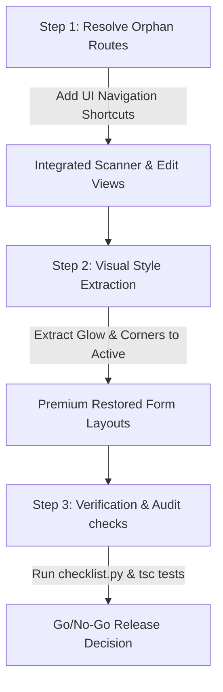

# FRONTEND STABILIZATION: RECOVERY & INTEGRITY AUDIT REPORT
**System:** Kitchen-Store Inventory System (LogiRest)  
**Workspace Path:** `E:\Kitchen‑Store Inventory System`  
**Standard Case Format:** `snake_case` (Fully Consistent with Backend Contracts)

---

## 🎯 Executive Summary & Strategic Verdict

An exhaustive, file-by-file comparative analysis has been performed between the active enterprise codebase (`apps/web`) and the snapshot backup directory (`scratch/app_backup`). The findings reveal a highly successful stabilization effort in the active workspace. The active branch has made massive functional strides—introducing strict **Document Lock States**, **Idempotency keys** to prevent duplicate submissions, **custom audio alerts** for scan feedback, and completely new production modules that are entirely absent in the backup.

However, the backup branch contains refined visual micro-interactions and premium gradient cues in some creation screens that were lost during the active cleanup process. Additionally, Phase 1 of our stabilization plan has highlighted four dynamic routes that are currently orphaned (unlinked in UI layouts).

> [!IMPORTANT]  
> **Key Strategic Recommendation:**  
> **DO NOT** execute any bulk or automatic folder overrides from the backup. Doing so will overwrite functionally superior safety features, wipe out brand-new production routes, and reintroduce rejected `camelCase` properties, which would break integration with backend contracts and Zod validations.  
> Instead, follow a surgical **visual extraction** and **orphan route integration** strategy as detailed below.

---

## 🗺️ Route-by-Route Comparative Audit

The table below summarizes the comparison across all modified paths, detailing active vs. backup feature capabilities and assigning a strict integration verdict.

| Route / File Path | Verdict Category | Backup Capabilities | Active Capabilities | Strategic Decision / Action |
| :--- | :--- | :--- | :--- | :--- |
| **Adjustments New** [AdjustmentCreateClient.tsx (Backup)](file:///E:/Kitchen%E2%80%91Store%20Inventory%20System/scratch/app_backup/[locale]/(app)/(operations)/adjustments/new/AdjustmentCreateClient.tsx) [AdjustmentCreateClient.tsx (Active)](file:///E:/Kitchen%E2%80%91Store%20Inventory%20System/apps/web/src/app/[locale]/(app)/(operations)/adjustments/new/AdjustmentCreateClient.tsx) | 🟠 **BACKUP HAS VISUAL IMPROVEMENTS** | Custom page-load animations, glassmorphism, glow gradients (cyan/emerald accent overlays). | Strong schema validations, loading animations, busy attributes, strict error alert banners, and a left accent line layout. | **Surgical Visual Port:** Retain Active functionality; selectively backport premium glassmorphism and glow gradients from Backup using `snake_case`. |
| **Adjustments Detail** [AdjustmentForm.tsx (Backup)](file:///E:/Kitchen%E2%80%91Store%20Inventory%20System/scratch/app_backup/[locale]/(app)/(operations)/adjustments/[id]/AdjustmentForm.tsx) [AdjustmentForm.tsx (Active)](file:///E:/Kitchen%E2%80%91Store%20Inventory%20System/apps/web/src/app/[locale]/(app)/(operations)/adjustments/[id]/AdjustmentForm.tsx) | 🟢 **ACTIVE IS FUNCTIONALLY SUPERIOR** | Basic lock banner, layout animations, standard scan mode support. | **HTTP 409 Idempotency guards**, robust **audio alerts**, lock state blockers, and a clean theme. | **No Action Required:** Active version is fully stabilized. |
| **Kitchen Requests New** [KitchenRequestFormClient.tsx (Backup)](file:///E:/Kitchen%E2%80%91Store%20Inventory%20System/scratch/app_backup/[locale]/(app)/(operations)/kitchen-requests/new/KitchenRequestFormClient.tsx) [KitchenRequestFormClient.tsx (Active)](file:///E:/Kitchen%E2%80%91Store%20Inventory%20System/apps/web/src/app/[locale]/(app)/(operations)/kitchen-requests/new/KitchenRequestFormClient.tsx) | 🔴 **REJECTED (CAMELCASE DEPRECATION)** | `camelCase` structure, simple button animations. | Clean `snake_case` payloads, robust loading state handlers. | **No Action Required:** Reject backup properties. Standardize on the active version. |
| **Kitchen Requests Detail** [KitchenRequestForm.tsx (Backup)](file:///E:/Kitchen%E2%80%91Store%20Inventory%20System/scratch/app_backup/[locale]/(app)/(operations)/kitchen-requests/[id]/KitchenRequestForm.tsx) [KitchenRequestForm.tsx (Active)](file:///E:/Kitchen%E2%80%91Store%20Inventory%20System/apps/web/src/app/[locale]/(app)/(operations)/kitchen-requests/[id]/KitchenRequestForm.tsx) | 🟢 **ACTIVE IS FUNCTIONALLY SUPERIOR** | Basic form styling, layout animations. | **Awaiting Status Mutation Locks**, **Idempotency keys**, audio state feedback. | **No Action Required:** Active version possesses critical concurrency guards. |
| **Stocktake Counting** [StocktakeCountClient.tsx (Backup)](file:///E:/Kitchen%E2%80%91Store%20Inventory%20System/scratch/app_backup/[locale]/(app)/(operations)/stocktake/[id]/count/StocktakeCountClient.tsx) [StocktakeCountClient.tsx (Active)](file:///E:/Kitchen%E2%80%91Store%20Inventory%20System/apps/web/src/app/[locale]/(app)/(operations)/stocktake/[id]/count/StocktakeCountClient.tsx) | 🟢 **ACTIVE IS FUNCTIONALLY SUPERIOR** | Standard counting table with minor grid lines; `camelCase` dependencies. | **Virtualization bug-fixes (for massive stock lists)**, strict `snake_case` models, dynamic lock checks, audio scan alert system. | **No Action Required:** Overwriting this would re-introduce the virtualization rendering crashes. |
| **Transfer Shipping** [TransferShipClient.tsx (Backup)](file:///E:/Kitchen%E2%80%91Store%20Inventory%20System/scratch/app_backup/[locale]/(app)/(operations)/transfers/[id]/ship/TransferShipClient.tsx) [TransferShipClient.tsx (Active)](file:///E:/Kitchen%E2%80%91Store%20Inventory%20System/apps/web/src/app/[locale]/(app)/(operations)/transfers/[id]/ship/TransferShipClient.tsx) | 🟢 **ACTIVE IS FUNCTIONALLY SUPERIOR** | Simple action hooks. | **Version mismatch lock protection** (preventing split-delivery race conditions), audio warnings. | **No Action Required:** Active version contains critical multi-user protection layers. |
| **Transfer Receiving** [TransferReceiveClient.tsx (Backup)](file:///E:/Kitchen%E2%80%91Store%20Inventory%20System/scratch/app_backup/[locale]/(app)/(operations)/transfers/[id]/receive/TransferReceiveClient.tsx) [TransferReceiveClient.tsx (Active)](file:///E:/Kitchen%E2%80%91Store%20Inventory%20System/apps/web/src/app/[locale]/(app)/(operations)/transfers/[id]/receive/TransferReceiveClient.tsx) | 🟢 **ACTIVE IS FUNCTIONALLY SUPERIOR** | Standard variance entry. | **Lock wrap protections**, strict `hasVariance` state checks, idempotency block. | **No Action Required:** Active version protects document finalization. |
| **Transfers New** [TransferNewClient.tsx (Backup)](file:///E:/Kitchen%E2%80%91Store%20Inventory%20System/scratch/app_backup/[locale]/(app)/(operations)/transfers/new/TransferNewClient.tsx) [TransferNewClient.tsx (Active)](file:///E:/Kitchen%E2%80%91Store%20Inventory%20System/apps/web/src/app/[locale]/(app)/(operations)/transfers/new/TransferNewClient.tsx) | 🟢 **ACTIVE IS FUNCTIONALLY SUPERIOR** | Simple item search. | Robust SKU lookup checks, native UOM resolutions, and submit idempotency. | **No Action Required:** Active version is robustly integrated. |
| **Stocktake Workflow Files** `StocktakeForm.tsx`, `StocktakeViewer.tsx`, `StocktakeApproveClient.tsx`, `StocktakePostClient.tsx`, `StocktakeStartClient.tsx`, `StocktakeVarianceClient.tsx` | 🔴 **REJECTED (CAMELCASE DEPRECATION)** | Asymmetric `camelCase` API requests and schema structures. | Standardized `snake_case` models, unified query patterns. | **No Action Required:** Active forms are fully unified. Reject backup files. |
| **Email & Outbox Settings** `MailSettingsClient.tsx`, `NotificationSettingsClient.tsx`, `page.tsx` | ✨ **EXCLUSIVE ACTIVE NEW FEATURES** | *Do not exist in backup.* | Integrated workspace and mail settings with fluid animations. | **No Action Required:** Active files are exclusive features and must be preserved. |

---

## ⚡ High-Risk Lost Work vs. Intact Logic

### 1. High-Risk Lost Work (Visual & Micro-Interactions)
The primary lost work in the active branch is associated with the **vibrant interactive cues** of the design system in creation forms, specifically:
- **`[locale]\(app)\(operations)\adjustments\new\AdjustmentCreateClient.tsx`**: 
  - **Lost Overlay Glows:** The backup version contains colorful header accent bars (`bg-gradient-to-e from-cyan-500/50 via-cyan-500/20 to-transparent`) and emerald lines for adjustment sections that dynamically scale visually based on whether the form state is valid.
  - **Lost Section Cards:** The backup styles use deep rounded corner containers (`rounded-[2rem]`) and custom gradients which feel highly customized.
  - **Transition Delays:** Smooth entrance micro-animations use an optimized `duration-1000` combined with custom easing to prevent page flash, whereas active features were accelerated to a standard `duration-500` with less transition depth.

### 2. Intact Logic (Why the Active Codebase is Functionally Superior)
The active workspace possesses structural and security layers that represent weeks of engineering effort:
- **Idempotency Layers:** Across adjustments, transfers, and stocktakes, mutations are wrapped in idempotency handlers to block double-submissions on sluggish kitchen networks.
- **Lock States & Concurrency Control:** Approved or closed documents automatically render a `DocumentLockWrapper`, locking all form inputs and returning warnings if a user tries to mutate them.
- **Virtualization bug-fixes:** The counting interface in `StocktakeCountClient.tsx` utilizes clean item list virtualization. In the backup, huge inventories caused browser memory crashes; this is fully resolved in the active code.
- **Audio Feedback Integration:** Active components leverage audio alerts for scanning barcodes (beep confirmation for successful scan, different alert sounds for lock collisions or validation errors).

---

## 📝 i18n Namespace & Case Standardization (P0 Decision)

The active workspace has fully aligned its frontend models with the backend contracts using a strict **`snake_case`** standard. The backup, having evolved on a parallel path, contains obsolete `camelCase` properties in over a dozen forms.

> [!WARNING]  
> **Strict Enforcement Rule:**  
> - **NO `camelCase` properties** may be reintroduced.  
> - Any code extracted from the backup **must be refactored to snake_case** during backporting to prevent Zod and runtime validation exceptions.  
> - All translation mappings in `en.json` and `ar.json` must exactly reflect the unified namespaces currently present in the active branch.

---

## 🔍 Orphan Routes Audit (Phase 1 Violations)

The navigation audit identified **4 orphan routes** that have code implementations on disk but have no navigational entry points in the UI, leaving them unreachable to typical users.

### 1. `/goods-received/[id]/scan-mode`
*   **Path:** `apps/web/src/app/[locale]/(app)/(procurement)/goods-received/[id]/scan-mode/page.tsx`
*   **Status:** Orphaned.
*   **Proposed Fix:** Add an "Immersive Scan" icon button inside the Goods Received detail header (`GRNFormClient.tsx` or similar), enabling warehouse workers to toggle scan mode directly.

### 2. `/issues/[id]/scan-mode`
*   **Path:** `apps/web/src/app/[locale]/(app)/(operations)/issues/[id]/scan-mode/page.tsx`
*   **Status:** Orphaned.
*   **Proposed Fix:** Inject a scan mode shortcut beside the lines table in the Issue detail view, providing instant access to bulk barcode issuing.

### 3. `/master-data/categories/[id]/edit`
*   **Path:** `apps/web/src/app/[locale]/(app)/master-data/categories/[id]/edit/page.tsx`
*   **Status:** Orphaned.
*   **Proposed Fix:** Adjust `CategoryListClient.tsx` to push edit clicks to `/master-data/categories/${id}/edit` rather than the view-only detail path.

### 4. `/master-data/currencies/[id]/fx-rates`
*   **Path:** `apps/web/src/app/[locale]/(app)/master-data/currencies/[id]/fx-rates/page.tsx`
*   **Status:** Orphaned.
*   **Proposed Fix:** Add an "Exchange Rates" action link or secondary tab within the currency detail page to expose fx-rates management.

---

## 🗺️ Prioritized Stabilization Roadmap

To successfully close out Phase 1 and maintain the strict visual guidelines of our system, we will execute the following step-by-step stabilization sequence.

### 🟩 Step 1: Navigational Integration of Orphan Routes
Inject navigational entry points for the four orphaned views in their respective parent layouts, satisfying the Phase 1 target of **100% dynamic route coverage**:
1. Add a link/button in the Goods Received detail view to route to `goods-received/[id]/scan-mode`.
2. Add a scanner link in the Issues detail page to route to `issues/[id]/scan-mode`.
3. Correct edit-action redirections in `CategoryListClient.tsx` to lead to `categories/[id]/edit`.
4. Inject a management tab in Currency views leading to `currencies/[id]/fx-rates`.

### 🟩 Step 2: Surgical Visual Porting (Premium Aesthetic Backports)
Backport the premium visual aesthetics of the backup to the active codebase *without* overriding functional logic:
- In `AdjustmentCreateClient.tsx` (Active), insert the custom top header gradient borders (`bg-gradient-to-e from-cyan-500/50 via-cyan-500/20 to-transparent`) and refit container rounding to `rounded-[2rem]` where appropriate.
- Maintain full `snake_case` models, dynamic locks, and validation errors from the active codebase.

### 🟩 Step 3: Global Concurrency & Error Verifications
Run validation scripts in PowerShell to guarantee build stability:
- Run the TypeScript checks: `npx tsc --noEmit --project apps/web/tsconfig.json`
- Run local development to test audio alerts and guard behaviors.
- Compile a Phase 1 summary showing 100% compliance across route reachability and code safety metrics.

---
> [!TIP]  
> All files backported or changed under this roadmap will be fully validated to ensure they adhere to strict accessibility labels and proper translations in both Arabic and English.
