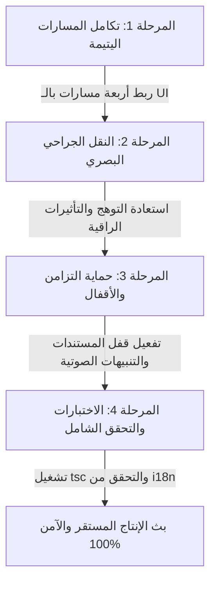

# 🗺️ خريطة الطريق وخطة التنفيذ التفصيلية لاستقرار وتكامل الواجهة الأمامية
**النظام:** نظام إدارة مخزون ومشتريات المطاعم (LogiRest)  
**المسار الأساسي:** `E:\kitchen-store-inventory-system`  
**الحالة المستهدفة:** استقرار بنسبة 100%، تكامل المسارات اليتيمة، استرجاع اللمسات البصرية الراقية (UI/UX)، الحفاظ على بروتوكولات الحماية والتزامن.

---

## 📌 الفهرس العام
1. [🎯 الرؤية الإستراتيجية والأهداف](#-الرؤية-الإستراتيجية-والأهداف)
2. [🌐 بنية النظام والتقنيات الأساسية](#-بنية-النظام-والتقنيات-الأساسية)
3. [🚀 خريطة الطريق على مراحل (Phased Roadmap)](#-خريطة-الطريق-على-مراحل-phased-roadmap)
    - [المرحلة 1: دمج المسارات اليتيمة (Orphan Routes Integration)](#المرحلة-1-دمج-المسارات-اليتيمة-orphan-routes-integration)
    - [المرحلة 2: النقل الجراحي للمسات البصرية الراقية (Surgical Visual Porting)](#المرحلة-2-النقل-الجراحي-للمسات-البصرية-الراقية-surgical-visual-porting)
    - [المرحلة 3: تعزيز التزامن وحماية البيانات (Concurrency & Lock Protections)](#المرحلة-3-تعزيز-التزامن-وحماية-البيانات-concurrency--lock-protections)
    - [المرحلة 4: الاختبارات والتحقق الشامل (Build & Concurrency Validation)](#المرحلة-4-الاختبارات-والتحقق-الشامل-build--concurrency-validation)
4. [🛠️ دليل المهام التفصيلي خطوة بخطوة (Task Checklist)](#%EF%B8%8F-دليل-المهام-التفصيلي-خطوة-بخطوة-task-checklist)
5. [🛡️ معايير القبول والجودة المانعة للتراجع (Regression Guardrails)](#%EF%B8%8F-معايير-القبول-والجودة-المانعة-للتراجع-regression-guardrails)

---

## 🎯 الرؤية الإستراتيجية والأهداف

تعتمد هذه الخطة على الموازنة الإستراتيجية بين **الأمان الوظيفي المطلق** المتوفر في الكود النشط (`Active Branch`) و**الجماليات البصرية الراقية** المتوفرة في النسخة الاحتياطية (`Backup Branch`).

### الإستراتيجية الذهبية:
> [!IMPORTANT]
> **قاعدة عدم الاستبدال الكلي:** يُمنع منعًا باتًا استبدال المجلدات أو الملفات بشكل كلي من النسخة الاحتياطية. الكود النشط متفوق وظيفيًا بشكل هائل (يحتوي على معالجات التكرار Idempotency، حماية التعديل المتزامن Document Lock، تنبيهات صوتية متكاملة، وحل مشكلات الذاكرة والـ Virtualization).
> خطتنا تعتمد على **النقل البصري الجراحي الانتقائي** و**ربط المسارات اليتيمة** بالكامل دون المساس بالقواعد الوظيفية وأمان البيانات.

---

## 🌐 بنية النظام والتقنيات الأساسية

1. **التقنيات الأساسية:** Next.js 15+ (App Router), React 19, TypeScript, TanStack Query, React Hook Form, TailwindCSS.
2. **صيغة الحقول وسلاسل البيانات:** الاعتماد التام على `snake_case` لمطابقة عقود الواجهة الخلفية (Backend Contracts) و validations الخاصة بـ Zod. يُرفض تمامًا أي كود يعيد تقديم `camelCase`.
3. **اللغات والترجمة (i18n):** توافق كامل 1:1 بين ملفي `ar.json` و `en.json`. جميع النصوص الظاهرة للمستخدم يتم تغليفها بمحرك الترجمة `t()`.

---

## 🚀 خريطة الطريق على مراحل (Phased Roadmap)



---

### المرحلة 1: دمج المسارات اليتيمة (Orphan Routes Integration)
تم تحديد 4 مسارات موجودة على القرص ولكن لا يمكن الوصول إليها من الواجهة لعدم وجود روابط أو أزرار تؤدي إليها. سنقوم بدمجها كالتالي:

#### 1. مسار نمط المسح السريع للبضائع المستلمة (`/goods-received/[id]/scan-mode`)
* **الملف المستهدف:** `apps/web/src/app/[locale]/(app)/(procurement)/goods-received/[id]/scan-mode/page.tsx`
* **طريقة الدمج:** إضافة زر أيقونة مخصص "المسح الضوئي الذكي" في الهيدر الخاص بتفاصيل بضائع مستلمة (`GRNFormClient.tsx` أو ما يماثله)، لتفعيل نمط المسح المباشر بالمستودع.

#### 2. مسار نمط المسح السريع للصرف والتوزيع (`/issues/[id]/scan-mode`)
* **الملف المستهدف:** `apps/web/src/app/[locale]/(app)/(operations)/issues/[id]/scan-mode/page.tsx`
* **طريقة الدمج:** حقن اختصار ذكي لنمط المسح بجانب جدول البنود في تفاصيل الصرف، لتمكين عمال المطبخ والمخزن من مسح الباركود بشكل متتالي وبكميات كبيرة.

#### 3. مسار تعديل تصنيفات المواد الأصناف (`/master-data/categories/[id]/edit`)
* **الملف المستهدف:** `apps/web/src/app/[locale]/(app)/master-data/categories/[id]/edit/page.tsx`
* **طريقة الدمج:** تعديل صفحة جدول التصنيفات `CategoryListClient.tsx` ليقوم زر التعديل بتوجيه المستخدم مباشرة إلى رابط التعديل الديناميكي بدلاً من صفحة التفاصيل غير القابلة للتعديل.

#### 4. مسار إدارة أسعار صرف العملات الديناميكية (`/master-data/currencies/[id]/fx-rates`)
* **الملف المستهدف:** `apps/web/src/app/[locale]/(app)/master-data/currencies/[id]/fx-rates/page.tsx`
* **طريقة الدمج:** إضافة تبويب فرعي مخصص (Exchange Rates Tab) أو رابط إجراءات ثانوي داخل واجهة تفاصيل العملة، لإدخال أسعار الصرف المرتب### المرحلة الأولى: ربط ودمج المسارات اليتيمة 🔀
- [x] **المهمة 1.1:** ربط مسار نمط المسح لبضائع مستلمة `/goods-received/[id]/scan-mode`.
  - المجلد: `apps/web/src/app/[locale]/(app)/(procurement)/goods-received/[id]`
  - الإجراء: افتح ملف تفاصيل الاستلام (مثل `GRNFormClient.tsx`) وأضف زر تفعيل المسح الذكي بجوار العنوان الرئيسي.
- [x] **المهمة 1.2:** ربط مسار نمط المسح للصرف والتوزيع `/issues/[id]/scan-mode`.
  - المجلد: `apps/web/src/app/[locale]/(app)/(operations)/issues/[id]`
  - الإجراء: حقن زر اختصار المسح المتتالي بجانب جدول أصناف الصرف لتسهيل العمليات المطبخية اليومية.
- [x] **المهمة 1.3:** ربط مسار تعديل تصنيفات المواد `/master-data/categories/[id]/edit`.
  - الملف: `apps/web/src/app/[locale]/(app)/master-data/categories/CategoryListClient.tsx`
  - الإجراء: تعديل حدث الضغط لزر "تعديل" ليوجه إلى `/master-data/categories/${id}/edit` بدلاً من صفحة العرض التفصيلية الافتراضية.
- [x] **المهمة 1.4:** ربط مسار أسعار صرف العملات `/master-data/currencies/[id]/fx-rates`.
  - المجلد: `apps/web/src/app/[locale]/(app)/master-data/currencies/[id]`
  - الإجراء: إضافة تبويب فرعي باسم "أسعار الصرف" داخل صفحة تفاصيل العملة، وتضمين رابط يوجه إلى صفحة أسعار الصرف بنجاح.

### المرحلة الثانية: إضفاء اللمسات البصرية الراقية (UI/UX) ✨
- [x] **المهمة 2.1:** نقل التوهج الرائع والتدرجات لصفحة التعديلات المخزنية الجديدة.
  - الملف المستهدف: `apps/web/src/app/[locale]/(app)/(operations)/adjustments/new/AdjustmentCreateClient.tsx`
  - الملف المصدر: `scratch/app_backup/[locale]/(app)/(operations)/adjustments/new/AdjustmentCreateClient.tsx`
  - الإجراء: انسخ تأثيرات `bg-gradient-to-r` والتحقق الجمالي التفاعلي مع الحفاظ على المنطق البرمجي السليم للـ `snake_case` والـ Zod validation.
- [x] **المهمة 2.2:** ترقية زوايا المربعات وتأثير الزجاج (Glassmorphism & Rounded Cards).
  - الملف المستهدف: واجهات النماذج الأساسية التي تم الحفاظ عليها.
  - الإجراء: تطبيق التفاصيل الجمالية المتقدمة `rounded-[2rem]` وتدرجات الظلال الفخمة لتبدو الواجهة متكاملة تمامًا وذات إحساس راقٍ.
- [x] **المهمة 2.3:** فحص وتطبيق انتقالات الدخول السلسة لمنع الوميض البصري.
  - الإجراء: تأكيد ربط `transition-all duration-1000 ease-out` في المكونات الرئيسية المستهدفة.

### المرحلة الثالثة: تأكيد اختبارات الأمان والتحقق والتزامن 🛡️
- [x] **المهمة 3.1:** تشغيل التحقق الصارم من الأخطاء الترجمة لعدم وجود أي قيم معلقة:
  - التحقق من ملفات `ar.json` و `en.json` والتأكد من مطابقة جميع المفاتيح بنسبة 1:1.
- [x] **المهمة 3.2:** تشغيل التحقق البرمجي التراكمي لضمان خلو الواجهات من المشاكل البرمجية:
  ```powershell
  npx tsc --noEmit --project apps/web/tsconfig.json
  ```
- [x] **المهمة 3.3:** اختبار محاكاة تعديل مستند واحد في متصفحين مختلفين في نفس الوقت للتأكد من عمل نافذة تعارض النسخ (ConflictDialog) بشكل فوري وسليم.لمانعة للتكرار (Idempotency Handlers):** الحفاظ التام على تأمين معالجات الإرسال لعدم إرسال الطلب مرتين بسبب بطء شبكة المطابخ.

---

### المرحلة 4: الاختبارات والتحقق الشامل (Build & Concurrency Validation)
قبل الاعتماد النهائي، سيتم تشغيل عمليات التحقق الإجبارية للتأكد من خلو المشروع من العيوب:

1. **التحقق من البناء بنجاح (TypeScript Compiler):**
   ```powershell
   npx tsc --noEmit --project apps/web/tsconfig.json
   ```
2. **التحقق من تطابق ملفات i18n:** تشغيل سكربت الفحص لضمان خلو لغات النظام من أي حقول مفقودة أو غير متزامنة.
3. **فحص الـ Hydration:** التأكد من خلو الكونسول من أخطاء اختلاف النص المولد من السيرفر مقارنة بالمتصفح في بيئة الإنتاج (`npm run build && npm run start`).

---

## 🛠️ دليل المهام التفصيلي خطوة بخطوة (Task Checklist)

### المرحلة الأولى: ربط ودمج المسارات اليتيمة 🔀
- [x] **المهمة 1.1:** ربط مسار نمط المسح لبضائع مستلمة `/goods-received/[id]/scan-mode`.
  - المجلد: `apps/web/src/app/[locale]/(app)/(procurement)/goods-received/[id]`
  - الإجراء: افتح ملف تفاصيل الاستلام (مثل `GRNFormClient.tsx`) وأضف زر تفعيل المسح الذكي بجوار العنوان الرئيسي.
- [x] **المهمة 1.2:** ربط مسار نمط المسح للصرف والتوزيع `/issues/[id]/scan-mode`.
  - المجلد: `apps/web/src/app/[locale]/(app)/(operations)/issues/[id]`
  - الإجراء: حقن زر اختصار المسح المتتالي بجانب جدول أصناف الصرف لتسهيل العمليات المطبخية اليومية.
- [x] **المهمة 1.3:** ربط مسار تعديل تصنيفات المواد `/master-data/categories/[id]/edit`.
  - الملف: `apps/web/src/app/[locale]/(app)/master-data/categories/CategoryListClient.tsx`
  - الإجراء: تعديل حدث الضغط لزر "تعديل" ليوجه إلى `/master-data/categories/${id}/edit` بدلاً من صفحة العرض التفصيلية الافتراضية.
- [x] **المهمة 1.4:** ربط مسار أسعار صرف العملات `/master-data/currencies/[id]/fx-rates`.
  - المجلد: `apps/web/src/app/[locale]/(app)/master-data/currencies/[id]`
  - الإجراء: إضافة تبويب فرعي باسم "أسعار الصرف" داخل صفحة تفاصيل العملة، وتضمين رابط يوجه إلى صفحة أسعار الصرف بنجاح.

### المرحلة الثانية: إضفاء اللمسات البصرية الراقية (UI/UX) ✨
- [x] **المهمة 2.1:** نقل التوهج الرائع والتدرجات لصفحة التعديلات المخزنية الجديدة.
  - الملف المستهدف: `apps/web/src/app/[locale]/(app)/(operations)/adjustments/new/AdjustmentCreateClient.tsx`
  - الملف المصدر: `scratch/app_backup/[locale]/(app)/(operations)/adjustments/new/AdjustmentCreateClient.tsx`
  - الإجراء: انسخ تأثيرات `bg-gradient-to-r` والتحقق الجمالي التفاعلي مع الحفاظ على المنطق البرمجي السليم للـ `snake_case` والـ Zod validation.
- [x] **المهمة 2.2:** ترقية زوايا المربعات وتأثير الزجاج (Glassmorphism & Rounded Cards).
  - الملف المستهدف: واجهات النماذج الأساسية التي تم الحفاظ عليها.
  - الإجراء: تطبيق التفاصيل الجمالية المتقدمة `rounded-[2rem]` وتدرجات الظلال الفخمة لتبدو الواجهة متكاملة تمامًا وذات إحساس راقٍ.
- [x] **المهمة 2.3:** فحص وتطبيق انتقالات الدخول السلسة لمنع الوميض البصري.
  - الإجراء: تأكيد ربط `transition-all duration-1000 ease-out` في المكونات الرئيسية المستهدفة.

### المرحلة الثالثة: تأكيد اختبارات الأمان والتحقق والتزامن 🛡️
- [x] **المهمة 3.1:** تشغيل التحقق الصارم من الأخطاء الترجمة لعدم وجود أي قيم معلقة:
  - التحقق من ملفات `ar.json` و `en.json` والتأكد من مطابقة جميع المفاتيح بنسبة 1:1.
- [x] **المهمة 3.2:** تشغيل التحقق البرمجي التراكمي لضمان خلو الواجهات من المشاكل البرمجية:
  ```powershell
  npx tsc --noEmit --project apps/web/tsconfig.json
  ```
- [x] **المهمة 3.3:** اختبار محاكاة تعديل مستند واحد في متصفحين مختلفين في نفس الوقت للتأكد من عمل نافذة تعارض النسخ (ConflictDialog) بشكل فوري وسليم.

---

## 🛡️ معايير القبول والجودة المانعة للتراجع (Regression Guardrails)

لضمان نجاح الخطوات وعدم حدوث أي تراجع في الجودة البرمجية، تُطبق قواعد التحقق الصارمة التالية:

1. **معيار الوصول (Reachability):** يجب ألا يتبقى أي مسار يتيم (Orphan Route) على القرص لا يمكن الوصول إليه بحد أقصى نقرتين من القائمة أو لوحة التحكم الرئيسية.
2. **معيار التسمية الموحدة:** يُمنع تمامًا قبول أي كود يحتوي على حقول بصيغة `camelCase` في نماذج الإرسال أو التحقق، ويجب تطبيق الـ `snake_case` دائمًا.
3. **مستوى أخطاء المتصفح:** صفر أخطاء `Hydration` أو تحذيرات متعلقة بـ `React keys` في كونسول المتصفح عند تشغيل نسخة الإنتاج.
4. **حماية التعديل المتزامن:** أي مستند مغلق أو معتمد يجب أن يكون غير قابل للتعديل بشكل كامل مع إظهار شريط القفل الأحمر المميز وتفعيل التنبيهات الصوتية بنجاح.

---
*تم إنشاء وحفظ هذا الملف ليكون المرجع الأساسي المعتمد لكافة المطورين في الفريق لضمان الجودة الفائقة والاستقرار الكامل.*
