# ZERO-BASED ENTERPRISE SYSTEM AUDIT: SYSTEM INVENTORY & MAPS

In compliance with the mandatory zero-based audit instructions, this initial response establishes the absolute baseline of the current system architecture, routes, workflows, and authorization matrices. 

The following sections contain the complete, exhaustive mapping of the code directly inspected in the workspace. No historical audits, remediation plans, or previous assessments have been referenced.

---

## 1. COMPLETE CODEBASE MAP

### A. Backend Modules (`apps/api/src/`)
Exposing modular NestJS architectures registered in the root [app.module.ts](file:///e:/Kitchen‑Store%20Inventory%20System/apps/api/src/app.module.ts):
1. **PrismaModule**: Core database connector mapping PostgreSQL transactions [database.module.ts](file:///e:/Kitchen‑Store%20Inventory%20System/apps/api/src/database/database.module.ts)
2. **HealthModule**: Split public diagnostics framework [health.module.ts](file:///e:/Kitchen‑Store%20Inventory%20System/apps/api/src/modules/health/health.module.ts)
3. **BackupModule**: Database pg_dump management [backup.module.ts](file:///e:/Kitchen‑Store%20Inventory%20System/apps/api/src/backup/backup.module.ts)
4. **AuthModule**: Authentication, refresh tokens, and JWT utilities [auth.module.ts](file:///e:/Kitchen‑Store%20Inventory%20System/apps/api/src/auth/auth.module.ts)
5. **WorkflowModule**: Decentralized document state transition machine [workflow.module.ts](file:///e:/Kitchen‑Store%20Inventory%20System/apps/api/src/modules/workflow/workflow.module.ts)
6. **PurchaseRequestsModule**: Purchase Request document creation and transition modules [purchase-requests.module.ts](file:///e:/Kitchen‑Store%20Inventory%20System/apps/api/src/modules/purchase-requests/purchase-requests.module.ts)
7. **WarehouseLockModule**: Warehouse-level operational lock manager [warehouse-lock.module.ts](file:///e:/Kitchen‑Store%20Inventory%20System/apps/api/src/modules/warehouse-lock/warehouse-lock.module.ts)
8. **LedgerModule**: WAC calculations, FEFO lot allocations, and ledger logs [ledger.module.ts](file:///e:/Kitchen‑Store%20Inventory%20System/apps/api/src/modules/ledger/ledger.module.ts)
9. **PurchasingModule**: Purchase Order and Goods Received Note controllers [purchasing.module.ts](file:///e:/Kitchen‑Store%20Inventory%20System/apps/api/src/modules/purchasing/purchasing.module.ts)
10. **OperationsModule**: Transfers, inventory issues, adjustments, and yield batches [operations.module.ts](file:///e:/Kitchen‑Store%20Inventory%20System/apps/api/src/modules/operations/operations.module.ts)
11. **StocktakeModule**: Physical counts, variance checks, and session approvals [stocktake.module.ts](file:///e:/Kitchen‑Store%20Inventory%20System/apps/api/src/modules/stocktake/stocktake.module.ts)
12. **KitchenRequestsModule**: Kitchen request generation and issue-post links [kitchen-requests.module.ts](file:///e:/Kitchen‑Store%20Inventory%20System/apps/api/src/modules/kitchen-requests/kitchen-requests.module.ts)
13. **MasterDataModule**: Global definitions (items, categories, branches, suppliers, etc.) [master-data.module.ts](file:///e:/Kitchen‑Store%20Inventory%20System/apps/api/src/modules/master-data/master-data.module.ts)
14. **InventoryModule**: Live inventory balances and movement logs [inventory.module.ts](file:///e:/Kitchen‑Store%20Inventory%20System/apps/api/src/modules/inventory/inventory.module.ts)
15. **ReportsModule**: Dynamic WAC, movement, expiry, and variance calculations [reports.module.ts](file:///e:/Kitchen‑Store%20Inventory%20System/apps/api/src/modules/reports/reports.module.ts)
16. **NotificationModule**: Role-targeted notification generation [notification.module.ts](file:///e:/Kitchen‑Store%20Inventory%20System/apps/api/src/modules/notifications/notification.module.ts)
17. **AdminModule**: Audit logging and user/role administration [admin.module.ts](file:///e:/Kitchen‑Store%20Inventory%20System/apps/api/src/modules/admin/admin.module.ts)
18. **DocumentSequenceModule**: Sequence generation based on branch and year [document-sequence.module.ts](file:///e:/Kitchen‑Store%20Inventory%20System/apps/api/src/modules/sequencing/document-sequence.module.ts)
19. **OutboxModule**: Transactional Outbox pattern event handlers [outbox.module.ts](file:///e:/Kitchen‑Store%20Inventory%20System/apps/api/src/modules/outbox/outbox.module.ts)
20. **RedisModule**: Shared connection wrapper for locks and caching [redis.module.ts](file:///e:/Kitchen‑Store%20Inventory%20System/apps/api/src/redis/redis.module.ts)
21. **MetricsModule**: Prometheus scrape target endpoint metrics [metrics.module.ts](file:///e:/Kitchen‑Store%20Inventory%20System/apps/api/src/modules/metrics/metrics.module.ts)
22. **SearchModule**: Multi-entity fuzzy indexed query endpoints [search.module.ts](file:///e:/Kitchen‑Store%20Inventory%20System/apps/api/src/modules/search/search.module.ts)
23. **AlertModule**: Low stock and lot expiry automated alerts [alert.module.ts](file:///e:/Kitchen‑Store%20Inventory%20System/apps/api/src/modules/alerts/alert.module.ts)
24. **SettingsModule**: System-wide configuration options [settings.module.ts](file:///e:/Kitchen‑Store%20Inventory%20System/apps/api/src/modules/settings/settings.module.ts)
25. **LandedCostModule**: Landed cost allocations and WAC recalculations [landed-cost.module.ts](file:///e:/Kitchen‑Store%20Inventory%20System/apps/api/src/modules/procurement/landed-cost/landed-cost.module.ts)

---

### B. All Controllers
1. **AppController**: [app.controller.ts](file:///e:/Kitchen‑Store%20Inventory%20System/apps/api/src/app.controller.ts)
2. **AuthController**: [auth.controller.ts](file:///e:/Kitchen‑Store%20Inventory%20System/apps/api/src/auth/auth.controller.ts)
3. **AdminController**: [admin.controller.ts](file:///e:/Kitchen‑Store%20Inventory%20System/apps/api/src/modules/admin/admin.controller.ts)
4. **AuditLogsController**: [audit-logs.controller.ts](file:///e:/Kitchen‑Store%20Inventory%20System/apps/api/src/modules/admin/audit-logs.controller.ts)
5. **InventoryValidationController**: [inventory-validation.controller.ts](file:///e:/Kitchen‑Store%20Inventory%20System/apps/api/src/modules/admin/inventory-validation.controller.ts)
6. **WarehouseLockController**: [warehouse-lock.controller.ts](file:///e:/Kitchen‑Store%20Inventory%20System/apps/api/src/modules/warehouse-lock/warehouse-lock.controller.ts)
7. **StocktakeController**: [stocktake.controller.ts](file:///e:/Kitchen‑Store%20Inventory%20System/apps/api/src/modules/stocktake/stocktake.controller.ts)
8. **SettingsController**: [settings.controller.ts](file:///e:/Kitchen‑Store%20Inventory%20System/apps/api/src/modules/settings/settings.controller.ts)
9. **SearchController**: [search.controller.ts](file:///e:/Kitchen‑Store%20Inventory%20System/apps/api/src/modules/search/search.controller.ts)
10. **ReportsController**: [reports.controller.ts](file:///e:/Kitchen‑Store%20Inventory%20System/apps/api/src/modules/reports/reports.controller.ts)
11. **DashboardController**: [dashboard.controller.ts](file:///e:/Kitchen‑Store%20Inventory%20System/apps/api/src/modules/reports/dashboard.controller.ts)
12. **GRNController**: [grn.controller.ts](file:///e:/Kitchen‑Store%20Inventory%20System/apps/api/src/modules/purchasing/grn/grn.controller.ts)
13. **POController**: [po.controller.ts](file:///e:/Kitchen‑Store%20Inventory%20System/apps/api/src/modules/purchasing/purchase-orders/po.controller.ts)
14. **LandedCostController**: [landed-cost.controller.ts](file:///e:/Kitchen‑Store%20Inventory%20System/apps/api/src/modules/procurement/landed-cost/landed-cost.controller.ts)
15. **PurchaseRequestsController**: [purchase-requests.controller.ts](file:///e:/Kitchen‑Store%20Inventory%20System/apps/api/src/modules/purchase-requests/purchase-requests.controller.ts)
16. **TransfersController**: [transfers.controller.ts](file:///e:/Kitchen‑Store%20Inventory%20System/apps/api/src/modules/operations/transfers/transfers.controller.ts)
17. **IssuesController**: [issues.controller.ts](file:///e:/Kitchen‑Store%20Inventory%20System/apps/api/src/modules/operations/issues/issues.controller.ts)
18. **YieldController**: [yield.controller.ts](file:///e:/Kitchen‑Store%20Inventory%20System/apps/api/src/modules/operations/yield/yield.controller.ts)
19. **OperationsController**: [operations.controller.ts](file:///e:/Kitchen‑Store%20Inventory%20System/apps/api/src/modules/operations/operations.controller.ts)
20. **AdjustmentsController**: [adjustments.controller.ts](file:///e:/Kitchen‑Store%20Inventory%20System/apps/api/src/modules/operations/adjustments/adjustments.controller.ts)
21. **MetricsController**: [metrics.controller.ts](file:///e:/Kitchen‑Store%20Inventory%20System/apps/api/src/modules/metrics/metrics.controller.ts)
22. **NotificationController**: [notification.controller.ts](file:///e:/Kitchen‑Store%20Inventory%20System/apps/api/src/modules/notifications/notification.controller.ts)
23. **VarianceReasonsController**: [variance-reasons.controller.ts](file:///e:/Kitchen‑Store%20Inventory%20System/apps/api/src/modules/master-data/variance-reasons/variance-reasons.controller.ts)
24. **WarehousesDirectController**: [warehouses-direct.controller.ts](file:///e:/Kitchen‑Store%20Inventory%20System/apps/api/src/modules/master-data/warehouses/warehouses-direct.controller.ts)
25. **UOMController**: [uom.controller.ts](file:///e:/Kitchen‑Store%20Inventory%20System/apps/api/src/modules/master-data/units-of-measure/uom.controller.ts)
26. **SuppliersController**: [suppliers.controller.ts](file:///e:/Kitchen‑Store%20Inventory%20System/apps/api/src/modules/master-data/suppliers/suppliers.controller.ts)
27. **FXRatesController**: [fx-rates.controller.ts](file:///e:/Kitchen‑Store%20Inventory%20System/apps/api/src/modules/master-data/fx-rates/fx-rates.controller.ts)
28. **ItemsController**: [items.controller.ts](file:///e:/Kitchen‑Store%20Inventory%20System/apps/api/src/modules/master-data/items/items.controller.ts)
29. **DepartmentsController**: [departments.controller.ts](file:///e:/Kitchen‑Store%20Inventory%20System/apps/api/src/modules/master-data/departments/departments.controller.ts)
30. **CurrenciesController**: [currencies.controller.ts](file:///e:/Kitchen‑Store%20Inventory%20System/apps/api/src/modules/master-data/currencies/currencies.controller.ts)
31. **BranchesController**: [branches.controller.ts](file:///e:/Kitchen‑Store%20Inventory%20System/apps/api/src/modules/master-data/branches/branches.controller.ts)
32. **CategoriesController**: [categories.controller.ts](file:///e:/Kitchen‑Store%20Inventory%20System/apps/api/src/modules/master-data/categories/categories.controller.ts)
33. **KitchenRequestsController**: [kitchen-requests.controller.ts](file:///e:/Kitchen‑Store%20Inventory%20System/apps/api/src/modules/kitchen-requests/kitchen-requests.controller.ts)
34. **BarcodesController**: [barcodes.controller.ts](file:///e:/Kitchen‑Store%20Inventory%20System/apps/api/src/modules/master-data/barcodes/barcodes.controller.ts)
35. **InventoryController**: [inventory.controller.ts](file:///e:/Kitchen‑Store%20Inventory%20System/apps/api/src/modules/inventory/inventory.controller.ts)
36. **LotsController**: [lots.controller.ts](file:///e:/Kitchen‑Store%20Inventory%20System/apps/api/src/modules/inventory/lots.controller.ts)
37. **HealthController**: [health.controller.ts](file:///e:/Kitchen‑Store%20Inventory%20System/apps/api/src/health/health.controller.ts)
38. **BackupController**: [backup.controller.ts](file:///e:/Kitchen‑Store%20Inventory%20System/apps/api/src/backup/backup.controller.ts)

---

### C. All Services & Providers
1. **AppService**: System startup ping handler [app.service.ts](file:///e:/Kitchen‑Store%20Inventory%20System/apps/api/src/app.service.ts)
2. **AuthService**: Handles registration, login attempts, lockouts, and JWTs [auth.service.ts](file:///e:/Kitchen‑Store%20Inventory%20System/apps/api/src/auth/auth.service.ts)
3. **UserService**: Manages user profiles and credential hashing [user.service.ts](file:///e:/Kitchen‑Store%20Inventory%20System/apps/api/src/auth/user.service.ts)
4. **UserWarehouseScopeService**: Branch and warehouse scope validations [user-warehouse-scope.service.ts](file:///e:/Kitchen‑Store%20Inventory%20System/apps/api/src/auth/user-warehouse-scope.service.ts)
5. **ScopeValidationService**: Enforces warehouse isolation rules [scope-validation.service.ts](file:///e:/Kitchen‑Store%20Inventory%20System/apps/api/src/auth/scope-validation.service.ts)
6. **WorkflowService**: Central transition driver with optimistic locking checks [workflow.service.ts](file:///e:/Kitchen‑Store%20Inventory%20System/apps/api/src/modules/workflow/workflow.service.ts)
7. **WarehouseLockService**: Applies physical lock flags on warehouses [warehouse-lock.service.ts](file:///e:/Kitchen‑Store%20Inventory%20System/apps/api/src/modules/warehouse-lock/warehouse-lock.service.ts)
8. **LedgerLockService**: Row-level SELECT FOR UPDATE locking [ledger-lock.service.ts](file:///e:/Kitchen‑Store%20Inventory%20System/apps/api/src/modules/ledger/ledger-lock.service.ts)
9. **WacService**: Recalculates WAC upon receipts and positive adjustments [wac.service.ts](file:///e:/Kitchen‑Store%20Inventory%20System/apps/api/src/modules/ledger/wac.service.ts)
10. **AllocationService**: Progressive lot-allocation (FEFO/FIFO) and decrement [allocation.service.ts](file:///e:/Kitchen‑Store%20Inventory%20System/apps/api/src/modules/ledger/allocation.service.ts)
11. **GRNService**: Manages goods receipt metadata and line details [grn.service.ts](file:///e:/Kitchen‑Store%20Inventory%20System/apps/api/src/modules/purchasing/grn/grn.service.ts)
12. **GRNPostService**: Handles goods receipt posting [grn-post.service.ts](file:///e:/Kitchen‑Store%20Inventory%20System/apps/api/src/modules/purchasing/grn-post.service.ts)
13. **GRNVoidService**: Reverses goods receipt transactions [grn-void.service.ts](file:///e:/Kitchen‑Store%20Inventory%20System/apps/api/src/modules/operations/grn-void.service.ts)
14. **POService**: Manages purchase orders and links to PRs [po.service.ts](file:///e:/Kitchen‑Store%20Inventory%20System/apps/api/src/modules/purchasing/purchase-orders/po.service.ts)
15. **PurchaseRequestsService**: Purchase Request lines and approvals [purchase-requests.service.ts](file:///e:/Kitchen‑Store%20Inventory%20System/apps/api/src/modules/purchase-requests/purchase-requests.service.ts)
16. **LandedCostService**: Manages landed cost vouchers [landed-cost.service.ts](file:///e:/Kitchen‑Store%20Inventory%20System/apps/api/src/modules/procurement/landed-cost/landed-cost.service.ts)
17. **LandedCostCalculatorService**: Cost allocations based on value, weight, etc. [landed-cost-calculator.service.ts](file:///e:/Kitchen‑Store%20Inventory%20System/apps/api/src/modules/procurement/landed-cost/landed-cost-calculator.service.ts)
18. **LandedCostPostService**: Posts landed cost allocations and queues jobs [landed-cost-post.service.ts](file:///e:/Kitchen‑Store%20Inventory%20System/apps/api/src/modules/procurement/landed-cost/landed-cost-post.service.ts)
19. **RevaluationLockingService**: Row locking specifically for revaluation transactions [revaluation-locking.service.ts](file:///e:/Kitchen‑Store%20Inventory%20System/apps/api/src/modules/procurement/landed-cost/revaluation-locking.service.ts)
20. **TransfersService**: Manages transfer lines and metadata [transfers.service.ts](file:///e:/Kitchen‑Store%20Inventory%20System/apps/api/src/modules/operations/transfers/transfers.service.ts)
21. **TransferPostService**: Manages transfer shipment and receipt posting [transfer-post.service.ts](file:///e:/Kitchen‑Store%20Inventory%20System/apps/api/src/modules/operations/transfer-post.service.ts)
22. **TransferVoidService**: Reverses transfer shipments and receipts [transfer-void.service.ts](file:///e:/Kitchen‑Store%20Inventory%20System/apps/api/src/modules/operations/transfer-void.service.ts)
23. **IssuesService**: Manages inventory issues [issues.service.ts](file:///e:/Kitchen‑Store%20Inventory%20System/apps/api/src/modules/operations/issues/issues.service.ts)
24. **IssuePostService**: Posts stock issues [issue-post.service.ts](file:///e:/Kitchen‑Store%20Inventory%20System/apps/api/src/modules/operations/issue-post.service.ts)
25. **IssueVoidService**: Reverses posted issues [issue-void.service.ts](file:///e:/Kitchen‑Store%20Inventory%20System/apps/api/src/modules/operations/issue-void.service.ts)
26. **AdjustmentsService**: Manages adjustments [adjustments.service.ts](file:///e:/Kitchen‑Store%20Inventory%20System/apps/api/src/modules/operations/adjustments/adjustments.service.ts)
27. **AdjustmentPostService**: Posts adjustments [adjustment-post.service.ts](file:///e:/Kitchen‑Store%20Inventory%20System/apps/api/src/modules/operations/adjustment-post.service.ts)
28. **AdjustmentVoidService**: Reverses posted adjustments [adjustment-void.service.ts](file:///e:/Kitchen‑Store%20Inventory%20System/apps/api/src/modules/operations/adjustment-void.service.ts)
29. **KitchenRequestVoidService**: Reverses kitchen requests [kitchen-request-void.service.ts](file:///e:/Kitchen‑Store%20Inventory%20System/apps/api/src/modules/operations/kitchen-request-void.service.ts)
30. **LotsAvailableService**: Returns active lots for inventory mapping [lots-available.service.ts](file:///e:/Kitchen‑Store%20Inventory%20System/apps/api/src/modules/operations/lots-available.service.ts)
31. **YieldService**: Handles raw batch calculations [yield.service.ts](file:///e:/Kitchen‑Store%20Inventory%20System/apps/api/src/modules/operations/yield/yield.service.ts)
32. **StocktakeService**: Handles physical stocktake counts [stocktake.service.ts](file:///e:/Kitchen‑Store%20Inventory%20System/apps/api/src/modules/stocktake/stocktake.service.ts)
33. **StocktakePostService**: Posts stocktake differences to the ledger [stocktake-post.service.ts](file:///e:/Kitchen‑Store%20Inventory%20System/apps/api/src/modules/stocktake/stocktake-post.service.ts)
34. **SettingsService**: Key-value encrypted options service [settings.service.ts](file:///e:/Kitchen‑Store%20Inventory%20System/apps/api/src/modules/settings/settings.service.ts)
35. **ReportsService**: Generates reports (expiry, valuation, WAC) [reports.service.ts](file:///e:/Kitchen‑Store%20Inventory%20System/apps/api/src/modules/reports/reports.service.ts)
36. **NotificationService**: Handles database notification insertion [notification.service.ts](file:///e:/Kitchen‑Store%20Inventory%20System/apps/api/src/modules/notifications/notification.service.ts)
37. **NotificationTemplateService**: Parses and formats templates [notification-template.service.ts](file:///e:/Kitchen‑Store%20Inventory%20System/apps/api/src/modules/notifications/notification-template.service.ts)
38. **DocumentSequenceService**: Generates document sequences [document-sequence.service.ts](file:///e:/Kitchen‑Store%20Inventory%20System/apps/api/src/modules/sequencing/document-sequence.service.ts)
39. **OutboxService**: Writes outbox events to the queue [outbox.service.ts](file:///e:/Kitchen‑Store%20Inventory%20System/apps/api/src/modules/outbox/outbox.service.ts)
40. **EmailService**: Simulates supplier notification emails [email.service.ts](file:///e:/Kitchen‑Store%20Inventory%20System/apps/api/src/modules/outbox/email.service.ts)
41. **MetricsService**: Prometheus integration collector [metrics.service.ts](file:///e:/Kitchen‑Store%20Inventory%20System/apps/api/src/modules/metrics/metrics.service.ts)
42. **IdempotencyService**: Records key-value pairs for request de-duplication [idempotency.service.ts](file:///e:/Kitchen‑Store%20Inventory%20System/apps/api/src/services/idempotency.service.ts)
43. **ConcurrencyService**: Manages transaction conflict handlers [concurrency.service.ts](file:///e:/Kitchen‑Store%20Inventory%20System/apps/api/src/services/concurrency.service.ts)
44. **RedisLockService**: Distributed locking service using Redis [redis-lock.service.ts](file:///e:/Kitchen‑Store%20Inventory%20System/apps/api/src/redis/redis-lock.service.ts)

---

### D. All Prisma Models
Defined in [schema.prisma](file:///e:/Kitchen‑Store%20Inventory%20System/apps/api/prisma/schema.prisma):
* **User**: User credentials, role, and scoping records.
* **UserWarehouseScope**: Maps users to authorized warehouses.
* **RefreshToken**: Tracks active refresh tokens and sessions.
* **PasswordResetToken**: Tracks password reset requests.
* **Branch**: Branch entity mapping departments and sequences.
* **Warehouse**: Warehouses that store items and lots.
* **Department**: Destination departments for inventory issues.
* **Category**: Item categories.
* **UnitOfMeasure**: Units of measure (UOM) for inventory items.
* **Supplier**: Vendor details for purchase orders.
* **Currency**: System currencies, including base currency flag.
* **FXRate**: Exchange rates between currencies.
* **Item**: Core inventory items (SKUs, batch and expiry flags).
* **BarcodeMapping**: Map unique barcodes to specific items.
* **PurchaseRequest**: Purchase requests raised by branches.
* **PRLine**: Line items on purchase requests.
* **PurchaseOrder**: Purchase orders sent to suppliers.
* **POLine**: Line items on purchase orders.
* **GoodsReceivedNote**: GRNs raised upon stock receipt.
* **GRNLine**: Line items on GRNs, linked to lots.
* **LandedCostVoucher**: Landed cost allocation vouchers.
* **LandedCostAllocationLine**: Landed cost allocations per GRN line.
* **LandedCostGRNRelation**: Links landed cost vouchers to GRNs.
* **InventoryIssue**: Store issues to departments.
* **InventoryIssueLine**: Line items on inventory issues.
* **LotAllocation**: Expiry lot tracking allocations.
* **Transfer**: Inventory transfers between warehouses.
* **TransferLine**: Line items on transfers.
* **Adjustment**: Stock adjustments (reconciliations).
* **AdjustmentLine**: Line items on adjustments.
* **KitchenRequest**: Direct material consumption requests.
* **YieldBatch**: Recipe output, waste, and yield batch records.
* **KitchenRequestItem**: Line items on kitchen requests.
* **ApprovalEvent**: Workflow step history logs.
* **Lot**: Expiry lot records.
* **WarehouseItem**: Current inventory balance and WAC.
* **WarehouseItemLot**: Current lot balance.
* **StockLedger**: Immutable ledger tracking all stock movements.
* **CostLedger**: Immutable ledger tracking WAC adjustments.
* **WarehouseLock**: Lock flag mapping to prevent concurrent mutations.
* **IdempotencyLog**: Logs API idempotency keys.
* **AuditLog**: Activity logs for audit trails.
* **StocktakeSession**: Physical counting sessions.
* **StocktakeCount**: Count records added by warehouse keepers.
* **StocktakeSnapshot**: Balance snapshots taken at session start.
* **NotificationLog**: Targeted notification records.
* **DocumentSequence**: Numeric sequences per branch and type.
* **OutboxEvent**: Outbox pattern events.
* **ReconciliationRun**: WAC and stock ledger reconciliation results.
* **SystemSetting**: Encrypted system configurations.
* **AuditLogArchive**: Archived audit logs.
* **StockLedgerArchive**: Archived stock ledger logs.

---

### E. Frontend Pages
Extracted from [pages_list_utf8.txt](file:///e:/Kitchen‑Store%20Inventory%20System/pages_list_utf8.txt):
* **Root Pages**:
  * [page.tsx](file:///e:/Kitchen‑Store%20Inventory%20System/apps/web/src/app/[locale]/page.tsx)
* **Auth Module**:
  * [forgot-password/page.tsx](file:///e:/Kitchen‑Store%20Inventory%20System/apps/web/src/app/[locale]/(auth)/forgot-password/page.tsx)
  * [login/page.tsx](file:///e:/Kitchen‑Store%20Inventory%20System/apps/web/src/app/[locale]/(auth)/login/page.tsx)
  * [reset-password/page.tsx](file:///e:/Kitchen‑Store%20Inventory%20System/apps/web/src/app/[locale]/(auth)/reset-password/page.tsx)
* **Dashboard & Settings**:
  * [dashboard/page.tsx](file:///e:/Kitchen‑Store%20Inventory%20System/apps/web/src/app/[locale]/(app)/dashboard/page.tsx)
  * [context-selector/page.tsx](file:///e:/Kitchen‑Store%20Inventory%20System/apps/web/src/app/[locale]/(app)/context-selector/page.tsx)
  * [profile/page.tsx](file:///e:/Kitchen‑Store%20Inventory%20System/apps/web/src/app/[locale]/(app)/profile/page.tsx)
* **Operations**:
  * Adjustments: [adjustments/page.tsx](file:///e:/Kitchen‑Store%20Inventory%20System/apps/web/src/app/[locale]/(app)/(operations)/adjustments/page.tsx) | [new/page.tsx](file:///e:/Kitchen‑Store%20Inventory%20System/apps/web/src/app/[locale]/(app)/(operations)/adjustments/new/page.tsx) | [[id]/page.tsx](file:///e:/Kitchen‑Store%20Inventory%20System/apps/web/src/app/[locale]/(app)/(operations)/adjustments/[id]/page.tsx)
  * Issues: [issues/page.tsx](file:///e:/Kitchen‑Store%20Inventory%20System/apps/web/src/app/[locale]/(app)/(operations)/issues/page.tsx) | [new/page.tsx](file:///e:/Kitchen‑Store%20Inventory%20System/apps/web/src/app/[locale]/(app)/(operations)/issues/new/page.tsx) | [new/scan-mode/page.tsx](file:///e:/Kitchen‑Store%20Inventory%20System/apps/web/src/app/[locale]/(app)/(operations)/issues/new/scan-mode/page.tsx) | [[id]/page.tsx](file:///e:/Kitchen‑Store%20Inventory%20System/apps/web/src/app/[locale]/(app)/(operations)/issues/[id]/page.tsx) | [[id]/scan-mode/page.tsx](file:///e:/Kitchen‑Store%20Inventory%20System/apps/web/src/app/[locale]/(app)/(operations)/issues/[id]/scan-mode/page.tsx)
  * Kitchen Requests: [kitchen-requests/page.tsx](file:///e:/Kitchen‑Store%20Inventory%20System/apps/web/src/app/[locale]/(app)/(operations)/kitchen-requests/page.tsx) | [new/page.tsx](file:///e:/Kitchen‑Store%20Inventory%20System/apps/web/src/app/[locale]/(app)/(operations)/kitchen-requests/new/page.tsx) | [[id]/page.tsx](file:///e:/Kitchen‑Store%20Inventory%20System/apps/web/src/app/[locale]/(app)/(operations)/kitchen-requests/[id]/page.tsx)
  * Stocktake: [stocktake/page.tsx](file:///e:/Kitchen‑Store%20Inventory%20System/apps/web/src/app/[locale]/(app)/(operations)/stocktake/page.tsx) | [new/page.tsx](file:///e:/Kitchen‑Store%20Inventory%20System/apps/web/src/app/[locale]/(app)/(operations)/stocktake/new/page.tsx) | [[id]/page.tsx](file:///e:/Kitchen‑Store%20Inventory%20System/apps/web/src/app/[locale]/(app)/(operations)/stocktake/[id]/page.tsx) | [[id]/approve/page.tsx](file:///e:/Kitchen‑Store%20Inventory%20System/apps/web/src/app/[locale]/(app)/(operations)/stocktake/[id]/approve/page.tsx) | [[id]/count/page.tsx](file:///e:/Kitchen‑Store%20Inventory%20System/apps/web/src/app/[locale]/(app)/(operations)/stocktake/[id]/count/page.tsx) | [[id]/post/page.tsx](file:///e:/Kitchen‑Store%20Inventory%20System/apps/web/src/app/[locale]/(app)/(operations)/stocktake/[id]/post/page.tsx) | [[id]/start/page.tsx](file:///e:/Kitchen‑Store%20Inventory%20System/apps/web/src/app/[locale]/(app)/(operations)/stocktake/[id]/start/page.tsx) | [[id]/variance/page.tsx](file:///e:/Kitchen‑Store%20Inventory%20System/apps/web/src/app/[locale]/(app)/(operations)/stocktake/[id]/variance/page.tsx)
  * Transfers: [transfers/page.tsx](file:///e:/Kitchen‑Store%20Inventory%20System/apps/web/src/app/[locale]/(app)/(operations)/transfers/page.tsx) | [new/page.tsx](file:///e:/Kitchen‑Store%20Inventory%20System/apps/web/src/app/[locale]/(app)/(operations)/transfers/new/page.tsx) | [[id]/page.tsx](file:///e:/Kitchen‑Store%20Inventory%20System/apps/web/src/app/[locale]/(app)/(operations)/transfers/[id]/page.tsx) | [[id]/receive/page.tsx](file:///e:/Kitchen‑Store%20Inventory%20System/apps/web/src/app/[locale]/(app)/(operations)/transfers/[id]/receive/page.tsx) | [[id]/ship/page.tsx](file:///e:/Kitchen‑Store%20Inventory%20System/apps/web/src/app/[locale]/(app)/(operations)/transfers/[id]/ship/page.tsx)
  * Yield Management: [yield-management/page.tsx](file:///e:/Kitchen‑Store%20Inventory%20System/apps/web/src/app/[locale]/(app)/(operations)/yield-management/page.tsx)
* **Procurement**:
  * Goods Received Notes: [goods-received/page.tsx](file:///e:/Kitchen‑Store%20Inventory%20System/apps/web/src/app/[locale]/(app)/(procurement)/goods-received/page.tsx) | [new/page.tsx](file:///e:/Kitchen‑Store%20Inventory%20System/apps/web/src/app/[locale]/(app)/(procurement)/goods-received/new/page.tsx) | [[id]/page.tsx](file:///e:/Kitchen‑Store%20Inventory%20System/apps/web/src/app/[locale]/(app)/(procurement)/goods-received/[id]/page.tsx) | [[id]/post/page.tsx](file:///e:/Kitchen‑Store%20Inventory%20System/apps/web/src/app/[locale]/(app)/(procurement)/goods-received/[id]/post/page.tsx) | [[id]/scan-mode/page.tsx](file:///e:/Kitchen‑Store%20Inventory%20System/apps/web/src/app/[locale]/(app)/(procurement)/goods-received/[id]/scan-mode/page.tsx)
  * Landed Cost Vouchers: [landed-cost/page.tsx](file:///e:/Kitchen‑Store%20Inventory%20System/apps/web/src/app/[locale]/(app)/(procurement)/landed-cost/page.tsx)
  * Purchase Orders: [purchase-orders/page.tsx](file:///e:/Kitchen‑Store%20Inventory%20System/apps/web/src/app/[locale]/(app)/(procurement)/purchase-orders/page.tsx) | [new/page.tsx](file:///e:/Kitchen‑Store%20Inventory%20System/apps/web/src/app/[locale]/(app)/(procurement)/purchase-orders/new/page.tsx) | [[id]/page.tsx](file:///e:/Kitchen‑Store%20Inventory%20System/apps/web/src/app/[locale]/(app)/(procurement)/purchase-orders/[id]/page.tsx) | [[id]/approve/page.tsx](file:///e:/Kitchen‑Store%20Inventory%20System/apps/web/src/app/[locale]/(app)/(procurement)/purchase-orders/[id]/approve/page.tsx)
  * Purchase Requests: [purchase-requests/page.tsx](file:///e:/Kitchen‑Store%20Inventory%20System/apps/web/src/app/[locale]/(app)/(procurement)/purchase-requests/page.tsx) | [new/page.tsx](file:///e:/Kitchen‑Store%20Inventory%20System/apps/web/src/app/[locale]/(app)/(procurement)/purchase-requests/new/page.tsx) | [[id]/page.tsx](file:///e:/Kitchen‑Store%20Inventory%20System/apps/web/src/app/[locale]/(app)/(procurement)/purchase-requests/[id]/page.tsx) | [[id]/approve/page.tsx](file:///e:/Kitchen‑Store%20Inventory%20System/apps/web/src/app/[locale]/(app)/(procurement)/purchase-requests/[id]/approve/page.tsx) | [[id]/edit/page.tsx](file:///e:/Kitchen‑Store%20Inventory%20System/apps/web/src/app/[locale]/(app)/(procurement)/purchase-requests/[id]/edit/page.tsx)
* **Inventory Balance & Movements**:
  * [inventory/page.tsx](file:///e:/Kitchen‑Store%20Inventory%20System/apps/web/src/app/[locale]/(app)/inventory/page.tsx)
  * [balance/page.tsx](file:///e:/Kitchen‑Store%20Inventory%20System/apps/web/src/app/[locale]/(app)/inventory/balance/page.tsx)
  * [expired-override/page.tsx](file:///e:/Kitchen‑Store%20Inventory%20System/apps/web/src/app/[locale]/(app)/inventory/expired-override/page.tsx)
  * [lots/page.tsx](file:///e:/Kitchen‑Store%20Inventory%20System/apps/web/src/app/[locale]/(app)/inventory/lots/page.tsx)
  * [movements/page.tsx](file:///e:/Kitchen‑Store%20Inventory%20System/apps/web/src/app/[locale]/(app)/inventory/movements/page.tsx)
  * [scan-mode/page.tsx](file:///e:/Kitchen‑Store%20Inventory%20System/apps/web/src/app/[locale]/(app)/inventory/scan-mode/page.tsx)
* **Master Data**:
  * [master-data/page.tsx](file:///e:/Kitchen‑Store%20Inventory%20System/apps/web/src/app/[locale]/(app)/master-data/page.tsx)
  * Barcodes: [barcodes/page.tsx](file:///e:/Kitchen‑Store%20Inventory%20System/apps/web/src/app/[locale]/(app)/master-data/barcodes/page.tsx) | [new/page.tsx](file:///e:/Kitchen‑Store%20Inventory%20System/apps/web/src/app/[locale]/(app)/master-data/barcodes/new/page.tsx) | [[id]/page.tsx](file:///e:/Kitchen‑Store%20Inventory%20System/apps/web/src/app/[locale]/(app)/master-data/barcodes/[id]/page.tsx) | [[id]/edit/page.tsx](file:///e:/Kitchen‑Store%20Inventory%20System/apps/web/src/app/[locale]/(app)/master-data/barcodes/[id]/edit/page.tsx)
  * Branches: [branches/page.tsx](file:///e:/Kitchen‑Store%20Inventory%20System/apps/web/src/app/[locale]/(app)/master-data/branches/page.tsx) | [new/page.tsx](file:///e:/Kitchen‑Store%20Inventory%20System/apps/web/src/app/[locale]/(app)/master-data/branches/new/page.tsx) | [[id]/page.tsx](file:///e:/Kitchen‑Store%20Inventory%20System/apps/web/src/app/[locale]/(app)/master-data/branches/[id]/page.tsx) | [[id]/edit/page.tsx](file:///e:/Kitchen‑Store%20Inventory%20System/apps/web/src/app/[locale]/(app)/master-data/branches/[id]/edit/page.tsx)
  * Categories: [categories/page.tsx](file:///e:/Kitchen‑Store%20Inventory%20System/apps/web/src/app/[locale]/(app)/master-data/categories/page.tsx) | [new/page.tsx](file:///e:/Kitchen‑Store%20Inventory%20System/apps/web/src/app/[locale]/(app)/master-data/categories/new/page.tsx) | [[id]/page.tsx](file:///e:/Kitchen‑Store%20Inventory%20System/apps/web/src/app/[locale]/(app)/master-data/categories/[id]/page.tsx) | [[id]/edit/page.tsx](file:///e:/Kitchen‑Store%20Inventory%20System/apps/web/src/app/[locale]/(app)/master-data/categories/[id]/edit/page.tsx)
  * Currencies: [currencies/page.tsx](file:///e:/Kitchen‑Store%20Inventory%20System/apps/web/src/app/[locale]/(app)/master-data/currencies/page.tsx) | [new/page.tsx](file:///e:/Kitchen‑Store%20Inventory%20System/apps/web/src/app/[locale]/(app)/master-data/currencies/new/page.tsx) | [[id]/page.tsx](file:///e:/Kitchen‑Store%20Inventory%20System/apps/web/src/app/[locale]/(app)/master-data/currencies/[id]/page.tsx) | [[id]/edit/page.tsx](file:///e:/Kitchen‑Store%20Inventory%20System/apps/web/src/app/[locale]/(app)/master-data/currencies/[id]/edit/page.tsx) | [[id]/fx-rates/page.tsx](file:///e:/Kitchen‑Store%20Inventory%20System/apps/web/src/app/[locale]/(app)/master-data/currencies/[id]/fx-rates/page.tsx)
  * Departments: [departments/page.tsx](file:///e:/Kitchen‑Store%20Inventory%20System/apps/web/src/app/[locale]/(app)/master-data/departments/page.tsx) | [new/page.tsx](file:///e:/Kitchen‑Store%20Inventory%20System/apps/web/src/app/[locale]/(app)/master-data/departments/new/page.tsx) | [[id]/page.tsx](file:///e:/Kitchen‑Store%20Inventory%20System/apps/web/src/app/[locale]/(app)/master-data/departments/[id]/page.tsx) | [[id]/edit/page.tsx](file:///e:/Kitchen‑Store%20Inventory%20System/apps/web/src/app/[locale]/(app)/master-data/departments/[id]/edit/page.tsx)
  * FX Rates: [fx-rates/page.tsx](file:///e:/Kitchen‑Store%20Inventory%20System/apps/web/src/app/[locale]/(app)/master-data/fx-rates/page.tsx) | [new/page.tsx](file:///e:/Kitchen‑Store%20Inventory%20System/apps/web/src/app/[locale]/(app)/master-data/fx-rates/new/page.tsx) | [[id]/edit/page.tsx](file:///e:/Kitchen‑Store%20Inventory%20System/apps/web/src/app/[locale]/(app)/master-data/fx-rates/[id]/edit/page.tsx)
  * Data Import Wizards: [import/page.tsx](file:///e:/Kitchen‑Store%20Inventory%20System/apps/web/src/app/[locale]/(app)/master-data/import/page.tsx) | [import/barcodes/page.tsx](file:///e:/Kitchen‑Store%20Inventory%20System/apps/web/src/app/[locale]/(app)/master-data/import/barcodes/page.tsx) | [import/items/page.tsx](file:///e:/Kitchen‑Store%20Inventory%20System/apps/web/src/app/[locale]/(app)/master-data/import/items/page.tsx) | [import/uoms/page.tsx](file:///e:/Kitchen‑Store%20Inventory%20System/apps/web/src/app/[locale]/(app)/master-data/import/uoms/page.tsx)
  * Items: [items/page.tsx](file:///e:/Kitchen‑Store%20Inventory%20System/apps/web/src/app/[locale]/(app)/master-data/items/page.tsx) | [new/page.tsx](file:///e:/Kitchen‑Store%20Inventory%20System/apps/web/src/app/[locale]/(app)/master-data/items/new/page.tsx) | [[id]/page.tsx](file:///e:/Kitchen‑Store%20Inventory%20System/apps/web/src/app/[locale]/(app)/master-data/items/[id]/page.tsx) | [[id]/edit/page.tsx](file:///e:/Kitchen‑Store%20Inventory%20System/apps/web/src/app/[locale]/(app)/master-data/items/[id]/edit/page.tsx)
  * Suppliers: [suppliers/page.tsx](file:///e:/Kitchen‑Store%20Inventory%20System/apps/web/src/app/[locale]/(app)/master-data/suppliers/page.tsx) | [new/page.tsx](file:///e:/Kitchen‑Store%20Inventory%20System/apps/web/src/app/[locale]/(app)/master-data/suppliers/new/page.tsx) | [[id]/page.tsx](file:///e:/Kitchen‑Store%20Inventory%20System/apps/web/src/app/[locale]/(app)/master-data/suppliers/[id]/page.tsx) | [[id]/edit/page.tsx](file:///e:/Kitchen‑Store%20Inventory%20System/apps/web/src/app/[locale]/(app)/master-data/suppliers/[id]/edit/page.tsx)
  * Units of Measure: [units-of-measure/page.tsx](file:///e:/Kitchen‑Store%20Inventory%20System/apps/web/src/app/[locale]/(app)/master-data/units-of-measure/page.tsx) | [new/page.tsx](file:///e:/Kitchen‑Store%20Inventory%20System/apps/web/src/app/[locale]/(app)/master-data/units-of-measure/new/page.tsx) | [[id]/page.tsx](file:///e:/Kitchen‑Store%20Inventory%20System/apps/web/src/app/[locale]/(app)/master-data/units-of-measure/[id]/page.tsx) | [[id]/edit/page.tsx](file:///e:/Kitchen‑Store%20Inventory%20System/apps/web/src/app/[locale]/(app)/master-data/units-of-measure/[id]/edit/page.tsx)
  * Warehouses: [warehouses/page.tsx](file:///e:/Kitchen‑Store%20Inventory%20System/apps/web/src/app/[locale]/(app)/master-data/warehouses/page.tsx) | [new/page.tsx](file:///e:/Kitchen‑Store%20Inventory%20System/apps/web/src/app/[locale]/(app)/master-data/warehouses/new/page.tsx) | [[id]/page.tsx](file:///e:/Kitchen‑Store%20Inventory%20System/apps/web/src/app/[locale]/(app)/master-data/warehouses/[id]/page.tsx) | [[id]/edit/page.tsx](file:///e:/Kitchen‑Store%20Inventory%20System/apps/web/src/app/[locale]/(app)/master-data/warehouses/[id]/edit/page.tsx)
* **Communications**:
  * [communications/email-outbox/page.tsx](file:///e:/Kitchen‑Store%20Inventory%20System/apps/web/src/app/[locale]/(app)/communications/email-outbox/page.tsx)
  * [communications/notifications/page.tsx](file:///e:/Kitchen‑Store%20Inventory%20System/apps/web/src/app/[locale]/(app)/communications/notifications/page.tsx)
  * [communications/notifications/templates/page.tsx](file:///e:/Kitchen‑Store%20Inventory%20System/apps/web/src/app/[locale]/(app)/communications/notifications/templates/page.tsx) | [[id]/page.tsx](file:///e:/Kitchen‑Store%20Inventory%20System/apps/web/src/app/[locale]/(app)/communications/notifications/templates/[id]/page.tsx)
* **Reports**:
  * [reports/page.tsx](file:///e:/Kitchen‑Store%20Inventory%20System/apps/web/src/app/[locale]/(app)/reports/page.tsx)
  * [available-inventory/page.tsx](file:///e:/Kitchen‑Store%20Inventory%20System/apps/web/src/app/[locale]/(app)/reports/available-inventory/page.tsx)
  * [currency-summaries/page.tsx](file:///e:/Kitchen‑Store%20Inventory%20System/apps/web/src/app/[locale]/(app)/reports/currency-summaries/page.tsx)
  * [expiry/page.tsx](file:///e:/Kitchen‑Store%20Inventory%20System/apps/web/src/app/[locale]/(app)/reports/expiry/page.tsx)
  * [movements/page.tsx](file:///e:/Kitchen‑Store%20Inventory%20System/apps/web/src/app/[locale]/(app)/reports/movements/page.tsx)
  * [procurement-status/page.tsx](file:///e:/Kitchen‑Store%20Inventory%20System/apps/web/src/app/[locale]/(app)/reports/procurement-status/page.tsx)
  * [stocktake-variance/page.tsx](file:///e:/Kitchen‑Store%20Inventory%20System/apps/web/src/app/[locale]/(app)/reports/stocktake-variance/page.tsx)
  * [search/page.tsx](file:///e:/Kitchen‑Store%20Inventory%20System/apps/web/src/app/[locale]/(app)/search/page.tsx)
* **Admin Module**:
  * [admin/audit-logs/page.tsx](file:///e:/Kitchen‑Store%20Inventory%20System/apps/web/src/app/[locale]/(app)/admin/audit-logs/page.tsx)
  * [admin/restaurant-profile/page.tsx](file:///e:/Kitchen‑Store%20Inventory%20System/apps/web/src/app/[locale]/(app)/admin/restaurant-profile/page.tsx)
  * [admin/roles/page.tsx](file:///e:/Kitchen‑Store%20Inventory%20System/apps/web/src/app/[locale]/(app)/admin/roles/page.tsx) | [matrix/page.tsx](file:///e:/Kitchen‑Store%20Inventory%20System/apps/web/src/app/[locale]/(app)/admin/roles/matrix/page.tsx) | [[id]/page.tsx](file:///e:/Kitchen‑Store%20Inventory%20System/apps/web/src/app/[locale]/(app)/admin/roles/[id]/page.tsx) | [[id]/edit/page.tsx](file:///e:/Kitchen‑Store%20Inventory%20System/apps/web/src/app/[locale]/(app)/admin/roles/[id]/edit/page.tsx)
  * [admin/settings/page.tsx](file:///e:/Kitchen‑Store%20Inventory%20System/apps/web/src/app/[locale]/(app)/admin/settings/page.tsx)
  * [admin/users/page.tsx](file:///e:/Kitchen‑Store%20Inventory%20System/apps/web/src/app/[locale]/(app)/admin/users/page.tsx) | [new/page.tsx](file:///e:/Kitchen‑Store%20Inventory%20System/apps/web/src/app/[locale]/(app)/admin/users/new/page.tsx) | [[id]/page.tsx](file:///e:/Kitchen‑Store%20Inventory%20System/apps/web/src/app/[locale]/(app)/admin/users/[id]/page.tsx) | [[id]/edit/page.tsx](file:///e:/Kitchen‑Store%20Inventory%20System/apps/web/src/app/[locale]/(app)/admin/users/[id]/edit/page.tsx)

---

### F. React Query Hooks
* **Core Hooks**:
  * `useSafeMutation`: Transaction safety wrapper [useSafeMutation.ts](file:///e:/Kitchen‑Store%20Inventory%20System/apps/web/src/core/concurrency/useSafeMutation.ts)
  * `useConflictHandler`: Recovers from optimistic locking conflicts [useConflictHandler.ts](file:///e:/Kitchen‑Store%20Inventory%20System/apps/web/src/core/concurrency/useConflictHandler.ts)
* **Master Data Hooks**:
  * `useCurrencies`: Fetch currency rates and details [useCurrencies.ts](file:///e:/Kitchen‑Store%20Inventory%20System/apps/web/src/features/currencies/hooks/useCurrencies.ts)
  * `useBarcodes`: Get mapped barcodes [useBarcodes.ts](file:///e:/Kitchen‑Store%20Inventory%20System/apps/web/src/features/barcodes/hooks/useBarcodes.ts)
  * `useBranches`: Get branches list [useBranches.ts](file:///e:/Kitchen‑Store%20Inventory%20System/apps/web/src/features/branches/hooks/useBranches.ts)
  * `useCategories`: Get item category metadata [useCategories.ts](file:///e:/Kitchen‑Store%20Inventory%20System/apps/web/src/features/categories/hooks/useCategories.ts)
  * `useDepartments`: Get destination departments [useDepartments.ts](file:///e:/Kitchen‑Store%20Inventory%20System/apps/web/src/features/departments/hooks/useDepartments.ts)
  * `useFXRates`: Get FX rates [useFXRates.ts](file:///e:/Kitchen‑Store%20Inventory%20System/apps/web/src/features/fx-rates/hooks/useFXRates.ts)
  * `useItems`: Get and manage inventory item definitions [useItems.ts](file:///e:/Kitchen‑Store%20Inventory%20System/apps/web/src/features/items/hooks/useItems.ts)
  * `useSuppliers`: Manage vendor credentials [useSuppliers.ts](file:///e:/Kitchen‑Store%20Inventory%20System/apps/web/src/features/suppliers/hooks/useSuppliers.ts)
  * `useUoMs`: Fetch Unit of Measure properties [useUoMs.ts](file:///e:/Kitchen‑Store%20Inventory%20System/apps/web/src/features/uoms/hooks/useUoMs.ts)
  * `useWarehouses`: Get authorized warehouses [useWarehouses.ts](file:///e:/Kitchen‑Store%20Inventory%20System/apps/web/src/features/warehouses/hooks/useWarehouses.ts)
* **Inventory Balance Hooks**:
  * `useInventoryBalance`: Get live warehouse item quantities [useInventoryBalance.ts](file:///e:/Kitchen‑Store%20Inventory%20System/apps/web/src/features/inventory/hooks/useInventoryBalance.ts)
  * `useInventoryLots`: Get active lots [useInventoryLots.ts](file:///e:/Kitchen‑Store%20Inventory%20System/apps/web/src/features/inventory/hooks/useInventoryLots.ts)
  * `useInventoryMovements`: Get movements ledger [useInventoryMovements.ts](file:///e:/Kitchen‑Store%20Inventory%20System/apps/web/src/features/inventory/hooks/useInventoryMovements.ts)
* **Procurement & Purchasing Hooks**:
  * `usePRList`, `usePR`, `useCreatePR`, `useUpdatePR`, `useSubmitPR`, `useApprovePR`, `useRejectPR`, `useCancelPR`, `useDeletePR`
  * `usePOList`, `usePO`, `useCreatePO`, `useUpdatePO`, `useSubmitPO`, `useApprovePO`, `useRejectPO`, `useCancelPO`, `useDeletePO`
  * `useGRNList`, `useGRN`, `useCreateGRN`, `useUpdateGRN`, `usePostGRN`, `useCancelGRN`, `useDeleteGRN`
  * `useLandedCost`: Landed Cost calculations [use-landed-cost.ts](file:///e:/Kitchen‑Store%20Inventory%20System/apps/web/src/features/procurement/hooks/use-landed-cost.ts)
* **Operations Hooks**:
  * `useAdjustmentList`, `useAdjustment`, `useCreateAdjustment`, `useEditAdjustment`, `useUpdateAdjustment`, `useSubmitAdjustment`, `useApproveAdjustment`, `useRejectAdjustment`, `usePostAdjustment`, `useCancelAdjustment`
  * `useIssueList`, `useIssue`, `useCreateIssue`, `useSubmitIssue`, `usePostIssue`, `useCancelIssue`
  * `useTransferList`, `useTransfer`, `useCreateTransfer`, `useShipTransfer`, `useReceiveTransfer`, `usePostTransfer`, `useCancelTransfer`
  * `useKitchenRequests`: Load kitchen requests [useKitchenRequests.ts](file:///e:/Kitchen‑Store%20Inventory%20System/apps/web/src/features/operations/hooks/useKitchenRequests.ts)
  * `useYieldList`, `useYield`, `useCreateYieldBatch`: Yield tracking [useYield.ts](file:///e:/Kitchen‑Store%20Inventory%20System/apps/web/src/features/operations/hooks/useYield.ts)
  * `useStocktakeList`, `useStocktakeSession`, `useStartStocktake`, `useUpdateCount`, `usePostStocktake`, `useCancelStocktake`: Physical counts [useStocktakeList.ts](file:///e:/Kitchen‑Store%20Inventory%20System/apps/web/src/features/operations/hooks/useStocktakeList.ts)
* **Reports Hooks**:
  * `useReports`: Trigger WAC history, movements, and variance reports [useReports.ts](file:///e:/Kitchen‑Store%20Inventory%20System/apps/web/src/features/reports/hooks/useReports.ts)
  * `useWacHistory`: Valuation checks [useWacHistory.ts](file:///e:/Kitchen‑Store%20Inventory%20System/apps/web/src/features/reports/hooks/useWacHistory.ts)
  * `useLotTrace`: Trace specific lots [useLotTrace.ts](file:///e:/Kitchen‑Store%20Inventory%20System/apps/web/src/features/reports/hooks/useLotTrace.ts)
* **Admin Hooks**:
  * `useAdminRoles`, `useAdminUsers`, `useAdminSettings`, `useAuditLogs`, `useRestaurantProfile`

---

### G. Forms
Components directly rendering HTML `<form>` tags in the Next.js frontend:
* **Procurement Forms**:
  * `PurchaseRequestForm`: [purchase-request-form.tsx](file:///e:/Kitchen‑Store%20Inventory%20System/apps/web/src/features/purchasing/components/purchase-request-form.tsx) (New PR layout)
  * `PRForm`: [PRForm.tsx](file:///e:/Kitchen‑Store%20Inventory%20System/apps/web/src/app/[locale]/(app)/(procurement)/purchase-requests/[id]/PRForm.tsx) (Edit PR layout)
  * `PurchaseOrderForm`: [purchase-order-form.tsx](file:///e:/Kitchen‑Store%20Inventory%20System/apps/web/src/features/purchasing/components/purchase-order-form.tsx) (New PO layout)
  * `POForm`: [POForm.tsx](file:///e:/Kitchen‑Store%20Inventory%20System/apps/web/src/app/[locale]/(app)/(procurement)/purchase-orders/[id]/POForm.tsx) (Edit PO layout)
  * `GRNForm`: [grn-form.tsx](file:///e:/Kitchen‑Store%20Inventory%20System/apps/web/src/features/purchasing/components/grn-form.tsx) (GRN creation and scanning layout)
  * `LotEntryModal`: [LotEntryModal.tsx](file:///e:/Kitchen‑Store%20Inventory%20System/apps/web/src/app/[locale]/(app)/(procurement)/goods-received/[id]/scan-mode/LotEntryModal.tsx) (Lot and expiry input form)
* **Operations Forms**:
  * `TransferForm`: [transfer-form.tsx](file:///e:/Kitchen‑Store%20Inventory%20System/apps/web/src/features/operations/components/transfer-form.tsx) (New Transfer layout)
  * `TransferNewClient`: [TransferNewClient.tsx](file:///e:/Kitchen‑Store%20Inventory%20System/apps/web/src/app/[locale]/(app)/(operations)/transfers/new/TransferNewClient.tsx)
  * `TransferShipClient`: [TransferShipClient.tsx](file:///e:/Kitchen‑Store%20Inventory%20System/apps/web/src/app/[locale]/(app)/(operations)/transfers/[id]/ship/TransferShipClient.tsx)
  * `TransferReceiveClient`: [TransferReceiveClient.tsx](file:///e:/Kitchen‑Store%20Inventory%20System/apps/web/src/app/[locale]/(app)/(operations)/transfers/[id]/receive/TransferReceiveClient.tsx)
  * `IssueForm`: [issue-form.tsx](file:///e:/Kitchen‑Store%20Inventory%20System/apps/web/src/features/operations/components/issue-form.tsx) (DRAFT issues)
  * `IssueNewForm`: [issue-form.tsx](file:///e:/Kitchen‑Store%20Inventory%20System/apps/web/src/app/[locale]/(app)/(operations)/issues/new/issue-form.tsx)
  * `AdjustmentForm`: [AdjustmentForm.tsx](file:///e:/Kitchen‑Store%20Inventory%20System/apps/web/src/app/[locale]/(app)/(operations)/adjustments/[id]/AdjustmentForm.tsx) (Discrepancy edits)
  * `StocktakeForm`: [stocktake-form.tsx](file:///e:/Kitchen‑Store%20Inventory%20System/apps/web/src/app/[locale]/(app)/(operations)/stocktake/new/stocktake-form.tsx) (New session)
  * `KitchenRequestFormClient`: [KitchenRequestFormClient.tsx](file:///e:/Kitchen‑Store%20Inventory%20System/apps/web/src/app/[locale]/(app)/(operations)/kitchen-requests/new/KitchenRequestFormClient.tsx)
  * `KitchenRequestForm`: [KitchenRequestForm.tsx](file:///e:/Kitchen‑Store%20Inventory%20System/apps/web/src/app/[locale]/(app)/(operations)/kitchen-requests/[id]/KitchenRequestForm.tsx)
  * `YieldNewBatchClient`: [YieldNewBatchClient.tsx](file:///e:/Kitchen‑Store%20Inventory%20System/apps/web/src/app/[locale]/(app)/(operations)/yield-management/new/YieldNewBatchClient.tsx)
* **Master Data & System Forms**:
  * `MasterDataFormLayout`: [MasterDataFormLayout.tsx](file:///e:/Kitchen‑Store%20Inventory%20System/apps/web/src/features/master-data/components/MasterDataFormLayout.tsx) (Generic layout for items, warehouses, UOMs, suppliers, branches)
  * `CreateCustomItemDialog`: [CreateCustomItemDialog.tsx](file:///e:/Kitchen‑Store%20Inventory%20System/apps/web/src/components/shared/CreateCustomItemDialog.tsx)
  * `MailSettingsClient`: [MailSettingsClient.tsx](file:///e:/Kitchen‑Store%20Inventory%20System/apps/web/src/app/[locale]/(app)/admin/mail-settings/MailSettingsClient.tsx)
  * `SettingsClient`: [SettingsClient.tsx](file:///e:/Kitchen‑Store%20Inventory%20System/apps/web/src/app/[locale]/(app)/admin/settings/SettingsClient.tsx)
  * `TemplateEditorClient`: [TemplateEditorClient.tsx](file:///e:/Kitchen‑Store%20Inventory%20System/apps/web/src/app/[locale]/(app)/communications/notifications/templates/[id]/TemplateEditorClient.tsx)
* **User & Profile Forms**:
  * `Login`: [page.tsx](file:///e:/Kitchen‑Store%20Inventory%20System/apps/web/src/app/[locale]/(auth)/login/page.tsx)
  * `ForgotPassword`: [page.tsx](file:///e:/Kitchen‑Store%20Inventory%20System/apps/web/src/app/[locale]/(auth)/forgot-password/page.tsx)
  * `ResetPassword`: [page.tsx](file:///e:/Kitchen‑Store%20Inventory%20System/apps/web/src/app/[locale]/(auth)/reset-password/page.tsx)
  * `Profile`: [page.tsx](file:///e:/Kitchen‑Store%20Inventory%20System/apps/web/src/app/[locale]/(app)/profile/page.tsx)
  * `ChangePassword`: [ChangePasswordClient.tsx](file:///e:/Kitchen‑Store%20Inventory%20System/apps/web/src/app/[locale]/(app)/profile/ChangePasswordClient.tsx)

---

### H. Workflow Definitions
Derived directly from the core state definitions in the shared types module [statuses.ts](file:///e:/Kitchen‑Store%20Inventory%20System/packages/shared-types/src/contracts/statuses.ts):
1. **Purchase Request (`pr`)**: `DRAFT` ➔ `SUBMITTED` ➔ `APPROVED` / `REJECTED` / `CANCELLED`
2. **Purchase Order (`po`)**: `DRAFT` ➔ `SUBMITTED` ➔ `APPROVED` / `REJECTED` / `CANCELLED` ➔ `FULFILLED` / `PARTIAL`
3. **Goods Received Note (`grn`)**: `DRAFT` ➔ `RECEIVED` ➔ `POSTED` / `CANCELLED` / `VOIDED`
4. **Transfer (`transfer`)**: `DRAFT` ➔ `IN_TRANSIT` ➔ `RECEIVED` / `CANCELLED` / `VOIDED`
5. **Inventory Issue (`issue`)**: `DRAFT` ➔ `SUBMITTED` ➔ `POSTED` / `CANCELLED` / `VOIDED`
6. **Adjustment (`adjustment`)**: `DRAFT` ➔ `SUBMITTED` ➔ `APPROVED` / `REJECTED` / `CANCELLED` ➔ `POSTED` / `VOIDED`
7. **Stocktake (`stocktake`)**: `DRAFT` ➔ `STARTED` ➔ `COUNTING` ➔ `REVIEW` ➔ `APPROVED` ➔ `POSTED` ➔ `CLOSED` / `CANCELLED` / `VOIDED`
8. **Kitchen Request (`kitchen_request`)**: `DRAFT` ➔ `SUBMITTED` ➔ `FULFILLED` / `CANCELLED` / `VOIDED`

---

### I. Guards
Enforcing access control rules in `apps/api/src/`:
1. **JwtAuthGuard**: Validates user JWT, extracts metadata, allows `@Public()` route bypass [jwt-auth.guard.ts](file:///e:/Kitchen‑Store%20Inventory%20System/apps/api/src/auth/guards/jwt-auth.guard.ts)
2. **RolesGuard**: Checks permission capabilities mapped by `@Roles(...)` decorator [roles.guard.ts](file:///e:/Kitchen‑Store%20Inventory%20System/apps/api/src/auth/guards/roles.guard.ts)
3. **CsrfGuard**: Validates XSRF-TOKEN cookies and headers on mutating methods [csrf.guard.ts](file:///e:/Kitchen‑Store%20Inventory%20System/apps/api/src/guards/csrf.guard.ts)
4. **IdempotencyGuard**: Inspects transaction idempotency headers [idempotency.guard.ts](file:///e:/Kitchen‑Store%20Inventory%20System/apps/api/src/guards/idempotency.guard.ts)
5. **WarehouseLockGuard**: Ensures mutations are blocked if target warehouse locks are active [warehouse-lock.guard.ts](file:///e:/Kitchen‑Store%20Inventory%20System/apps/api/src/guards/warehouse-lock.guard.ts)
6. **WorkflowStateGuard**: Performs authorization, transition validation, and warehouse lock checks [workflow-state.guard.ts](file:///e:/Kitchen‑Store%20Inventory%20System/apps/api/src/guards/workflow-state.guard.ts)
7. **MetricsGuard**: Secures metrics endpoint with env-based secret keys [metrics.guard.ts](file:///e:/Kitchen‑Store%20Inventory%20System/apps/api/src/modules/metrics/metrics.guard.ts)

---

### J. Background Jobs
Registered cron jobs and workers:
1. **LockCleanupJob**: Releases expired warehouse locks hourly [lock-cleanup.job.ts](file:///e:/Kitchen‑Store%20Inventory%20System/apps/api/src/jobs/lock-cleanup.job.ts)
2. **LowStockAlertJob**: Scans and logs reorder point alerts [low-stock-alert.job.ts](file:///e:/Kitchen‑Store%20Inventory%20System/apps/api/src/jobs/low-stock-alert.job.ts)
3. **ExpiryAlertJob**: Scans lots approaching expiry dates [expiry-alert.job.ts](file:///e:/Kitchen‑Store%20Inventory%20System/apps/api/src/jobs/expiry-alert.job.ts)
4. **WacConsistencyJob**: Weekly scan verifying WarehouseItem WAC against ledger logs [wac-consistency.job.ts](file:///e:/Kitchen‑Store%20Inventory%20System/apps/api/src/jobs/wac-consistency.job.ts)
5. **NotificationCleanupJob**: Prunes notification logs older than TTL [notification-cleanup.job.ts](file:///e:/Kitchen‑Store%20Inventory%20System/apps/api/src/jobs/notification-cleanup.job.ts)
6. **IdempotencyCleanupJob**: Clears stale idempotency records [idempotency-cleanup.job.ts](file:///e:/Kitchen‑Store%20Inventory%20System/apps/api/src/jobs/idempotency-cleanup.job.ts)
7. **TokenCleanupJob**: Clears expired refresh tokens [token-cleanup.job.ts](file:///e:/Kitchen‑Store%20Inventory%20System/apps/api/src/jobs/token-cleanup.job.ts)
8. **ArchivalJob**: Weekly job archiving old stock ledger entries [archival.job.ts](file:///e:/Kitchen‑Store%20Inventory%20System/apps/api/src/jobs/archival.job.ts)
9. **OutboxSweepJob**: Sweeps pending outbox events stuck in BullMQ [outbox-sweep.job.ts](file:///e:/Kitchen‑Store%20Inventory%20System/apps/api/src/modules/outbox/outbox-sweep.job.ts)
10. **OutboxCleanupJob**: Clears processed outbox logs [outbox-cleanup.job.ts](file:///e:/Kitchen‑Store%20Inventory%20System/apps/api/src/modules/outbox/outbox-cleanup.job.ts)
11. **ReconciliationJob**: Checks for database differences [reconciliation.job.ts](file:///e:/Kitchen‑Store%20Inventory%20System/apps/api/src/modules/ledger/reconciliation.job.ts)

---

## 2. COMPLETE ROUTE MAP

| Endpoint | Method | Controller | Guards / Interceptors | Scope Header Mandatory? |
| :--- | :--- | :--- | :--- | :--- |
| `/api/v1/auth/login` | `POST` | `AuthController` | None (Public) | No |
| `/api/v1/auth/logout` | `POST` | `AuthController` | `JwtAuthGuard` | No |
| `/api/v1/auth/refresh` | `POST` | `AuthController` | None (Public) | No |
| `/api/v1/procurement/purchase-requests` | `POST` | `PurchaseRequestsController` | `JwtAuthGuard`, `ScopeInterceptor` | Yes |
| `/api/v1/procurement/purchase-requests` | `GET` | `PurchaseRequestsController` | `JwtAuthGuard`, `ScopeInterceptor` | Yes |
| `/api/v1/procurement/purchase-requests/:id` | `GET` | `PurchaseRequestsController` | `JwtAuthGuard`, `ScopeInterceptor` | Yes |
| `/api/v1/procurement/purchase-requests/:id` | `PUT` | `PurchaseRequestsController` | `JwtAuthGuard`, `ScopeInterceptor` | Yes |
| `/api/v1/procurement/purchase-requests/:id` | `DELETE` | `PurchaseRequestsController` | `JwtAuthGuard`, `ScopeInterceptor` | Yes |
| `/api/v1/procurement/purchase-requests/:id/submit`| `POST` | `PurchaseRequestsController` | `JwtAuthGuard`, `WorkflowStateGuard` | Yes |
| `/api/v1/procurement/purchase-requests/:id/approve`| `POST` | `PurchaseRequestsController` | `JwtAuthGuard`, `WorkflowStateGuard` | Yes |
| `/api/v1/procurement/purchase-requests/:id/reject` | `POST` | `PurchaseRequestsController` | `JwtAuthGuard`, `WorkflowStateGuard` | Yes |
| `/api/v1/procurement/purchase-requests/:id/cancel` | `POST` | `PurchaseRequestsController` | `JwtAuthGuard`, `WorkflowStateGuard` | Yes |
| `/api/v1/procurement/purchase-orders` | `POST` | `POController` | `JwtAuthGuard`, `ScopeInterceptor` | Yes |
| `/api/v1/procurement/purchase-orders` | `GET` | `POController` | `JwtAuthGuard`, `ScopeInterceptor` | Yes |
| `/api/v1/procurement/purchase-orders/:id` | `GET` | `POController` | `JwtAuthGuard`, `ScopeInterceptor` | Yes |
| `/api/v1/procurement/purchase-orders/:id` | `PUT` | `POController` | `JwtAuthGuard`, `ScopeInterceptor` | Yes |
| `/api/v1/procurement/purchase-orders/:id` | `DELETE` | `POController` | `JwtAuthGuard`, `ScopeInterceptor` | Yes |
| `/api/v1/procurement/purchase-orders/:id/submit`| `POST` | `POController` | `JwtAuthGuard`, `WorkflowStateGuard` | Yes |
| `/api/v1/procurement/purchase-orders/:id/approve`| `POST` | `POController` | `JwtAuthGuard`, `WorkflowStateGuard` | Yes |
| `/api/v1/procurement/purchase-orders/:id/reject` | `POST` | `POController` | `JwtAuthGuard`, `WorkflowStateGuard` | Yes |
| `/api/v1/procurement/purchase-orders/:id/cancel` | `POST` | `POController` | `JwtAuthGuard`, `WorkflowStateGuard` | Yes |
| `/api/v1/procurement/grns` | `POST` | `GRNController` | `JwtAuthGuard`, `ScopeInterceptor` | Yes |
| `/api/v1/procurement/grns` | `GET` | `GRNController` | `JwtAuthGuard`, `ScopeInterceptor` | Yes |
| `/api/v1/procurement/grns/:id` | `GET` | `GRNController` | `JwtAuthGuard`, `ScopeInterceptor` | Yes |
| `/api/v1/procurement/grns/:id` | `PUT` | `GRNController` | `JwtAuthGuard`, `ScopeInterceptor` | Yes |
| `/api/v1/procurement/grns/:id` | `DELETE` | `GRNController` | `JwtAuthGuard`, `ScopeInterceptor` | Yes |
| `/api/v1/procurement/grns/:id/submit` | `POST` | `GRNController` | `JwtAuthGuard`, `WorkflowStateGuard` | Yes |
| `/api/v1/procurement/grns/:id/post` | `POST` | `GRNController` | `JwtAuthGuard`, `WorkflowStateGuard` | Yes |
| `/api/v1/procurement/grns/:id/cancel` | `POST` | `GRNController` | `JwtAuthGuard`, `WorkflowStateGuard` | Yes |
| `/api/v1/procurement/grns/:id/void` | `POST` | `GRNController` | `JwtAuthGuard`, `WorkflowStateGuard` | Yes |
| `/api/v1/procurement/landed-cost` | `POST` | `LandedCostController` | `JwtAuthGuard`, `RolesGuard` | No |
| `/api/v1/procurement/landed-cost/:id` | `PUT` | `LandedCostController` | `JwtAuthGuard`, `RolesGuard` | No |
| `/api/v1/procurement/landed-cost/:id` | `GET` | `LandedCostController` | `JwtAuthGuard`, `RolesGuard` | No |
| `/api/v1/procurement/landed-cost/:id/status` | `GET` | `LandedCostController` | `JwtAuthGuard`, `RolesGuard` | No |
| `/api/v1/procurement/landed-cost/:id/post` | `POST` | `LandedCostController` | `JwtAuthGuard`, `RolesGuard` | No |
| `/api/v1/procurement/landed-cost` | `GET` | `LandedCostController` | `JwtAuthGuard`, `RolesGuard` | No |
| `/api/v1/operations/transfers` | `POST` | `TransfersController` | `JwtAuthGuard`, `ScopeInterceptor` | Yes |
| `/api/v1/operations/transfers` | `GET` | `TransfersController` | `JwtAuthGuard`, `ScopeInterceptor` | Yes |
| `/api/v1/operations/transfers/:id` | `GET` | `TransfersController` | `JwtAuthGuard`, `ScopeInterceptor` | Yes |
| `/api/v1/operations/transfers/:id` | `PUT` | `TransfersController` | `JwtAuthGuard`, `ScopeInterceptor` | Yes |
| `/api/v1/operations/transfers/:id` | `DELETE` | `TransfersController` | `JwtAuthGuard`, `ScopeInterceptor` | Yes |
| `/api/v1/operations/transfers/:id/ship` | `POST` | `TransfersController` | `JwtAuthGuard`, `WorkflowStateGuard` | Yes |
| `/api/v1/operations/transfers/:id/receive` | `POST` | `TransfersController` | `JwtAuthGuard`, `WorkflowStateGuard` | Yes |
| `/api/v1/operations/transfers/:id/cancel` | `POST` | `TransfersController` | `JwtAuthGuard`, `WorkflowStateGuard` | Yes |
| `/api/v1/operations/transfers/:id/void` | `POST` | `TransfersController` | `JwtAuthGuard`, `WorkflowStateGuard` | Yes |
| `/api/v1/operations/issues` | `POST` | `IssuesController` | `JwtAuthGuard`, `ScopeInterceptor` | Yes |
| `/api/v1/operations/issues` | `GET` | `IssuesController` | `JwtAuthGuard`, `ScopeInterceptor` | Yes |
| `/api/v1/operations/issues/:id` | `GET` | `IssuesController` | `JwtAuthGuard`, `ScopeInterceptor` | Yes |
| `/api/v1/operations/issues/:id/submit` | `POST` | `IssuesController` | `JwtAuthGuard`, `WorkflowStateGuard` | Yes |
| `/api/v1/operations/issues/:id/post` | `POST` | `IssuesController` | `JwtAuthGuard`, `WorkflowStateGuard` | Yes |
| `/api/v1/operations/issues/:id/cancel` | `POST` | `IssuesController` | `JwtAuthGuard`, `WorkflowStateGuard` | Yes |
| `/api/v1/operations/issues/:id/void` | `POST` | `IssuesController` | `JwtAuthGuard`, `WorkflowStateGuard` | Yes |
| `/api/v1/operations/adjustments` | `POST` | `AdjustmentsController` | `JwtAuthGuard`, `ScopeInterceptor` | Yes |
| `/api/v1/operations/adjustments` | `GET` | `AdjustmentsController` | `JwtAuthGuard`, `ScopeInterceptor` | Yes |
| `/api/v1/operations/adjustments/:id` | `GET` | `AdjustmentsController` | `JwtAuthGuard`, `ScopeInterceptor` | Yes |
| `/api/v1/operations/adjustments/:id` | `PUT` | `AdjustmentsController` | `JwtAuthGuard`, `ScopeInterceptor` | Yes |
| `/api/v1/operations/adjustments/:id` | `DELETE` | `AdjustmentsController` | `JwtAuthGuard`, `ScopeInterceptor` | Yes |
| `/api/v1/operations/adjustments/:id/submit` | `POST` | `AdjustmentsController` | `JwtAuthGuard`, `WorkflowStateGuard` | Yes |
| `/api/v1/operations/adjustments/:id/approve` | `POST` | `AdjustmentsController` | `JwtAuthGuard`, `WorkflowStateGuard` | Yes |
| `/api/v1/operations/adjustments/:id/reject` | `POST` | `AdjustmentsController` | `JwtAuthGuard`, `WorkflowStateGuard` | Yes |
| `/api/v1/operations/adjustments/:id/post` | `POST` | `AdjustmentsController` | `JwtAuthGuard`, `WorkflowStateGuard` | Yes |
| `/api/v1/operations/adjustments/:id/cancel` | `POST` | `AdjustmentsController` | `JwtAuthGuard`, `WorkflowStateGuard` | Yes |
| `/api/v1/operations/adjustments/:id/void` | `POST` | `AdjustmentsController` | `JwtAuthGuard`, `WorkflowStateGuard` | Yes |
| `/api/v1/operations/kitchen-requests` | `POST` | `KitchenRequestsController` | `JwtAuthGuard`, `ScopeInterceptor` | Yes |
| `/api/v1/operations/kitchen-requests` | `GET` | `KitchenRequestsController` | `JwtAuthGuard`, `ScopeInterceptor` | Yes |
| `/api/v1/operations/kitchen-requests/:id` | `GET` | `KitchenRequestsController` | `JwtAuthGuard`, `ScopeInterceptor` | Yes |
| `/api/v1/operations/kitchen-requests/:id/submit` | `POST` | `KitchenRequestsController` | `JwtAuthGuard`, `WorkflowStateGuard` | Yes |
| `/api/v1/operations/kitchen-requests/:id/fulfill` | `POST` | `KitchenRequestsController` | `JwtAuthGuard`, `WorkflowStateGuard` | Yes |
| `/api/v1/operations/kitchen-requests/:id/cancel` | `POST` | `KitchenRequestsController` | `JwtAuthGuard`, `WorkflowStateGuard` | Yes |
| `/api/v1/operations/kitchen-requests/:id/void` | `POST` | `KitchenRequestsController` | `JwtAuthGuard`, `WorkflowStateGuard` | Yes |
| `/api/v1/operations/yield` | `POST` | `YieldController` | `JwtAuthGuard`, `RolesGuard` | No |
| `/api/v1/operations/yield` | `GET` | `YieldController` | `JwtAuthGuard` | No |
| `/api/v1/operations/yield/:id` | `GET` | `YieldController` | `JwtAuthGuard` | No |
| `/api/v1/stocktake/sessions` | `POST` | `StocktakeController` | `JwtAuthGuard`, `ScopeInterceptor` | Yes |
| `/api/v1/stocktake/sessions` | `GET` | `StocktakeController` | `JwtAuthGuard`, `ScopeInterceptor` | Yes |
| `/api/v1/stocktake/sessions/summary` | `GET` | `StocktakeController` | `JwtAuthGuard`, `ScopeInterceptor` | Yes |
| `/api/v1/stocktake/sessions/:id` | `GET` | `StocktakeController` | `JwtAuthGuard`, `ScopeInterceptor` | Yes |
| `/api/v1/stocktake/sessions/:stocktakeId/items/:lineId` | `PUT` | `StocktakeController` | `JwtAuthGuard`, `ScopeInterceptor` | Yes |
| `/api/v1/stocktake/sessions/:sessionId/counts/:countId` | `PUT` | `StocktakeController` | `JwtAuthGuard`, `ScopeInterceptor` | Yes |
| `/api/v1/stocktake/sessions/:id/start` | `POST` | `StocktakeController` | `JwtAuthGuard`, `WorkflowStateGuard` | Yes |
| `/api/v1/stocktake/sessions/:id/count` | `POST` | `StocktakeController` | `JwtAuthGuard`, `WorkflowStateGuard` | Yes |
| `/api/v1/stocktake/sessions/:id/submit` | `POST` | `StocktakeController` | `JwtAuthGuard`, `WorkflowStateGuard` | Yes |
| `/api/v1/stocktake/sessions/:id/approve` | `POST` | `StocktakeController` | `JwtAuthGuard`, `WorkflowStateGuard` | Yes |
| `/api/v1/stocktake/sessions/:id/reject` | `POST` | `StocktakeController` | `JwtAuthGuard`, `WorkflowStateGuard` | Yes |
| `/api/v1/stocktake/sessions/:id/recount` | `POST` | `StocktakeController` | `JwtAuthGuard`, `WorkflowStateGuard` | Yes |
| `/api/v1/stocktake/sessions/:id/review_variance` | `POST` | `StocktakeController` | `JwtAuthGuard`, `WorkflowStateGuard` | Yes |
| `/api/v1/stocktake/sessions/:id/cancel` | `POST` | `StocktakeController` | `JwtAuthGuard`, `WorkflowStateGuard` | Yes |
| `/api/v1/stocktake/sessions/:id/post` | `POST` | `StocktakeController` | `JwtAuthGuard`, `WorkflowStateGuard` | Yes |
| `/api/v1/search` | `GET` | `SearchController` | `JwtAuthGuard`, `WarehouseScopeInterceptor` | No |
| `/api/v1/settings/currency` | `GET` | `SettingsController` | None (Public) | No |
| `/api/v1/reports/kpis` | `GET` | `ReportsController` | `JwtAuthGuard`, `ScopeInterceptor` | Yes |
| `/api/v1/reports/dashboard` | `GET` | `ReportsController` | `JwtAuthGuard`, `ScopeInterceptor` | Yes |
| `/api/v1/reports/available-inventory` | `GET` | `ReportsController` | `JwtAuthGuard`, `ScopeInterceptor` | Yes |
| `/api/v1/reports/movements` | `GET` | `ReportsController` | `JwtAuthGuard`, `ScopeInterceptor` | Yes |
| `/api/v1/reports/expiry` | `GET` | `ReportsController` | `JwtAuthGuard`, `ScopeInterceptor` | Yes |
| `/api/v1/reports/stocktake-variance` | `GET` | `ReportsController` | `JwtAuthGuard`, `ScopeInterceptor` | Yes |
| `/api/v1/reports/procurement-status` | `GET` | `ReportsController` | `JwtAuthGuard`, `ScopeInterceptor` | Yes |
| `/api/v1/reports/currency-summaries` | `GET` | `ReportsController` | `JwtAuthGuard`, `ScopeInterceptor` | Yes |
| `/api/v1/reports/wac-history` | `GET` | `ReportsController` | `JwtAuthGuard`, `ScopeInterceptor` | Yes |
| `/api/v1/reports/lot-trace` | `GET` | `ReportsController` | `JwtAuthGuard`, `ScopeInterceptor` | Yes |
| `/api/v1/reports/export` | `GET` | `ReportsController` | `JwtAuthGuard`, `ScopeInterceptor` | Yes |
| `/api/v1/dashboard/stats` | `GET` | `DashboardController` | `JwtAuthGuard`, `ScopeInterceptor` | Yes |
| `/api/v1/admin/audit-logs` | `GET` | `AuditLogsController` | `JwtAuthGuard`, `RolesGuard` | No |
| `/api/v1/admin/users` | `GET` | `AdminController` | `JwtAuthGuard`, `RolesGuard` | No |
| `/api/v1/admin/users` | `POST` | `AdminController` | `JwtAuthGuard`, `RolesGuard` | No |
| `/api/v1/admin/users/:id` | `GET` | `AdminController` | `JwtAuthGuard`, `RolesGuard` | No |
| `/api/v1/admin/users/:id` | `PUT` | `AdminController` | `JwtAuthGuard`, `RolesGuard` | No |
| `/api/v1/admin/roles` | `GET` | `AdminController` | `JwtAuthGuard`, `RolesGuard` | No |
| `/api/v1/admin/roles` | `POST` | `AdminController` | `JwtAuthGuard`, `RolesGuard` | No |
| `/api/v1/admin/roles/:id` | `GET` | `AdminController` | `JwtAuthGuard`, `RolesGuard` | No |
| `/api/v1/admin/roles/:id` | `PUT` | `AdminController` | `JwtAuthGuard`, `RolesGuard` | No |
| `/api/v1/warehouses` | `GET` | `WarehousesDirectController` | `JwtAuthGuard` | No |
| `/api/v1/warehouses` | `POST` | `WarehousesDirectController` | `JwtAuthGuard`, `RolesGuard` | No |
| `/api/v1/warehouses/:id` | `GET` | `WarehousesDirectController` | `JwtAuthGuard` | No |
| `/api/v1/warehouses/:id` | `PUT` | `WarehousesDirectController` | `JwtAuthGuard`, `RolesGuard` | No |
| `/api/v1/master-data/units-of-measure` | `GET` | `UOMController` | `JwtAuthGuard` | No |
| `/api/v1/master-data/units-of-measure` | `POST` | `UOMController` | `JwtAuthGuard`, `RolesGuard` | No |
| `/api/v1/master-data/units-of-measure/:id` | `GET` | `UOMController` | `JwtAuthGuard` | No |
| `/api/v1/master-data/units-of-measure/:id` | `PUT` | `UOMController` | `JwtAuthGuard`, `RolesGuard` | No |
| `/api/v1/master-data/suppliers` | `GET` | `SuppliersController` | `JwtAuthGuard` | No |
| `/api/v1/master-data/suppliers` | `POST` | `SuppliersController` | `JwtAuthGuard`, `RolesGuard` | No |
| `/api/v1/master-data/suppliers/:id` | `GET` | `SuppliersController` | `JwtAuthGuard` | No |
| `/api/v1/master-data/suppliers/:id` | `PUT` | `SuppliersController` | `JwtAuthGuard`, `RolesGuard` | No |
| `/api/v1/master-data/currencies` | `GET` | `CurrenciesController` | `JwtAuthGuard` | No |
| `/api/v1/master-data/currencies` | `POST` | `CurrenciesController` | `JwtAuthGuard`, `RolesGuard` | No |
| `/api/v1/master-data/currencies/:id` | `GET` | `CurrenciesController` | `JwtAuthGuard` | No |
| `/api/v1/master-data/currencies/:id` | `PUT` | `CurrenciesController` | `JwtAuthGuard`, `RolesGuard` | No |
| `/api/v1/currencies/fx-rates` | `GET` | `FXRatesController` | `JwtAuthGuard` | No |
| `/api/v1/currencies/fx-rates` | `POST` | `FXRatesController` | `JwtAuthGuard`, `RolesGuard` | No |
| `/api/v1/currencies/fx-rates/:id` | `PUT` | `FXRatesController` | `JwtAuthGuard`, `RolesGuard` | No |
| `/api/v1/master-data/items` | `GET` | `ItemsController` | `JwtAuthGuard` | No |
| `/api/v1/master-data/items` | `POST` | `ItemsController` | `JwtAuthGuard`, `RolesGuard` | No |
| `/api/v1/master-data/items/:id` | `GET` | `ItemsController` | `JwtAuthGuard` | No |
| `/api/v1/master-data/items/:id` | `PUT` | `ItemsController` | `JwtAuthGuard`, `RolesGuard` | No |
| `/api/v1/departments` | `GET` | `DepartmentsController` | `JwtAuthGuard` | No |
| `/api/v1/departments` | `POST` | `DepartmentsController` | `JwtAuthGuard`, `RolesGuard` | No |
| `/api/v1/departments/:id` | `GET` | `DepartmentsController` | `JwtAuthGuard` | No |
| `/api/v1/departments/:id` | `PUT` | `DepartmentsController` | `JwtAuthGuard`, `RolesGuard` | No |
| `/api/v1/branches` | `GET` | `BranchesController` | `JwtAuthGuard` | No |
| `/api/v1/branches` | `POST` | `BranchesController` | `JwtAuthGuard`, `RolesGuard` | No |
| `/api/v1/branches/:id` | `GET` | `BranchesController` | `JwtAuthGuard` | No |
| `/api/v1/branches/:id` | `PUT` | `BranchesController` | `JwtAuthGuard`, `RolesGuard` | No |
| `/api/v1/master-data/categories` | `GET` | `CategoriesController` | `JwtAuthGuard` | No |
| `/api/v1/master-data/categories` | `POST` | `CategoriesController` | `JwtAuthGuard`, `RolesGuard` | No |
| `/api/v1/master-data/categories/:id` | `GET` | `CategoriesController` | `JwtAuthGuard` | No |
| `/api/v1/master-data/categories/:id` | `PUT` | `CategoriesController` | `JwtAuthGuard`, `RolesGuard` | No |
| `/api/v1/master-data/barcodes` | `GET` | `BarcodesController` | `JwtAuthGuard` | No |
| `/api/v1/master-data/barcodes` | `POST` | `BarcodesController` | `JwtAuthGuard`, `RolesGuard` | No |
| `/api/v1/master-data/barcodes/:id` | `GET` | `BarcodesController` | `JwtAuthGuard` | No |
| `/api/v1/master-data/barcodes/:id` | `PUT` | `BarcodesController` | `JwtAuthGuard`, `RolesGuard` | No |
| `/health` | `GET` | `HealthController` | None (Public) | No |
| `/health/backup` | `GET` | `HealthController` | `JwtAuthGuard`, `RolesGuard` | No |
| `/backup` | `GET` | `BackupController` | None (Public) | No |

---

## 3. COMPLETE WORKFLOW MAP
Extracted from [document-engine.ts](file:///e:/Kitchen‑Store%20Inventory System/packages/shared-types/src/workflow/document-engine.ts):

```mermaid
stateDiagram-v2
    note right of pr: Purchase Request Transitions
    state pr {
        [*] --> pr_DRAFT
        pr_DRAFT --> pr_SUBMITTED : SUBMIT (PROC_OFFICER, INV_MGR)
        pr_DRAFT --> pr_CANCELLED : CANCEL (PROC_OFFICER, INV_MGR)
        pr_SUBMITTED --> pr_APPROVED : APPROVE (APPROVER, INV_MGR)
        pr_SUBMITTED --> pr_REJECTED : REJECT (APPROVER, INV_MGR)
        pr_REJECTED --> pr_DRAFT : EDIT (PROC_OFFICER, INV_MGR)
        pr_APPROVED --> [*] : CONVERT_TO_PO (PROC_OFFICER)
    }

    note right of po: Purchase Order Transitions
    state po {
        [*] --> po_DRAFT
        po_DRAFT --> po_SUBMITTED : SUBMIT (PROC_OFFICER, INV_MGR)
        po_DRAFT --> po_CANCELLED : CANCEL (PROC_OFFICER, INV_MGR)
        po_SUBMITTED --> po_APPROVED : APPROVE (APPROVER, INV_MGR)
        po_SUBMITTED --> po_REJECTED : REJECT (APPROVER, INV_MGR)
        po_REJECTED --> po_DRAFT : EDIT (PROC_OFFICER, INV_MGR)
        po_APPROVED --> po_FULFILLED : FULFILL (WH_KEEPER, INV_MGR)
    }

    note right of grn: Goods Received Note Transitions
    state grn {
        [*] --> grn_DRAFT
        grn_DRAFT --> grn_RECEIVED : SUBMIT (WH_KEEPER, INV_MGR)
        grn_DRAFT --> grn_CANCELLED : CANCEL (WH_KEEPER, INV_MGR)
        grn_RECEIVED --> grn_POSTED : POST (PROC_OFFICER, INV_MGR)
        grn_POSTED --> grn_VOIDED : VOID (ADMIN)
    }

    note right of transfer: Transfer Transitions
    state transfer {
        [*] --> transfer_DRAFT
        transfer_DRAFT --> transfer_IN_TRANSIT : SHIP (WH_KEEPER, INV_MGR, STORE_MGR)
        transfer_DRAFT --> transfer_CANCELLED : CANCEL (WH_KEEPER, INV_MGR, STORE_MGR)
        transfer_IN_TRANSIT --> transfer_RECEIVED : RECEIVE (WH_KEEPER, INV_MGR)
    }

    note right of issue: Inventory Issue Transitions
    state issue {
        [*] --> issue_DRAFT
        issue_DRAFT --> issue_SUBMITTED : SUBMIT (WH_KEEPER, INV_MGR, STORE_MGR, KITCHEN_CHIEF)
        issue_DRAFT --> issue_CANCELLED : CANCEL (WH_KEEPER, INV_MGR, STORE_MGR, KITCHEN_CHIEF)
        issue_SUBMITTED --> issue_POSTED : POST (INV_MGR)
        issue_SUBMITTED --> issue_CANCELLED : CANCEL (INV_MGR)
        issue_POSTED --> issue_VOIDED : VOID (ADMIN)
    }

    note right of adjustment: Adjustment Transitions
    state adjustment {
        [*] --> adj_DRAFT
        adj_DRAFT --> adj_SUBMITTED : SUBMIT (WH_KEEPER, INV_MGR, STORE_MGR)
        adj_DRAFT --> adj_CANCELLED : CANCEL (INV_MGR, WH_KEEPER, STORE_MGR)
        adj_SUBMITTED --> adj_APPROVED : APPROVE (APPROVER, INV_MGR, STORE_MGR)
        adj_SUBMITTED --> adj_REJECTED : REJECT (APPROVER, INV_MGR)
        adj_SUBMITTED --> adj_CANCELLED : CANCEL (INV_MGR)
        adj_REJECTED --> adj_DRAFT : EDIT (INV_MGR, WH_KEEPER)
        adj_APPROVED --> adj_POSTED : POST (INV_MGR)
        adj_POSTED --> adj_VOIDED : VOID (ADMIN)
    }

    note right of stocktake: Stocktake Transitions
    state stocktake {
        [*] --> st_DRAFT
        st_DRAFT --> st_STARTED : START (WH_KEEPER, INV_MGR, STORE_MGR)
        st_DRAFT --> st_CANCELLED : CANCEL (WH_KEEPER, INV_MGR, STORE_MGR)
        st_STARTED --> st_COUNTING : COUNT (WH_KEEPER, INV_MGR)
        st_STARTED --> st_CANCELLED : CANCEL (INV_MGR)
        st_COUNTING --> st_REVIEW : SUBMIT (WH_KEEPER, INV_MGR)
        st_REVIEW --> st_APPROVED : APPROVE (APPROVER, INV_MGR)
        st_REVIEW --> st_REVIEW : REJECT/RECOUNT (INV_MGR)
        st_REVIEW --> st_CANCELLED : CANCEL (INV_MGR)
        st_APPROVED --> st_POSTED : POST (INV_MGR)
        st_POSTED --> st_CLOSED : CLOSE (INV_MGR)
        st_POSTED --> st_VOIDED : VOID (ADMIN)
    }

    note right of kitchen: Kitchen Request Transitions
    state kitchen {
        [*] --> kr_DRAFT
        kr_DRAFT --> kr_SUBMITTED : SUBMIT (KITCHEN_CHIEF, INV_MGR, STORE_MGR)
        kr_DRAFT --> kr_CANCELLED : CANCEL (KITCHEN_CHIEF, INV_MGR, STORE_MGR)
        kr_SUBMITTED --> kr_FULFILLED : FULFILL (WH_KEEPER, KITCHEN_CHIEF, INV_MGR)
        kr_SUBMITTED --> kr_CANCELLED : CANCEL (KITCHEN_CHIEF, INV_MGR)
        kr_FULFILLED --> kr_VOIDED : VOID (INV_MGR)
    }
```

---

## 4. COMPLETE AUTHORIZATION MAP

### A. Role Capability Permissions (RBAC Matrix)
Derived from [role-capabilities.ts](file:///e:/Kitchen‑Store%20Inventory%20System/packages/shared-types/src/contracts/role-capabilities.ts):

| Document Type | Action | ADMIN | GM | INV_MGR | WH_KEEPER | PROC_OFFICER | APPROVER | AUDITOR | VIEWER | KITCHEN_CHIEF | STORE_MGR |
| :--- | :--- | :---: | :---: | :---: | :---: | :---: | :---: | :---: | :---: | :---: | :---: |
| **Adjustment** | create | ✅ | | ✅ | ✅ | | | | | | ✅ |
| | submit | ✅ | | ✅ | ✅ | | | | | | ✅ |
| | approve | ✅ | | ✅ | | | ✅ | | | | ✅ |
| | reject | ✅ | | ✅ | | | ✅ | | | | ✅ |
| | post | ✅ | | ✅ | | | | | | | |
| | cancel | ✅ | | ✅ | ✅ | | | | | | ✅ |
| | edit | ✅ | | ✅ | ✅ | | | | | | ✅ |
| | view | ✅ | ✅ | ✅ | ✅ | ✅ | ✅ | ✅ | ✅ | ✅ | ✅ |
| | export | ✅ | ✅ | ✅ | | | | ✅ | | | ✅ |
| **Transfer** | create | ✅ | | ✅ | ✅ | | | | | | ✅ |
| | ship | ✅ | | ✅ | ✅ | | | | | | ✅ |
| | receive | ✅ | | ✅ | ✅ | | | | | | |
| | cancel | ✅ | | ✅ | ✅ | | | | | | ✅ |
| | view | ✅ | ✅ | ✅ | ✅ | ✅ | ✅ | ✅ | ✅ | ✅ | ✅ |
| | export | ✅ | ✅ | ✅ | | | | ✅ | | | ✅ |
| **Issue** | create | ✅ | | ✅ | ✅ | | | | | ✅ | ✅ |
| | submit | ✅ | | ✅ | ✅ | | | | | ✅ | ✅ |
| | post | ✅ | | ✅ | | | | | | | |
| | cancel | ✅ | | ✅ | ✅ | | | | | ✅ | ✅ |
| | view | ✅ | ✅ | ✅ | ✅ | ✅ | ✅ | ✅ | ✅ | ✅ | ✅ |
| | export | ✅ | ✅ | ✅ | | | | ✅ | | | ✅ |
| **Stocktake** | create | ✅ | | ✅ | ✅ | | | | | | ✅ |
| | start | ✅ | | ✅ | ✅ | | | | | | ✅ |
| | count | ✅ | | ✅ | ✅ | | | | | | ✅ |
| | review | ✅ | | ✅ | | | | | | | ✅ |
| | approve | ✅ | | ✅ | | | ✅ | | | | ✅ |
| | reject | ✅ | | ✅ | | | ✅ | | | | ✅ |
| | post | ✅ | | ✅ | | | | | | | |
| | close | ✅ | | ✅ | | | | | | | |
| | view | ✅ | ✅ | ✅ | ✅ | ✅ | ✅ | ✅ | ✅ | ✅ | ✅ |
| | export | ✅ | ✅ | ✅ | | | | ✅ | | | ✅ |
| **Kitchen Request** | create | ✅ | | ✅ | | | | | | ✅ | ✅ |
| | submit | ✅ | | ✅ | | | | | | ✅ | ✅ |
| | fulfill | ✅ | | ✅ | ✅ | | | | | ✅ | ✅ |
| | cancel | ✅ | | ✅ | | | | | | ✅ | ✅ |
| | view | ✅ | ✅ | ✅ | ✅ | ✅ | ✅ | ✅ | ✅ | ✅ | ✅ |
| **PR** | create | ✅ | | ✅ | | | ✅ | | | | ✅ |
| | submit | ✅ | | ✅ | | ✅ | | | | | ✅ |
| | approve | ✅ | | ✅ | | | ✅ | | | | ✅ |
| | reject | ✅ | | ✅ | | | ✅ | | | | ✅ |
| | cancel | ✅ | | ✅ | | ✅ | | | | | ✅ |
| | view | ✅ | ✅ | ✅ | ✅ | ✅ | ✅ | ✅ | ✅ | ✅ | ✅ |
| **PO** | create | ✅ | | ✅ | | ✅ | | | | | |
| | submit | ✅ | | ✅ | | ✅ | | | | | |
| | approve | ✅ | | ✅ | | | ✅ | | | | ✅ |
| | reject | ✅ | | ✅ | | | ✅ | | | | ✅ |
| | cancel | ✅ | | ✅ | | ✅ | | | | | |
| | view | ✅ | ✅ | ✅ | ✅ | ✅ | ✅ | ✅ | ✅ | ✅ | ✅ |
| **GRN** | create | ✅ | | ✅ | ✅ | | | | | | ✅ |
| | post | ✅ | | ✅ | | | | | | | |
| | cancel | ✅ | | ✅ | ✅ | | | | | | ✅ |
| | view | ✅ | ✅ | ✅ | ✅ | ✅ | ✅ | ✅ | ✅ | ✅ | ✅ |
| | export | ✅ | ✅ | ✅ | | | | ✅ | | | ✅ |

---

### B. Scope Validation & Warehouse-Branch Isolation Rules
1. **Scope Checking Interceptor (`ScopeInterceptor`)**: 
   * Active for all endpoints except those starting with: `/api/v1/auth/`, `/health`, `/api/v1/admin/`, `/api/v1/notifications`, `/api/v1/dashboard/`, `/api/v1/branches`, `/api/v1/warehouses`, `/api/v1/departments`, `/api/v1/currencies`, `/api/v1/master-data/`.
   * Enforces that the client request must send `x-branch-id` and `x-warehouse-id` headers.
   * Cross-checks database `UserWarehouseScope` configuration: the authenticated user MUST have a record mapping their `userId` to the requested `warehouseId`.
   * Ensures that the selected warehouse belongs to the branch matching the `x-branch-id` header.
2. **Workflow Security Guard (`WorkflowStateGuard`)**:
   * Inspects the target document before letting any workflow action through.
   * Maps document structure back to its parent warehouse (`warehouseId`, `fromWarehouseId`, or `toWarehouseId`).
   * Validates active user warehouse scopes against the document's warehouse ID (preventing BOLA/IDOR on status transition updates).
3. **Data Isolation Constraints**:
   * Search requests filter by the user's `allowedWarehouseIds` resolved by the `WarehouseScopeInterceptor`.
   * Read, Update, and Delete endpoints check the user's warehouse scopes (via controller checks or guards) before allowing access.

---

### Verification and Next Steps
The codebase, routes, workflows, and authorization models are fully mapped based on our source code analysis. 

We are ready to begin the formal audit execution phase. Let us know if you approve this baseline map, and we will proceed directly to generating Phase 1 (Architecture Audit) through Phase 16 (Master Remediation Plan).