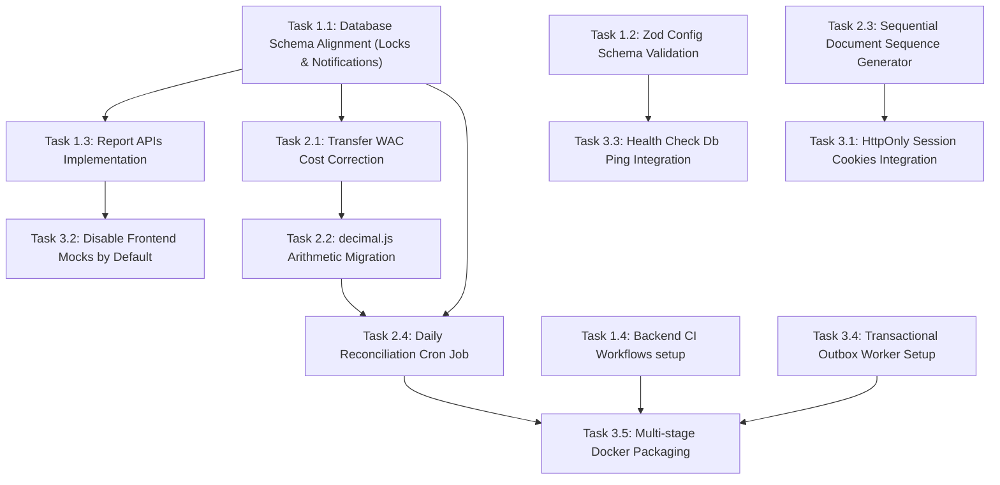

# Enterprise Production Hardening & Remediation Roadmap
**System:** LogiRest Kitchen-Store Inventory System  
**Auditors:** Principal Systems Architect, Enterprise ERP Technical Lead, Production Reliability Engineer, and Transactional Systems Auditor  
**Status:** Hardening Plan Finalized  
**Date:** 2026-05-23  

---

## 1. PRODUCTION READINESS SUMMARY

*   **Current Readiness Level:** **45 / 100**  
    The system is currently **NOT READY** for production deployment. The primary blockages are critical live database schema drifts (preventing the execution of warehouse locking mechanisms and notification logging services), unimplemented reporting endpoints on the NestJS backend, and a severe financial bug in transfer receipts that erases the cost basis (WAC) of items.
*   **Target Readiness Level:** **95 / 100**  
    Upon completion of this roadmap, the platform will have zero schema drift, fully verified financial calculations using big decimal representation, a robust runtime integrity reconciliation engine, automated transactional outbox pipelines, and enterprise-grade observability.
*   **Highest-Risk Operational Areas:**
    1.  **Financial Integrity:** Cost basis evaporation during warehouse-to-warehouse transfers and floating-point rounding errors in high-volume valuations.
    2.  **Concurrency Blockers:** Warehouse locks that block physical mutations are database-dependent but cannot execute due to missing database columns.
    3.  **Black-Box Failures:** Generic health check endpoints that mask database connectivity loss, lack of telemetry for lock duration, and unvalidated environment configurations.
*   **Release Confidence Blockers:**
    *   Missing `status` and `isActive` columns/indexes in the `warehouse_locks` table.
    *   Missing `notification_logs` table.
    *   Unimplemented reporting routes on the backend.
    *   WAC initialization to 0 on transfer receipts.
    *   Frontend local storage mock client default-on.

---

## 2. EXPANDED CRITICAL RISK MATRIX

| Risk ID | Category | Severity | Probability | Target Component | Root Cause | Operational Impact | Mitigation Strategy | Validation Strategy |
| :--- | :--- | :--- | :--- | :--- | :--- | :--- | :--- | :--- |
| **R-01** | Database | **CRITICAL** | High | `warehouse_locks` table | Schema changes to `schema.prisma` were not applied to the live PostgreSQL instance. | All inventory adjustments, stocktake locks, and GRN postings fail on execution with SQL errors. | Generate and execute a delta migration to add `status` and `isActive` columns and indices. | Run `npx prisma migrate status` in CI and check lock endpoints manually. |
| **R-02** | Database | **CRITICAL** | High | `notification_logs` table | Schema was updated but migrations were never run on PostgreSQL. | Workflow state transitions (like PR submission/approval) crash during transaction commit. | Apply delta migration to create the `notification_logs` table. | Trigger document transition and verify notification log record creation. |
| **R-03** | Backend | **CRITICAL** | High | `ReportsController` | Backend controller routes for inventory, movements, and expiry reports are missing. | The frontend Reports hub is non-functional, returning 404 errors for all pages. | Implement missing reporting queries inside `ReportsController` and fetch from database. | Execute unit and integration tests for all 6 reports. |
| **R-04** | Finance | **CRITICAL** | High | `transfer-post.service.ts` | Receipt upsert creates new warehouse item record with `wac: 0` or ignores cost basis on update. | Transferred inventory loses its financial value, leading to distorted asset evaluations. | Refactor `receive()` to load the source warehouse WAC and recalculate the destination WAC. | Post a transfer shipment and receipt; assert that destination WAC matches source cost basis. |
| **R-05** | Security | **HIGH** | Medium | `cookies.ts` | Auth tokens are stored in standard cookies accessible to client-side scripts. | Session tokens are vulnerable to theft via Cross-Site Scripting (XSS) attacks. | Deliver JWT via `HttpOnly`, `Secure`, `SameSite=Strict` cookies directly from NestJS. | Verify that cookies cannot be accessed via `document.cookie` in developer console. |
| **R-06** | Audit | **HIGH** | High | PR, PO, GRN services | Document numbering uses `Date.now() + Math.random()` string format. | Unreadable numbering; non-sequential format fails standard compliance audits. | Implement a database-backed transactional sequential document number generator. | Generate 100 concurrent documents and verify sequential, gap-free numbering. |
| **R-07** | DevOps | **HIGH** | Medium | `.github/workflows` | CI pipeline is only configured to compile and test frontend code. | Untested backend code additions can be merged into `main`, risking build breakage. | Add NestJS compilation, linting, and jest test commands to the CI workflow. | Verify that PR merges run and pass NestJS tests before merging. |
| **R-08** | Ops | **HIGH** | Low | `health.controller.ts` | Health endpoint returns a static `OK` status without executing checks. | Unhealthy containers remain in production routing, as database crashes are not detected. | Integrate Prisma connection pings and memory checks into NestJS health checks. | Terminate PostgreSQL connection and assert that `/health` returns `503 Service Unavailable`. |
| **R-09** | Config | **HIGH** | High | `app.module.ts` | Environment variables are loaded without validation. | Application starts with missing/invalid configs, leading to runtime failures. | Add Zod schema validation to `ConfigModule` configuration. | Run backend with missing `JWT_ACCESS_SECRET` and assert startup failure. |
| **R-10** | Finance | **HIGH** | Medium | `wac.service.ts` | Calculations perform arithmetic using native JS floating-point numbers. | Cumulative rounding errors introduce drift in asset ledger values. | Refactor mathematical operations in `WacService` to use `decimal.js`. | Execute high-volume rounding simulation tests and assert zero ledger drift. |
| **R-11** | Reliability | **MEDIUM** | Medium | `notification.service.ts` | Notifications are dispatched synchronously inline during database transactions. | Blocks database transactions during third-party integration delays and increases latency. | Implement Transactional Outbox pattern. Write notifications to `OutboxEvent` table and process asynchronously. | Block outbound email adapter; verify transaction succeeds and event is logged to Outbox. |
| **R-12** | Ops | **MEDIUM** | Low | `audit-logs.controller.ts` | Audit logs controller only permits filtering by user ID and simple pagination. | Operators cannot search audit logs by target table, record ID, action type, or IP. | Expand query filter validation schemas to support multi-column parameter routing. | Query audit logs passing table name and record ID; verify targeted results are returned. |
| **R-13** | Scalability | **MEDIUM** | High | `DataTable` | Table rendering renders all rows without virtualization. | UI freezes or lags on POS terminals and tablets during large inventory audits (500+ items). | Integrate `@tanstack/react-virtual` in the core DataTable component. | Render 1,000 mock rows and measure frame rates on mobile viewport. |
| **R-14** | DevOps | **MEDIUM** | Low | Root Directory | Repository lacks containerization configuration. | High probability of environment differences between development and production. | Provide optimized multi-stage Dockerfile and docker-compose.yml files. | Build and run production containers locally; verify health check connectivity. |
| **R-15** | Automation | **MEDIUM** | High | `lock-cleanup.job.ts` | No automated system reconciles physical balances with stock/cost ledgers. | Discrepancies from direct database overrides or bugs remain undetected. | Design a NestJS daily reconciliation job comparing `WarehouseItem` qty with ledger totals. | Manually modify a `qtyOnHand` in the database; verify reconciliation locks warehouse. |

---

## 3. PRODUCTION HARDENING PHASES

### Phase 1: Database & API Core Hardening (Milestone 1)
*   **Objective:** Resolve all blockers that prevent basic execution, eliminate schema drift, and build core backend reporting services.
*   **Tasks:**
    1.  **Task 1.1:** Generate and apply the drift delta migration on the database.
    2.  **Task 1.2:** Add Zod schema validation to the NestJS `ConfigModule` configuration.
    3.  **Task 1.3:** Implement missing `/reports/...` routes in `ReportsController` and integrate with Prisma queries.
    4.  **Task 1.4:** Update GitHub workflows to include NestJS type checks, lints, and Jest tests.

### Phase 2: Transactional & Financial Hardening (Milestone 2)
*   **Objective:** Eliminate data corruption paths, resolve the WAC propagation bug, enforce decimal math, and implement sequential numbering.
*   **Tasks:**
    1.  **Task 2.1:** Refactor transfer receive logic to propagate WAC and recalculate destination cost basis.
    2.  **Task 2.2:** Transition all calculations in `WacService` to `decimal.js`.
    3.  **Task 2.3:** Implement the transactional, database-backed sequential document numbering service.
    4.  **Task 2.4:** Build and schedule the database-level reconciliation cron job to detect stock and ledger drift.

### Phase 3: Observability, Security & Deployment Hardening (Milestone 3)
*   **Objective:** Secure user sessions, configure telemetry, establish health endpoints, and build outbox queue systems.
*   **Tasks:**
    1.  **Task 3.1:** Refactor authentication to deliver JWT tokens via `HttpOnly`, `Secure` cookies.
    2.  **Task 3.2:** Disable default mock API routing in the frontend's dev environment.
    3.  **Task 3.3:** Add database connection check to NestJS `/health` endpoint.
    4.  **Task 3.4:** Implement outbox log database table and transition notifications to asynchronous dispatch (e.g. using BullMQ).
    5.  **Task 3.5:** Create production `Dockerfile` and `docker-compose.yml` config templates.

---

## 4. DEPENDENCY GRAPH

The following diagram defines task prerequisites and sequencing:



---

## 5. SCHEMA DRIFT PREVENTION PLAN

To eliminate the risk of database schema drift between dev, staging, and production:

1.  **Migration Pipeline Execution:**  
    *   Developers must generate schema migrations locally using `npx prisma migrate dev --name <migration_name> --schema=prisma/schema.prisma`.
    *   Direct manual DDL execution is strictly blocked on PostgreSQL catalog.
2.  **Startup Validation Check:**  
    During application bootstrap (`OnModuleInit` in `DatabaseModule`), the API must query the Prisma migrations history:
    `SELECT * FROM _prisma_migrations WHERE applied_steps_count > 0;`  
    The database module must check for unapplied migrations. If mismatch exists, the bootstrap process must throw a fatal error and exit:
    `Error: Database is out of sync. Unapplied migrations detected.`
3.  **CI Validation Gate:**  
    Add a step to the GitHub Action workflow:
    `npx prisma validate --schema=apps/api/prisma/schema.prisma`  
    `npx prisma migrate resolve --status`
4.  **Rollback Strategy:**  
    For each forward migration file (`migration.sql`), the developer must document a reverse rollback SQL script in a `rollback/` folder. In the event of a deployment failure, the orchestrator executes the rollback script and resets the migration state using `npx prisma migrate resolve --rolled-back <migration_id>`.

---

## 6. RUNTIME INTEGRITY PLAN

To detect silent data corruption, negative balances, or ledger-stock drift, we will implement an automated **Reconciliation Service** running as a scheduled NestJS job:

1.  **Periodic Verification Checks (Cron - Daily at 01:00):**
    *   **Balance Verification:** Query all items in `WarehouseItem` and assert that:
        $$\text{qtyOnHand} = \sum \text{WarehouseItemLot.qtyOnHand} \quad (\text{for batched items})$$
    *   **Ledger Verification:** For each item-warehouse pair, calculate the historical sum of quantities in `StockLedger` and assert that:
        $$\sum \text{StockLedger.quantity} = \text{WarehouseItem.qtyOnHand}$$
    *   **Transfer Reconciliation:** Verify that for every transfer in `RECEIVED` status, the sum of shipped lots matches the received lots plus any approved discrepancies.
2.  **Alerting & Flags:**  
    If any check fails:
    *   Write a record to a new database table: `ReconciliationDiscrepancy` with the drift amount.
    *   Mark the warehouse as `isLocked = true` to prevent further mutations.
    *   Log a critical alert level entry to notify administrators.

---

## 7. REPORTING COMPLETION PLAN

The missing reporting endpoints will be implemented in the backend `ReportsController` and integrate with Prisma Client:

1.  **GET `/reports/available-inventory`**  
    *   *Query:* Sums `qtyOnHand` and `qtyAllocated` from `WarehouseItem` across all items, grouped by category.
    *   *Calculates:* `qty_available = qtyOnHand - qtyAllocated`.
2.  **GET `/reports/movements`**  
    *   *Query:* Paginated fetch from `StockLedger` scoped to the user's active warehouse, ordered by `postedAt DESC`.
3.  **GET `/reports/expiry`**  
    *   *Query:* Fetches from `WarehouseItemLot` where `qtyOnHand > 0` and `lot.expiryDate` is not null, sorted by `expiryDate ASC`.
4.  **GET `/reports/stocktake-variance`**  
    *   *Query:* Compares `StocktakeSnapshot.qtySnapshot` against `StocktakeCount.qtyCounted` for the specified stocktake session ID.
5.  **GET `/reports/procurement-status`**  
    *   *Query:* Aggregates totals from `PurchaseOrder` grouped by `status`.
6.  **GET `/reports/currency-summaries`**  
    *   *Query:* Groups `PurchaseOrder` by currency and calculates base currency equivalents using `FXRate`.
7.  **Enterprise Branding & PDF Printing:**  
    *   Extend `ReportExportMenu.tsx` to include metadata in exports: Restaurant Name, Branch Code, Generation Timestamp, and performed by User ID.
    *   Enforce a standard printing CSS media query page-break layout to prevent data truncation.

---

## 8. DOCUMENT NUMBERING REMEDIATION PLAN

To replace random document numbers with sequential numbering:

1.  **Sequence Ledger Table:**  
    Create a new database table `DocumentSequence`:
    *   `id` (UUID), `branchId` (String), `documentType` (Enum), `year` (Int), `currentSequence` (Int), `prefix` (String).
2.  **Transactional Generation (`SELECT FOR UPDATE`):**  
    Numbers must be generated within a transaction:
    ```sql
    SELECT * FROM "DocumentSequence"
    WHERE "branchId" = :branchId AND "documentType" = :docType AND "year" = :currentYear
    FOR UPDATE;
    ```
    Increment `currentSequence` and return the formatted number (e.g. `PR-2026-DXB-00042`).
3.  **Zero Collision Risk:**  
    The database unique constraints on the sequence fields prevent duplicate formats, and the `FOR UPDATE` lock forces concurrent requests to queue, ensuring sequential, gap-free numbering.

---

## 9. EMAIL & NOTIFICATION INFRASTRUCTURE PLAN

To transition notifications from synchronous DB writes to a reliable, asynchronous mail and notification pipeline:

1.  **Transactional Outbox Table:**  
    Create an `OutboxEvent` table:
    *   `id` (UUID), `eventType` (String), `payloadJson` (Text), `status` (PENDING, SENT, FAILED), `retryCount` (Int), `errorMessage` (Text), `createdAt` (DateTime).
2.  **Outbox Writer Pattern:**  
    During document workflow transitions, events are written to the `OutboxEvent` table **inside the same database transaction** as the document status update, ensuring atomic operations.
3.  **Background Message Broker (BullMQ + Redis):**  
    A background worker polls the `OutboxEvent` table, serializes events, and dispatches SMTP emails using nodemailer.
4.  **SMTP Configuration & Retries:**  
    *   Add SMTP environment variables (`SMTP_HOST`, `SMTP_PORT`, `SMTP_USER`, `SMTP_PASS`).
    *   Failed email dispatches must increment `retryCount` and apply an exponential backoff retry strategy up to 5 attempts before marking the event as `FAILED` and logging an alert.

---

## 10. SECURITY HARDENING PLAN

1.  **HttpOnly Cookie Authentication:**  
    *   Refactor the login endpoint in `AuthController` to return the JWT token in an `HttpOnly` cookie:
        `Set-Cookie: logirest_token=<jwt>; HttpOnly; Secure; SameSite=Strict; Path=/; Max-Age=86400`
    *   The frontend `client.ts` will rely on standard credentials propagation, preventing token access via JavaScript and mitigating XSS risks.
2.  **CORS Hardening:**  
    Explicitly list allowed production domains in `FRONTEND_URL` (comma-separated). Disable wildcards (`*`) or mirror headers in production configuration.
3.  **Secret Rotation:**  
    Store API secrets in production environment managers (like AWS Parameter Store or HashiCorp Vault) rather than static `.env` files in deployment configurations.

---

## 11. OBSERVABILITY & MONITORING PLAN

1.  **Structured JSON Logging:**  
    Replace default console logs in NestJS with structured JSON logging (using Pino or Winston). Logs must include: `timestamp`, `logLevel`, `traceId`, `userId`, `context`, `message`.
2.  **APM & Telemetry (OpenTelemetry):**  
    *   Trace API requests using OpenTelemetry middleware.
    *   Measure database transaction duration, SQL execution time, and Prisma connection queue lag.
3.  **Lock Telemetry:**  
    Log detailed metrics when a warehouse lock is established or manually overridden (duration of lock, locking user, target warehouse).
4.  **Grafana Dashboard KPIs:**  
    Export metrics to Prometheus:
    *   Active warehouse locks count.
    *   Average transaction duration.
    *   Rollback rates.
    *   Reconciliation discrepancy alerts.

---

## 12. DISASTER RECOVERY PLAN

1.  **Database Snapshot Strategy:**  
    *   Schedule automated daily backups of the PostgreSQL database using standard database snapshot tools.
    *   Encrypt backups at rest and store them in an isolated cloud storage bucket.
2.  **Automated Restore Testing:**  
    Schedule a monthly cron job that pulls a random snapshot, restores it to a sandbox instance, and validates the schema.
3.  **Point-in-Time Recovery (PITR):**  
    Enable write-ahead logging (WAL) archiving to support recovery down to specific seconds during catastrophic failures.
4.  **Migration Rollback Runbook:**  
    Document a step-by-step recovery guide for rolling back database tables using the reverse SQL scripts from the `rollback/` folder.

---

## 13. SCALABILITY & PERFORMANCE PLAN

1.  **Increase Connection Pool Limit:**  
    Increase database connection pool size in production (`connection_limit=20`) and implement NestJS transaction timeouts to prevent pool starvation.
2.  **Frontend Grid Virtualization:**  
    Refactor `<DataTable>` to use `@tanstack/react-virtual` for forms that render large quantities of items, reducing rendering lag.
3.  **Query Index Optimization:**  
    Periodically analyze PostgreSQL execution plans:
    `EXPLAIN ANALYZE SELECT * FROM stock_ledger WHERE "warehouseId" = ...`  
    Confirm that queries utilize `stock_ledger_warehouseId_itemId_postedAt_idx`.

---

## 14. TESTING & VALIDATION EXPANSION

To verify the reliability of the hardening fixes:

1.  **Reconciliation Engine Integration Tests:**  
    Write tests that manually inject stock discrepancies in `WarehouseItem` and verify that the reconciliation service locks the warehouse and flags the drift.
2.  **Concurrency & Lock Tests:**  
    Simulate 50 concurrent adjustment requests targeting a locked warehouse; assert that all requests return `423 Locked` and no double-deductions occur.
3.  **WAC Transfer Safety Tests:**  
    Write automated integration tests to transfer a lot with specific cost basis; assert that destination warehouse WAC updates correctly and does not drop to 0.

---

## 15. GO-LIVE GATE CHECKLIST

Before deploying the LogiRest system to production, the release must pass the following validation gates:

*   [ ] **Gate 1:** Database schema drift is completely resolved, and the startup validation check passes on the live production instance.
*   [ ] **Gate 2:** WAC recalculation logic on transfer receipts is verified, and cost basis calculations use `decimal.js`.
*   [ ] **Gate 3:** All 6 reports in `/reports` return live data from the database, and export functionalities are verified.
*   [ ] **Gate 4:** Document numbering generates sequential, gap-free numbers.
*   [ ] **Gate 5:** Daily reconciliation job is active, and test cases verify drift detection triggers.
*   [ ] **Gate 6:** JWT authentication utilizes `HttpOnly` and `Secure` cookies.
*   [ ] **Gate 7:** Frontend mock interceptors are disabled by default.
*   [ ] **Gate 8:** Structured logging and health checkpoints are verified.
*   [ ] **Gate 9:** Daily database backups are configured, and a test restore has been executed successfully.

---

## 16. FINAL PRODUCTION RECOMMENDATION

*   **Production Readiness Score:** **45 / 100**  
*   **Operational Stability Confidence:** **Low** (Crashing warehouse lock guard due to schema drift)  
*   **Inventory Integrity Confidence:** **Low** (WAC reset to 0 in transfer receipts)  

### Recommendation
**❌ NOT READY FOR PRODUCTION**

**Reasoning:**  
The LogiRest application contains critical gaps that prevent production deployment. The database schema drift causes immediate crashes on warehouse locking tasks, and the transfer receive service erases inventory cost basis valuations. 

Execution of this **Enterprise Production Hardening & Remediation Roadmap** is required to resolve these blockers and prepare the platform for a safe production release.
