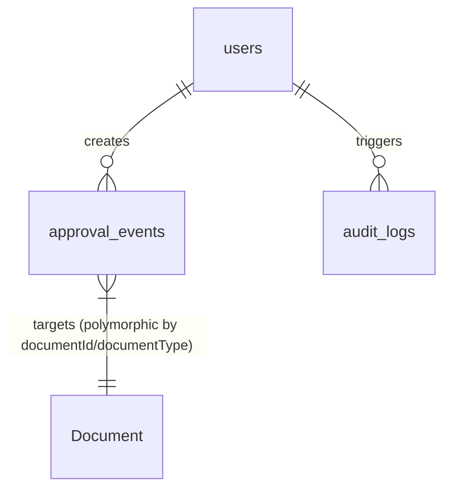

# Data Model: Workflow Engine Entities

This document defines the database schemas, field specifications, relationships, and validation rules for entities involved in Phase 4 (Workflow Engine).

## 1. Modified Entity: `ApprovalEvent`

Tracks the approval flow steps and transitions for all document types.

### Schema Definition (Prisma)

```prisma
model ApprovalEvent {
  id              String       @id @default(uuid())
  documentId      String       @map("document_id")
  documentType    DocumentType @map("document_type")
  fromStatus      String       @map("from_status")
  toStatus        String       @map("to_status")
  actionPerformed String       @map("action_performed")
  userId          String       @map("user_id")
  stepNumber      Int          @map("step_number")
  userRole        Role         @map("user_role")
  comments        String?      @db.Text
  createdAt       DateTime     @default(now()) @map("created_at")

  user            User         @relation(fields: [userId], references: [id], onDelete: Restrict)

  @@map("approval_events")
}
```

### Field Validation Rules

| Field | Type | Required | Constraints | Description |
|---|---|---|---|---|
| `id` | String (UUID) | Yes | Primary Key | Unique identifier for the approval event. |
| `documentId` | String (UUID) | Yes | Foreign Key | References the ID of the target document (PR, PO, etc.). |
| `documentType` | Enum (`DocumentType`) | Yes | Valid Prisma enum value | The type of the target document (e.g. `PURCHASE_REQUEST`). |
| `fromStatus` | String | Yes | Non-empty string | The status of the document *before* the transition. |
| `toStatus` | String | Yes | Non-empty string | The status of the document *after* the transition. |
| `actionPerformed` | String | Yes | Non-empty string | The action name performed (e.g., `SUBMIT`, `APPROVE`). |
| `userId` | String (UUID) | Yes | Foreign Key references `User` | The ID of the authenticated user who initiated the transition. |
| `stepNumber` | Int | Yes | `>= 1` | Sequential approval step number in this document's lifecycle. |
| `userRole` | Enum (`Role`) | Yes | Valid Role enum value | The authenticated user role used to authorize the transition. |
| `comments` | String | No | Max 1000 characters | Optional comments left by the user performing the action. |
| `createdAt` | DateTime | Yes | Defaults to `now()` | The timestamp when the transition was executed. |

---

## 2. Existing Entity: `AuditLog`

Used to record every status transition attempt (successful or failed) for compliance auditing.

### Schema Definition (Prisma)

```prisma
model AuditLog {
  id              String   @id @default(uuid())
  userId          String   @map("user_id")
  action          String
  targetTable     String   @map("target_table")
  targetId        String   @map("target_id")
  beforeStateJson String   @map("before_state_json")
  afterStateJson  String   @map("after_state_json")
  ipAddress       String?  @map("ip_address")
  createdAt       DateTime @default(now()) @map("created_at")

  user            User     @relation(fields: [userId], references: [id], onDelete: Restrict)

  @@map("audit_logs")
}
```

### Transition Mappings to Audit Fields

For status transitions, the `AuditLog` records will be populated as follows:

* `userId`: The ID of the authenticated user.
* `action`: Formatted as `WORKFLOW_TRANSITION: {actionPerformed}` (e.g., `WORKFLOW_TRANSITION: APPROVE`).
* `targetTable`: The name of the database table (e.g., `purchase_requests`).
* `targetId`: The ID of the document.
* `beforeStateJson`: JSON string capturing `{ status: fromStatus, version: currentVersion }`.
* `afterStateJson`: 
  * Successful: `{ status: toStatus, version: newVersion }`
  * Failed: `{ status: currentStatus, error: errorMessage }`

---

## 3. Relationships


