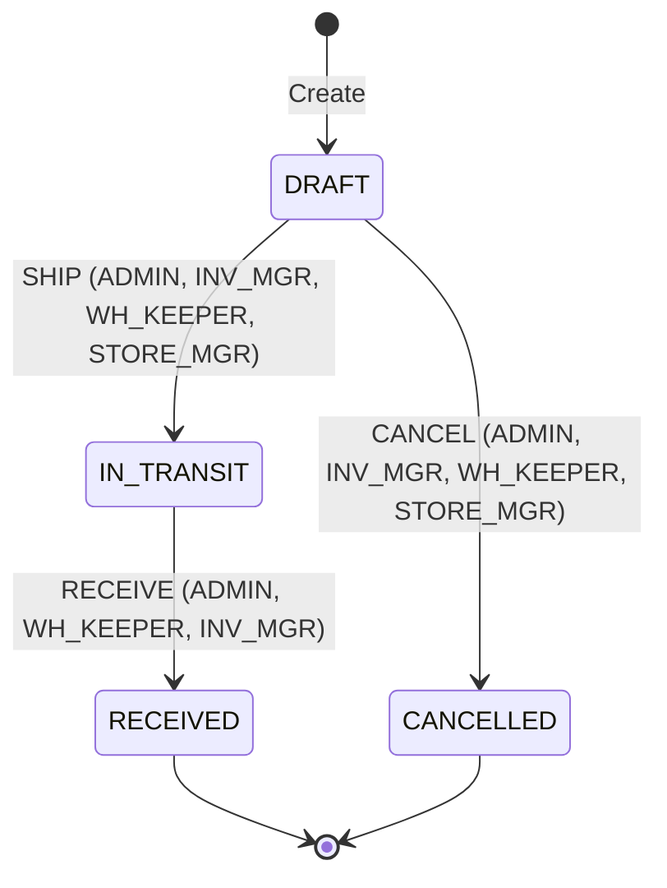
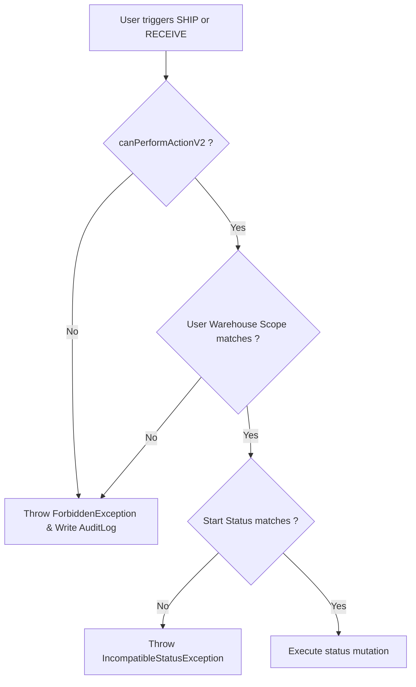

# Data Model & State Transitions: Fix Transfer SHIP/RECEIVE Workflow Role Validation

## Models & Schemas

This feature enforces role validation on existing data models without modifying the database schema. The critical models involved are:

### User (`users`)
Represents the authenticated actor triggering the operation.
*   `id`: String (UUID)
*   `role`: Enum (`ADMIN`, `INV_MGR`, `WH_KEEPER`, `STORE_MGR`, etc.)
*   `isActive`: Boolean

### UserWarehouseScope (`user_warehouse_scopes`)
Determines the branches/warehouses the user is authorized to manage.
*   `userId`: String (relation to User)
*   `warehouseId`: String (relation to Warehouse)

### Transfer (`transfers`)
The operational document being validated.
*   `id`: String (UUID)
*   `transferNumber`: String (Unique)
*   `fromWarehouseId`: String (Origin Warehouse)
*   `toWarehouseId`: String (Destination Warehouse)
*   `status`: String (DRAFT, IN_TRANSIT, RECEIVED, CANCELLED)

### AuditLog (`audit_logs`)
Created persistently for unauthorized/forbidden attempts.
*   `id`: String (UUID)
*   `userId`: String (Relation to User)
*   `action`: String (e.g. `'UNAUTHORIZED_TRANSFER_SHIP'`, `'UNAUTHORIZED_TRANSFER_RECEIVE'`)
*   `targetTable`: String (e.g. `'transfers'`)
*   `targetId`: String (ID of the transfer document)
*   `beforeStateJson`: String (e.g. `"{}"` or current status)
*   `afterStateJson`: String (e.g. `"{}"` or target status)
*   `ipAddress`: String?
*   `createdAt`: DateTime

---

## State Transition Rules

The lifecycle states and actions are defined in `transitionMapV2['transfer']` inside `@logirest/shared-types`:

### Authorization Gates

1.  **Central Role Matrix Check**:
    *   `canPerformActionV2('TRANSFER', transfer.status, 'SHIP', userRole)` MUST return `true` for shipment execution.
    *   `canPerformActionV2('TRANSFER', transfer.status, 'RECEIVE', userRole)` MUST return `true` for receipt execution.
2.  **Branch Scope Check**:
    *   For `SHIP`: Authenticated user's `warehouseScopes` MUST contain `transfer.fromWarehouseId` (unless user holds `Role.ADMIN` bypass).
    *   For `RECEIVE`: Authenticated user's `warehouseScopes` MUST contain `transfer.toWarehouseId` (unless user holds `Role.ADMIN` bypass).
