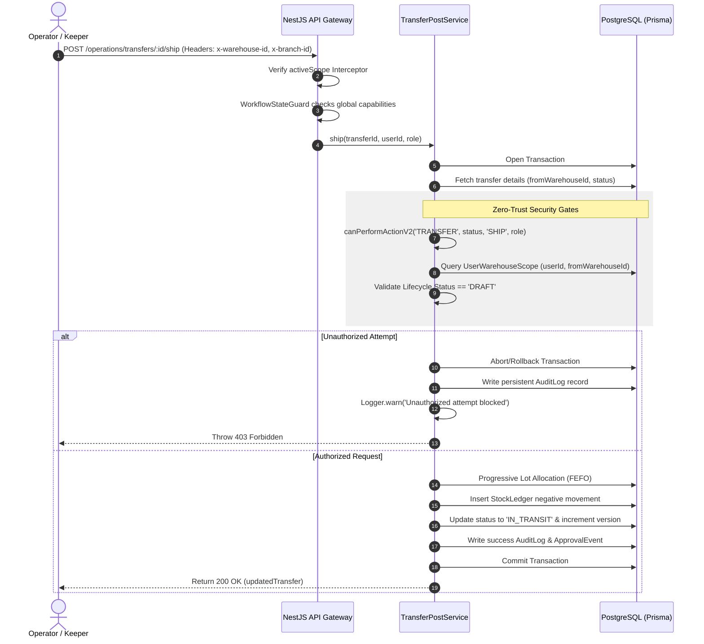

# Quickstart & Developer Guide: Fix Transfer SHIP/RECEIVE Workflow Role Validation

## Setup & Code Guidelines

This feature enhances security and segment of duties for transfer shipping and receiving actions. 

### Centralized Role Validation Check
The method `canPerformActionV2` is imported from `@logirest/shared-types`:
```ts
import { canPerformActionV2 } from '@logirest/shared-types';
```
It is called inside the service layer as:
```ts
const canShip = canPerformActionV2('TRANSFER', transfer.status as DocumentStatus, 'SHIP', userRole);
```

### Warehouse Branch Scope Validation
The user's branch scope permissions are queried directly inside the operational service database transaction `tx`:
```ts
const userScope = await tx.userWarehouseScope.findUnique({
  where: {
    userId_warehouseId: {
      userId,
      warehouseId: transfer.fromWarehouseId,
    },
  },
});
if (!userScope && userRole !== 'ADMIN') {
  throw new ForbiddenException('User is not authorized for the origin warehouse branch');
}
```

---

## Technical Flow Diagram



---

## Verifying with Automated Tests

Run the backend test suite:
```bash
# Run unit and E2E tests for the operations modules
npm run test --filter=api
```
To run the specific workflow roles E2E test suite:
```bash
npx jest apps/api/test/workflow-roles.e2e-spec.ts
```
