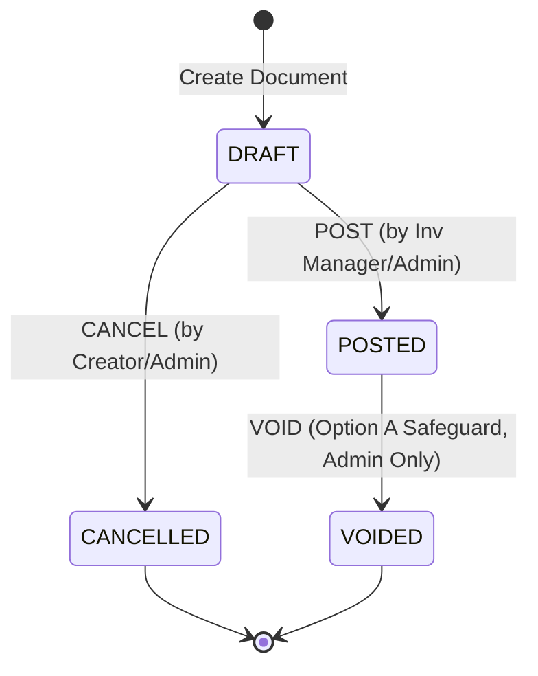

# Phase 1 Data Model & Constraints: Sprint 1 Production Readiness

This document defines the entity structures, database constraints, validations, and state transition configurations required for the Sprint 1 remediation.

---

## 1. Schema Modifications & Constraints

### 1.1 `DocumentSequence` Schema Modification
The sequence generator requires a composite unique constraint at the database layer to prevent concurrency numbering overlaps.

```prisma
model DocumentSequence {
  id           String       @id @default(uuid())
  documentType DocumentType @map("document_type")
  year         Int          @map("year")
  branchId     String       @map("branch_id")
  currentValue Int          @default(0) @map("current_value")
  updatedAt    DateTime     @updatedAt @map("updated_at")

  @@unique([documentType, year, branchId])
  @@map("document_sequences")
}
```

### 1.2 `ReconciliationRun` Schema Expansion
The Daily Reconciliation job needs to log any lot-level balance discrepancies discovered during checks.

```prisma
model ReconciliationRun {
  id                      String   @id @default(uuid())
  startedAt               DateTime @default(now()) @map("started_at")
  completedAt             DateTime? @map("completed_at")
  status                  String   // RUNNING, COMPLETED, FAILED
  itemsChecked            Int      @map("items_checked")
  discrepanciesFound      Int      @map("discrepancies_found")
  lotDiscrepanciesFound   Int      @default(0) @map("lot_discrepancies_found") // Added field
  detailsJson             String?  @map("details_json")

  @@map("reconciliation_runs")
}
```

---

## 2. Database-Level Check Constraints (PostgreSQL DDL)

To enforce raw physical inventory safety, the following native `CHECK` constraints will be applied directly to the PostgreSQL database via a Prisma migration:

### 2.1 Non-Negative Quantity Constraints
* **Constraint Name**: `warehouse_items_qty_on_hand_nonneg`
  * **Target**: `warehouse_items.qty_on_hand`
  * **Rule**: `CHECK (qty_on_hand >= 0)`
* **Constraint Name**: `warehouse_items_qty_allocated_nonneg`
  * **Target**: `warehouse_items.qty_allocated`
  * **Rule**: `CHECK (qty_allocated >= 0)`
* **Constraint Name**: `warehouse_item_lots_qty_on_hand_nonneg`
  * **Target**: `warehouse_item_lots.qty_on_hand`
  * **Rule**: `CHECK (qty_on_hand >= 0)`

### 2.2 Outbox Event Status Constraint
* **Constraint Name**: `outbox_events_status_valid`
  * **Target**: `outbox_events.status`
  * **Rule**: `CHECK (status IN ('PENDING', 'SUCCEEDED', 'FAILED'))`

---

## 3. Workflow State Transition Modifications (`shared-types`)

The state machine mappings in `packages/shared-types` will be updated to include the transition pathways for `CANCELLED` (Draft stages) and `VOIDED` (Posted stages).



### 3.1 Validation Rules for State Reversals (`VOID`)
Before transitioning a document to `VOIDED`, the following business rule mapping must run inside `WorkflowStateGuard`:

| Document Type | Initial State | Target State | Required Role | Pre-Condition (Option A Safeguard) |
|---|---|---|---|---|
| **Goods Receipt Note (GRN)** | `POSTED` | `VOIDED` | `ADMIN` | Current `qty_on_hand` for received items >= received quantities. |
| **Adjustment (IN)** | `POSTED` | `VOIDED` | `ADMIN` | Current `qty_on_hand` for added items >= adjusted quantities. |
| **Adjustment (OUT)** | `POSTED` | `VOIDED` | `ADMIN` | None (adding back stock is always safe). |
| **Stock Issue** | `POSTED` | `VOIDED` | `ADMIN` | None (restoring consumed stock is always safe). |
| **Stock Transfer** | `IN_TRANSIT` | `VOIDED` | `ADMIN` | None (cancels transfer before receipt). |

---

## 4. Operational DTO Validation Rules

### 4.1 Adjustment Line Validation (`AdjustmentLineDto`)
Enforces cost entry for inventory additions, and relaxes it for stock reductions.

```ts
import { IsNumber, IsPositive, IsOptional, ValidateIf } from 'class-validator';

export class AdjustmentLineDto {
  @IsNumber()
  quantity: number;

  @ValidateIf(o => o.quantity > 0)
  @IsNumber()
  @IsPositive({ message: 'Unit cost is required and must be positive for inventory increases (IN)' })
  unitCost: number;

  @ValidateIf(o => o.quantity <= 0)
  @IsOptional()
  @IsNumber()
  currentWac?: number;
}
```
