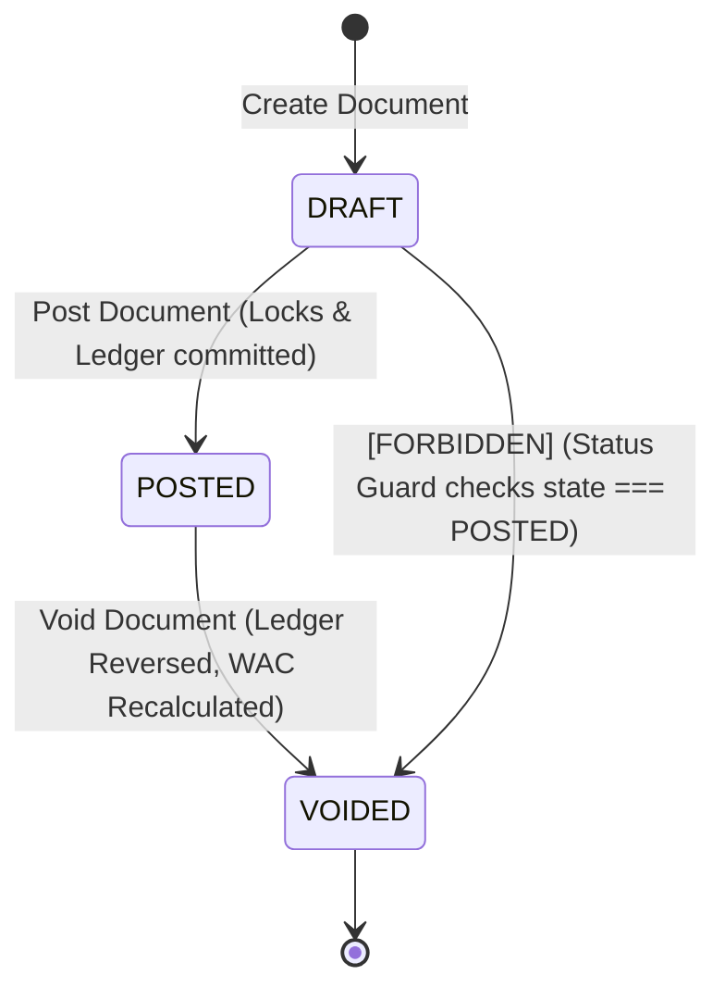

# Data Model Design: Sprint 2 Completion

This document defines the entity schema updates, validation rules, and structural constraints for Sprint 2 Quality Hardening & Completion.

---

## 1. Schema Modifications (Prisma)

### DocumentSequence
Ensures strict database-level unique sequence allocation across branches and years to prevent duplicate numbering.

```prisma
model DocumentSequence {
  id           String       @id @default(uuid())
  documentType DocumentType @map("document_type")
  year         Int
  branchId     String       @map("branch_id")
  nextNumber   Int          @map("next_number") @default(1)
  createdAt    DateTime     @default(now()) @map("created_at")
  updatedAt    DateTime     @updatedAt @map("updated_at")

  @@unique([documentType, year, branchId])
  @@map("document_sequences")
}
```

### OutboxEvent Payload Updates
The `OutboxEvent` payload JSON interface is extended to support lot tracking and expiry metadata.

```typescript
export interface OutboxPayload {
  id: string;
  documentNumber?: string;
  warehouseId?: string;
  warehouseName?: string;
  itemId?: string;
  itemName?: string;
  sku?: string;
  qtyOnHand?: number;
  uomCode?: string;
  lotNumber?: string;   // Added for EXPIRY_WARNING
  expiryDate?: string;  // Added for EXPIRY_WARNING
  timestamp: string;
}
```

---

## 2. Validation Rules (UpdateSettingsDto)

API-level input validation constraints for changing system-wide configurations.

| Parameter | Type | Validation Constraints |
| :--- | :--- | :--- |
| `system_name` | `string` | Optional, Max Length 100 characters. |
| `timezone` | `string` | Optional, Max Length 100 characters. |
| `base_currency` | `string` | Optional, Max Length 10 characters. |
| `language` | `string` | Optional, Max Length 50 characters. |
| `reply_to` | `string` | Optional, Max Length 100 characters. |
| `mail_provider` | `string` | Optional, Must be one of `['smtp', 'none']`. |
| `smtp_host` | `string` | Optional, Max Length 255 characters. |
| `smtp_port` | `number` | Optional, Parsed to Int, Min 1, Max 65535. |
| `smtp_user` | `string` | Optional, Max Length 255 characters. |
| `smtp_password` | `string` | Optional, Max Length 500 characters. |
| `smtp_encryption` | `string` | Optional, Must be one of `['none', 'tls', 'ssl']`. |
| `smtp_from` | `string` | Optional, Must be a valid email format, Max Length 255. |

---

## 3. State Machine & Void Transitions

### Document State Progression
Posted documents transition to `VOIDED` and trigger associated reversals in the stock/cost ledger.



### Void Reversal Logical Rules
1. **GRN Void Validation**: If any item lot contained in the GRN has already been consumed or partially issued, the void request is blocked at the database boundary to prevent negative stock balances.
2. **WAC Timeline Replay**:
   ```
   For each item in the voided GRN:
     Let T = voided_grn.postedAt
     Delete cost ledger entry of the voided GRN
     Recompute WAC at time T-1
     For each CostLedger entry of the item in this warehouse where postedAt > T:
       Re-evaluate newWac using the sequential WAC formula:
         WAC_new = (Previous_Qty * Previous_WAC + Inward_Qty * Inward_Cost) / (Previous_Qty + Inward_Qty)
     Update warehouseItem.wac to the final recalculated value
   ```
