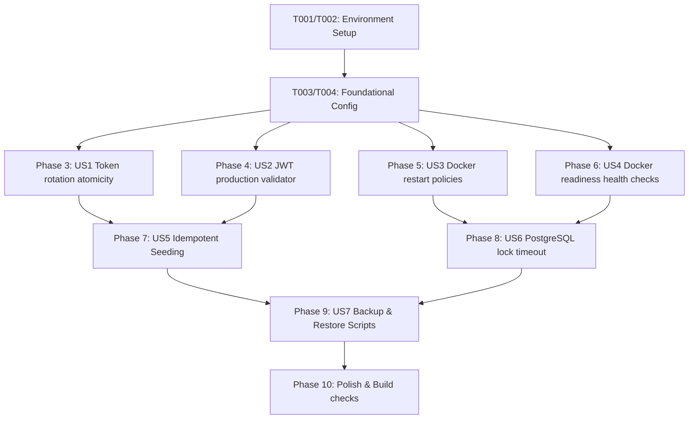

# Tasks: Phase 0 — Pre-Deploy Blockers

**Input**: Design documents from `/specs/038-phase0-pre-deploy-blockers/`
**Prerequisites**: plan.md (required), spec.md (required), research.md, data-model.md, contracts/health-auth.md, quickstart.md

---

## Format: `[ID] [P?] [Story] Description`

- **[P]**: Can run in parallel (different files, no shared execution blockers)
- **[Story]**: Which user story this task belongs to (e.g., US1, US2, US3)
- All descriptions include explicit file paths for direct execution.

---

## Phase 1: Setup (Shared Infrastructure)

**Purpose**: Verify the environment baseline and prepare worktrees.

- [x] T001 Verify git repository baseline and switch to active branch in `038-phase0-pre-deploy-blockers`
- [x] T002 Verify Docker Engine and Docker Compose versions are compatible with version 3.8 compose syntax on the target host

---

## Phase 2: Foundational (Blocking Prerequisites)

**Purpose**: Core configuration baseline readiness.

- [x] T003 Ensure database and Redis services are cleanly declared with active volume mappings in `docker-compose.yml`
- [x] T004 Ensure baseline Zod configuration schemas and exports exist inside `apps/api/src/config/env.validation.ts`

---

## Phase 3: User Story 1 - Token Rotation Atomicity (Priority: P1) 🎯 MVP

**Goal**: Wrap refresh-token revocation and new-token creation in a single interactive transaction, enforcing optimistic locking.

**Independent Test**: Mock database/connection drop mid-rotation → transaction rolls back → original token remains valid.

### Tests for User Story 1
- [x] T005 [P] [US1] Create unit tests in `apps/api/src/auth/rtr.service.spec.ts` mocking a crash between token revocation and new token creation to assert complete rollback.
- [x] T006 [P] [US1] Create unit tests in `apps/api/src/auth/rtr.service.spec.ts` asserting that old tokens are marked revoked and new tokens are created atomically during a successful flow.
  
### Implementation for User Story 1
- [x] T007 [US1] Refactor refresh-token rotation to execute both revocation and insertion steps under `this.prisma.$transaction(async (tx) => { ... })` using optimistic locking (`version` field check) inside `apps/api/src/auth/rtr.service.ts`.
- [x] T008 [US1] Run and verify RTR unit tests in `apps/api` using `npm run test` command.

---

## Phase 4: User Story 2 - JWT Secret Security Validation (Priority: P1) 🎯 MVP

**Goal**: Prevent NestJS from booting in production mode if Access or Refresh JWT secrets match weak development default values.

**Independent Test**: Set `NODE_ENV=production` and use default JWT secret keys → API container crashes on boot.

### Tests for User Story 2
- [x] T009 [P] [US2] Create validation schema unit tests in `apps/api/src/config/env.validation.spec.ts` asserting that weak JWT secrets throw a validation error when `NODE_ENV=production` but pass when `NODE_ENV=development`.

### Implementation for User Story 2
- [x] T010 [US2] Add Zod refinements (`refine`) to the `envSchema` validator verifying that `JWT_ACCESS_SECRET` and `JWT_REFRESH_SECRET` are not in the known default list when `NODE_ENV === 'production'` inside `apps/api/src/config/env.validation.ts`.
- [x] T011 [P] [US2] Add high-entropy JWT generation commands and clear production setup warnings inside `docker-compose.env.example`.
- [x] T012 [US2] Run and verify env validation unit tests in `apps/api` using `npm run test` command.

---

## Phase 5: User Story 3 - Docker Restart Policies (Priority: P1) 🎯 MVP

**Goal**: Ensure all core services self-heal automatically from OOM crashes or reboots.

**Independent Test**: Run `docker compose kill api` → verify container recovers and transitions back to `healthy` automatically.

### Implementation for User Story 3
- [ ] T013 [P] [US3] Add `restart: unless-stopped` configuration block to db, redis, api, web, and caddy services inside `docker-compose.yml`.
- [ ] T014 [US3] Build and start the stack, kill the API container, and verify automated restart status using `docker inspect logirest-api`.

---

## Phase 6: User Story 4 - Docker API & Frontend Health Check (Priority: P1) 🎯 MVP

**Goal**: Establish container readiness checks so that Caddy only routes incoming traffic after the NestJS and Next.js servers are fully initialised.

**Independent Test**: Health check returns `unhealthy` if PostgreSQL is down → Caddy cuts traffic routing.

### Implementation for User Story 4
- [ ] T015 [P] [US4] Define a readiness `healthcheck` block with `curl -f` pointing to the `/api/v1/health` endpoint on the api service inside `docker-compose.yml`.
- [ ] T016 [P] [US4] Define a readiness `healthcheck` block pointing to the `/api/health` route on the web service inside `docker-compose.yml`.
- [ ] T017 [P] [US4] Add `pg_isready` and `redis-cli ping` health check blocks to db and redis services in `docker-compose.yml`.
- [ ] T018 [US4] Configure `depends_on: { db: { condition: service_healthy }, redis: { condition: service_healthy } }` on api service, and healthy api/web service conditions on the caddy service inside `docker-compose.yml`.
- [ ] T019 [US4] Verify service health reporting using `docker inspect logirest-api --format '{{.State.Health.Status}}'`.

---

## Phase 7: User Story 5 - Idempotent Database Seeding (Priority: P2)

**Goal**: Decouple seed execution from container startupCMD, and ensure repeated runs do not trigger constraint violations or produce duplicate entries.

**Independent Test**: Running seeding twice against an existing populated database completes with exit code `0`.

### Implementation for User Story 5
- [ ] T020 [P] [US5] Rewrite database seed operations to use `upsert()` or checking conditional inserts inside `prisma/seed.ts`.
- [ ] T021 [US5] Remove seeding from the Docker run command (`CMD`) inside `apps/api/Dockerfile`.
- [ ] T022 [P] [US5] Document manual seeding commands and runbook steps for developers inside `RUNBOOK.md`.
- [ ] T023 [US5] Execute the seed command twice inside the api container and verify that both runs succeed with zero duplicate key errors.

---

## Phase 8: User Story 6 - PostgreSQL Lock Timeout (Priority: P2)

**Goal**: Protect the API connection pool from exhaustion by forcing blocked transactions to fail fast after 5 seconds.

**Independent Test**: Simulate database lock conflict → blocked transaction aborts within 5s and throws an explicit lock timeout error.

### Implementation for User Story 6
- [ ] T022 [P] [US6] Add `lock_timeout=5000` and `connect_timeout=10` query string parameters to the `DATABASE_URL` environment definition on the api service inside `docker-compose.yml`.
- [ ] T023 [P] [US6] Add explicit lock and connection timeout parameters to the connection string templates inside `docker-compose.env.example`.
- [ ] T024 [US6] Verify fast-abort behavior by simulating two concurrent write requests on the same warehouse inventory item.

---

## Phase 9: User Story 7 - Database Backup & Restore Procedure (Priority: P2)

**Goal**: Implement host-level shell scripts for compressed binary database backups, automated 30-day retention pruning, and interactive DB restoration with double confirmation.

**Independent Test**: Take manual backup → delete data → execute restore → verify data is recovered.

### Implementation for User Story 7
- [ ] T025 [P] [US7] Develop a automated backup shell script creating binary format snapshots and pruning dumps older than 30 days inside `scripts/backup.sh`.
- [ ] T026 [P] [US7] Develop an interactive database restore shell script requiring explicit operator keyboard confirmation (`RESTORE`) inside `scripts/restore.sh`.
- [ ] T027 [P] [US7] Add backup scheduling, cron configuration, and recovery guidelines to `RUNBOOK.md`.
- [ ] T028 [US7] Execute a complete mock backup and restore validation cycle on the target environment to verify reliability.

---

## Phase 10: Polish & Cross-Cutting Concerns

**Purpose**: Final audit and sanity checks before production release.

- [ ] T029 Run NestJS API lint sweep: `npm run lint --filter=api`
- [ ] T030 Run typecheck and production build validation: `npm run build --filter=api`
- [ ] T031 Validate the entire Phase 0 hardening checklist against operational guidelines inside `quickstart.md`

---

## Dependencies & Execution Order

### Parallel Opportunities
* All setup tasks (**T001**, **T002**) can run in parallel.
* Once Phase 2 (Foundational) is complete, all MVP User Stories (**US1**, **US2**, **US3**, **US4**) can be implemented in parallel by different developers.
* Within **US1** and **US2**, unit tests (**T005**, **T006**, **T009**) can be written in parallel before implementation.
* The script creation for **US7** (**T025**, **T026**) can be written in parallel.
