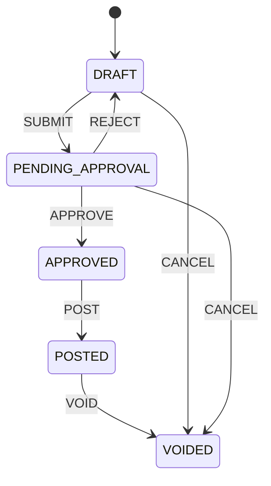

# Domain Data Model & State Transitions

This document details the entities, data structures, and state transitions affected by the Sprint 1 changes.

---

## 📊 Affected Entities & Attributes

### 1. Kitchen Request (`KitchenRequest`)
Represents the request made by the kitchen for inventory.
- `id` (UUID, Primary Key)
- `status` (Enum: `DRAFT`, `PENDING_APPROVAL`, `APPROVED`, `POSTED`, `VOIDED`)
- `warehouseId` (UUID, Foreign Key to `Warehouse`)
- `issueId` (UUID, Foreign Key to `InventoryIssue`, Nullable)
- `version` (Int, Optimistic Locking Version)

### 2. Inventory Issue (`InventoryIssue`)
Represents the actual stock deduction processed to fulfill a kitchen request.
- `id` (UUID, Primary Key)
- `status` (Enum: `DRAFT`, `POSTED`, `VOIDED`)
- `warehouseId` (UUID, Foreign Key to `Warehouse`)
- `kitchenRequestId` (UUID, Foreign Key to `KitchenRequest`, Nullable)
- `version` (Int, Optimistic Locking Version)

### 3. Warehouse Item (`WarehouseItem`)
Represents the overall stock of an item in a specific warehouse.
- `id` (UUID, Primary Key)
- `itemId` (UUID, Foreign Key to `Item`)
- `warehouseId` (UUID, Foreign Key to `Warehouse`)
- `qtyOnHand` (Decimal, Must remain >= 0 via DB CHECK constraint)

### 4. Warehouse Item Lot (`WarehouseItemLot`)
Represents batch/lot-specific stock tracked under FEFO expiration rules.
- `id` (UUID, Primary Key)
- `warehouseItemId` (UUID, Foreign Key to `WarehouseItem`)
- `lotId` (UUID, Foreign Key to `Lot`)
- `qtyOnHand` (Decimal, Must remain >= 0 via DB CHECK constraint)

---

## 🔄 Workflow State Transitions

The system enforces strict state machine rules governed by `transitionMapV2`:

### Kitchen Request Lifecycle



- **SUBMIT**: Allowed only when status is `DRAFT`.
- **APPROVE**: Allowed only when status is `PENDING_APPROVAL`.
- **POST**: Allowed only when status is `APPROVED`. Transitions status to `POSTED` and creates the linked `InventoryIssue`.
- **VOID**: Allowed only when status is `POSTED`. Triggers the `KitchenRequestVoidService` to reverse the associated `InventoryIssue` and restore warehouse lot balances.

---

## 🔒 Locking Protocols

### 1. Optimistic Locking
For all user-initiated draft mutations (PUT / DELETE), the system includes a `version` property check:
```sql
UPDATE "purchase_requests" 
SET "status" = 'PENDING_APPROVAL', "version" = "version" + 1 
WHERE "id" = $1 AND "version" = $2;
```

### 2. Pessimistic Row Locking
During the Kitchen Request void transition, pessimistic write locks are acquired to block concurrent adjustments:
```sql
-- Acquire pessimistic write locks on the lot balance rows
SELECT * FROM "warehouse_item_lots" 
WHERE "id" IN ($1, $2, $3) 
FOR UPDATE;

-- Recalculate average costs and lot quantities safely within a Serializable transaction
```
