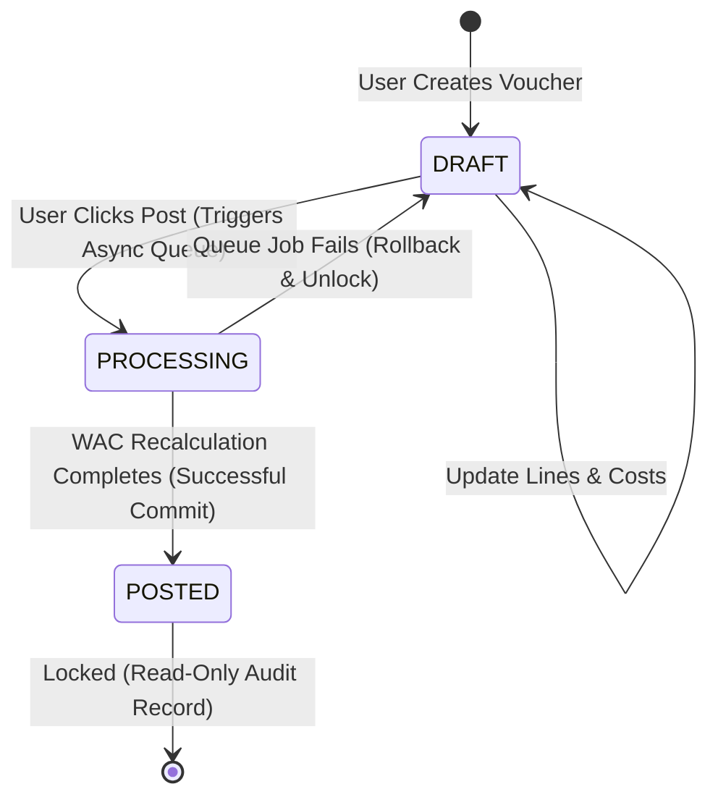

# Data Model Design: Landed Cost & Scoping (Sprint 3)

This document outlines the proposed database models and schema extensions required to support the Landed Cost allocation module, warehouse scoping attributes, and user-role relations.

---

## 🏗️ New Prisma Models

These models represent the database structures to be added to `schema.prisma` in subsequent sprints.

```prisma
enum LandedCostStatus {
  DRAFT
  PROCESSING
  POSTED
}

enum AllocationMethod {
  VALUE       // Pro-rata based on original item value
  QUANTITY    // Pro-rata based on item quantity
  WEIGHT      // Pro-rata based on item weight
  VOLUME      // Pro-rata based on item volume
}

model LandedCostVoucher {
  id                  String             @id @default(uuid())
  voucherNumber       String             @unique
  allocationMethod    AllocationMethod
  totalAllocatedCost  Decimal            @db.Decimal(18, 4)
  status              LandedCostStatus   @default(DRAFT)
  currencyId          String
  exchangeRate        Decimal            @db.Decimal(18, 6) @default(1.0)
  transactionDate     DateTime           @default(now())
  createdAt           DateTime           @default(now())
  updatedAt           DateTime           @updatedAt
  version             Int                @default(1)
  createdById         String

  createdBy           User               @relation("CreatedVouchers", fields: [createdById], references: [id])
  lines               LandedCostAllocationLine[]
  grnRelations        LandedCostGRNRelation[]

  @@map("landed_cost_vouchers")
}

model LandedCostAllocationLine {
  id                  String             @id @default(uuid())
  landedCostVoucherId String
  grnLineId           String
  allocatedCost       Decimal            @db.Decimal(18, 4)
  adjustedUnitCost    Decimal            @db.Decimal(18, 4)
  version             Int                @default(1)

  voucher             LandedCostVoucher  @relation(fields: [landedCostVoucherId], references: [id], onDelete: Cascade)
  grnLine             GRNLine            @relation(fields: [grnLineId], references: [id], onDelete: Restrict)

  @@map("landed_cost_allocation_lines")
}

model LandedCostGRNRelation {
  id                  String             @id @default(uuid())
  landedCostVoucherId String
  grnId               String

  voucher             LandedCostVoucher  @relation(fields: [landedCostVoucherId], references: [id], onDelete: Cascade)
  grn                 GoodsReceivedNote  @relation(fields: [grnId], references: [id], onDelete: Restrict)

  @@unique([landedCostVoucherId, grnId])
  @@map("landed_cost_grn_relations")
}
```

---

## 🔄 Modified Existing Models

To integrate Landed Cost lines and relationship mapping, existing models will receive these relations:

### 1. `GRNLine` Extension
```prisma
model GRNLine {
  // ... existing fields ...
  landedCostAllocations LandedCostAllocationLine[]
}
```

### 2. `GoodsReceivedNote` Extension
```prisma
model GoodsReceivedNote {
  // ... existing fields ...
  landedCostRelations   LandedCostGRNRelation[]
}
```

### 3. `User` Extension
```prisma
model User {
  // ... existing fields ...
  createdLandedCostVouchers LandedCostVoucher[] @relation("CreatedVouchers")
}
```

---

## 📈 State Transitions: Landed Cost Voucher



---

## 🔐 Database & Concurrency Constraints

1. **Optimistic Locking**: Every edit on the `LandedCostVoucher` document in `DRAFT` status validates `version` against a standard Prisma check block:
   ```typescript
   prisma.landedCostVoucher.update({
     where: { id, version: payload.version },
     data: { ...payload, version: { increment: 1 } }
   });
   ```
2. **Pessimistic Locking**: When WAC revaluation background workers process an allocation line, they must acquire a pessimistic lock on the corresponding item and lot rows:
   ```sql
   SELECT * FROM warehouse_items 
   WHERE warehouse_id = $1 AND item_id = $2 
   FOR UPDATE;
   ```
3. **Immutability Constraint**: Standard check constraints block updates on `landed_cost_vouchers` where `status = 'POSTED'` or `status = 'PROCESSING'`.
