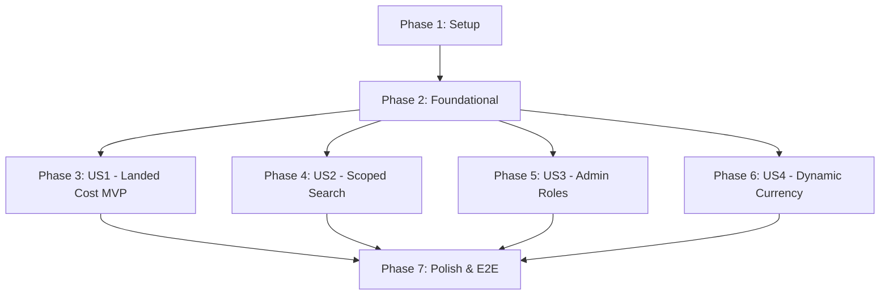

# Tasks: Landed Cost & Scoping (Sprint 3)

**Input**: Design documents from `/specs/046-landed-cost-scoping/`
**Prerequisites**: plan.md (required), spec.md (required for user stories), research.md, data-model.md, contracts/

## Format: `[ID] [P?] [Story] Description`

- **[P]**: Can run in parallel (different files, no dependencies)
- **[Story]**: Which user story this task belongs to (e.g., US1, US2, US3)
- All descriptions include exact file paths to preserve developer context.

---

## Phase 1: Setup (Shared Infrastructure)

**Purpose**: Database schema expansion, dependency setup, and unified types validation

- [x] T001 Create baseline schema models (`LandedCostVoucher`, `LandedCostAllocationLine`, `LandedCostGRNRelation`) in `apps/api/prisma/schema.prisma`
- [x] T002 Generate Prisma Client bindings and register types in `apps/api/src/database/prisma.service.ts`
- [x] T003 [P] Create unified Zod validation schemas for landed cost allocations in `packages/shared-types/src/zod/landed-cost.ts`

---

## Phase 2: Foundational (Blocking Prerequisites)

**Purpose**: Queuing modules, locking stubs, and currency resolution helpers

**⚠️ CRITICAL**: No user story work can begin until this phase is complete

- [x] T004 Configure NestJS BullMQ queue module in `apps/api/src/modules/procurement/landed-cost/landed-cost-queue.module.ts`
- [x] T005 [P] Create background revaluation queue processing worker stub in `apps/api/src/modules/procurement/landed-cost/landed-cost-revaluation.consumer.ts`
- [x] T006 [P] Create dynamic currency lookup services inside `apps/api/src/modules/settings/settings.service.ts`
- [x] T007 Create base Landed Cost service interfaces and registries in `apps/api/src/modules/procurement/landed-cost/landed-cost.service.ts`

**Checkpoint**: Foundation ready - user story implementation can now begin

---

## Phase 3: User Story 1 - Landed Cost Allocation & Retrospective WAC Recalculation (Priority: P1) 🎯 MVP

**Goal**: Implement the core landed cost allocation wizard UI, REST controller routes, and async WAC recalculations with serializable isolation.

**Independent Test**: Post a GRN, verify its initial WAC, allocate import costs via the Landed Cost Wizard in the UI, and verify the affected lot WAC updates retrospectively in the database ledger.

### Implementation for User Story 1

- [x] T008 [P] [US1] Implement landed cost controller endpoint handlers in `apps/api/src/modules/procurement/landed-cost/landed-cost.controller.ts`
- [x] T009 [US1] Build pro-rata allocation calculation service (Value, Qty, Weight/Volume formulas) in `apps/api/src/modules/procurement/landed-cost/landed-cost-calculator.service.ts`
- [x] T010 [US1] Implement post workflow dispatch that registers revaluation jobs in BullMQ in `apps/api/src/modules/procurement/landed-cost/landed-cost-post.service.ts`
- [x] T011 [US1] Create raw SQL row-locking query handler (`SELECT FOR UPDATE` on items/lots) in `apps/api/src/modules/procurement/landed-cost/revaluation-locking.service.ts`
- [x] T012 [US1] Write asynchronous background queue revaluation consumer and WAC update logic in `apps/api/src/modules/procurement/landed-cost/landed-cost-revaluation.consumer.ts`
- [x] T013 [P] [US1] Replace current landing cost placeholder page with client router container in `apps/web/src/app/[locale]/(app)/(procurement)/landed-cost/page.tsx`
- [x] T014 [US1] Build client Landed Cost Wizard step panels and pro-rata selection forms in `apps/web/src/app/[locale]/(app)/(procurement)/landed-cost/components/landed-cost-wizard.tsx`
- [x] T015 [US1] Implement React query allocation hooks and mutation endpoints in `apps/web/src/features/procurement/hooks/use-landed-cost.ts`

**Checkpoint**: User Story 1 is fully functional and testable independently.

---

## Phase 4: User Story 2 - Warehouse Scope-Filtered Search and Reports (Priority: P1)

**Goal**: Inject warehouse scope filters into global searches and reporting records based on the user's active session, allowing administrators to bypass bounds.

**Independent Test**: Log in as a scoped warehouse user, search for items, and verify that zero items or movements belonging to other warehouses are visible.

### Implementation for User Story 2

- [x] T016 [P] [US2] Implement warehouse scope parser and role-based global bypass interceptor in `apps/api/src/interceptors/warehouse-scope.interceptor.ts`
- [x] T017 [US2] Bind scoping interceptor to item search and documents search controllers in `apps/api/src/modules/search/search.controller.ts`
- [x] T018 [US2] Restrict ledger and inventory reports queries to active warehouse bounds in `apps/api/src/modules/reports/reports.service.ts`
- [x] T019 [US2] Build frontend scope-gated selector and header controls in `apps/web/src/features/navigation/components/scope-selector.tsx`

**Checkpoint**: User Stories 1 AND 2 are fully integrated and functional.

---

## Phase 5: User Story 3 - Admin Roles Matrix and User Role Assignment (Priority: P2)

**Goal**: Implement a read-only permissions display panel for statically defined system capabilities and allow administrators to update user role assignments.

**Independent Test**: Load the roles viewer as an admin, update a user's role to "Approver", and verify they instantly acquire document approval capabilities.

### Implementation for User Story 3

- [x] T020 [P] [US3] Create static capabilities roles endpoints under `apps/api/src/modules/admin/admin.controller.ts`
- [x] T021 [US3] Create user-role assignment update method `PUT /api/admin/users/:id/role` in `apps/api/src/modules/admin/admin.controller.ts`
- [x] T022 [P] [US3] Create read-only system permissions matrix UI page in `apps/web/src/app/[locale]/(app)/admin/roles/page.tsx`
- [x] T023 [US3] Build client role-assignment selector dialog inside `apps/web/src/app/[locale]/(app)/admin/roles/components/role-assignment-modal.tsx`
- [x] T024 [US3] Write React mutation hook to trigger role updates in `apps/web/src/features/admin/hooks/use-roles.ts`

**Checkpoint**: All role management and scoping mechanisms are fully complete.

---

## Phase 6: User Story 4 - Dynamic Base Currency from Settings (Priority: P3)

**Goal**: Resolve base currency setting dynamically and replace hardcoded values across the dashboard and inventory ledger pages.

**Independent Test**: Change base currency in settings, open dashboard, and verify all currency-denominated cards update labels automatically.

### Implementation for User Story 4

- [x] T025 [P] [US4] Create global settings currency API route in `apps/api/src/modules/settings/settings.controller.ts`
- [x] T026 [P] [US4] Construct React currency context provider in `apps/web/src/app/[locale]/providers/currency-provider.tsx`
- [x] T027 [US4] Wire dashboard summary cards to dynamic currency context in `apps/web/src/app/[locale]/(app)/dashboard/DashboardClient.tsx`
- [x] T028 [US4] Localize inventory valuations columns with active settings currency in `apps/web/src/features/reports/components/valuation-table.tsx`

**Checkpoint**: All user stories are independently functional and localized.

---

## Phase 7: Polish & Cross-Cutting Concerns

**Purpose**: Verify compilation, linter gates, and E2E workflow consistency

- [x] T029 [P] Create full Playwright E2E suites for landed cost allocations in `tests/e2e/landed-cost.spec.ts`
- [x] T030 Typecheck web client and run final linter checks using `npm run typecheck --filter=web` and `npm run lint`

---

## Dependencies & Execution Order

### Phase Dependencies

### Parallel Opportunities

- Within **Phase 1**: `T003` can run in parallel with `T001` and `T002`.
- Within **Phase 2**: `T005`, `T006` can be implemented in parallel.
- Once **Phase 2** (Foundational) is complete, all four user stories (**Phase 3**, **Phase 4**, **Phase 5**, **Phase 6**) can be implemented in parallel by different developers since they operate in separate directories with no shared logic.

---

## Implementation Strategy

### MVP First (User Story 1 Only)

1. Complete **Phase 1: Setup**
2. Complete **Phase 2: Foundational** (CRITICAL - blocks all user stories)
3. Complete **Phase 3: User Story 1** (Landed Cost MVP)
4. **STOP and VALIDATE**: Test Landed Cost calculations manually via quickstart.md guidelines.

### Incremental Delivery

1. Setup + Foundational Completed.
2. Add Landed Cost Allocation UI and Recalculations -> Demo WAC revaluations (MVP).
3. Secure user boundaries using Scope interceptors -> Verify data isolation.
4. Wire admin roles manager -> Verify user permissions updates.
5. Inject dynamic currency context -> Localize currency labels.
6. Conduct linter and Playwright E2E runs.
