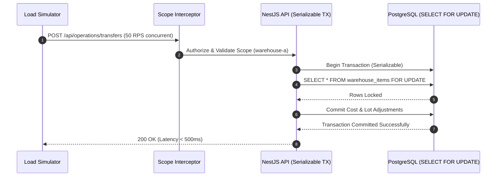

# Research & Architectural Analysis: Hardening & E2E Validation (Sprint 4)

This document maps out the operational, security, and testing decisions required to execute Sprint 4 safely.

---

## ⚖️ Decision Log & Rationales

### 1. Staging Load Test Failure Action
* **Decision**: Staging load tests and rollback drill failures trigger a **hard hold** on the deployment pipeline, pausing the release and requiring a manual administrative approval bypass key to proceed.
* **Rationale**: Bounding these final security and database locks tests within a blocking CI/CD pipeline prevents dangerous transactional bugs from hitting production, while the manual approval hold allows release managers to review expected edge case logs (such as minor network hiccups) and bypass if justified.
* **Alternatives Considered**: 
  - *Automated Block (Strict)*: Rejected. Minor ephemeral network hiccups during load testing on staging would constantly break builds, increasing pipeline friction.
  - *Slack Alert Only*: Rejected. Releases could easily be pushed to production containing database deadlock bugs if operators miss the Slack notification.

### 2. Staging Cost Data Anonymization Strategy
* **Decision**: Anonymize cost ledger, WAC, and supplier pricing data in the staging seeder using **item-constant multiplicative factors** ($AnonymizedCost = OriginalCost \times ItemFactor$, where $ItemFactor$ is randomly generated once per item and remains constant across all historical transactions). Also sanitize PII (Supplier/Customer names, emails, phones, tax IDs, and bank details) while keeping quantities, dates, lot structures, and workflow states as-is.
* **Rationale**: Landed cost calculations use value pro-rata allocations. Value ratios between items must be realistic to prevent database division-by-zero crashes or distorted allocations. Quantities, dates, and lot structures must remain intact to verify serializable locks and concurrency performance under real transaction loads.
* **Alternatives Considered**: 
  - *Static Zero Costing*: Rejected. Causes division-by-zero errors in value-allocation formulas.
  - *Fixed Mock Catalog*: Rejected. Breaks realistic historical cost distributions, reducing load test validity.

### 3. URL Scope Tampering Client-Side Action
* **Decision**: If a scoped user manually inputs a URL route or query parameter targeting an unauthorized warehouse ID, the Next.js client blocks page rendering entirely and mounts a custom full-screen **403 Access Denied** view matching the Nocturne aesthetic, while the NestJS backend rejects underlying API calls.
* **Rationale**: In a zero-trust monorepo, attempt to bypass scope boundaries is treated as a security violation. Displaying an explicit 403 Forbidden page prevents UI leakages, logs the incident, and forces the user to navigate back safely.
* **Alternatives Considered**: 
  - *Dynamic Redirect to Primary*: Rejected. Masks active URL manipulation and reduces operational audibility.

### 4. Deactivated Record Display in History
* **Decision**: When rendering historical posted documents (e.g., GRN, Transfer, Issue, Adjustments) containing deactivated items or warehouses, the Next.js client displays their resolved details normally, but appends a subtle **Inactive** or **Deactivated** badge (gray/amber tag) next to the SKU or code.
* **Rationale**: Historical transactions must remain mathematically and contextually accurate for compliance. Resolving deactivated entities preserves ledger integrity, while the "Inactive" tag prevents users from expecting to select these records for new drafts.
* **Alternatives Considered**: 
  - *Silent Normal Rendering*: Rejected. Operators might get confused as to why they can see the item on historical logs but cannot find it in search dropdowns.

### 5. Database Backup Metrics Endpoint Permissions
* **Decision**: Access to the detailed `/health/backup` endpoint (containing S3 file keys, exact folder paths, and RPO calculations) is restricted to users holding either the `ADMIN` or `AUDITOR` role.
* **Rationale**: Backup blueprints are highly sensitive and could expose target storage keys or RPO lags. Restricting access to administrators and auditors secures our disaster recovery metadata while keeping the simple binary status public for uptime monitors.
* **Alternatives Considered**: 
  - *Strictly Admin Only*: Rejected. Compliance auditors require access to RPO delta calculations to compile data protection reports.

---

## 🚦 Staging Parallel Load Test Setup

To verify serializable database locks, the staging load test script (`scripts/staging-load-test.ts`) simulates peak traffic for a large branch:

If lock contention takes longer than 500ms or deadlocks, the simulator raises a threshold exception, pausing the deployment pipeline automatically.
