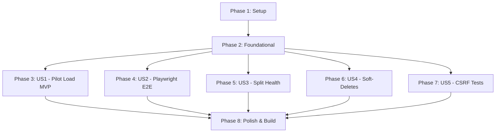

# Tasks: Hardening & E2E Validation (Sprint 4)

**Input**: Design documents from `/specs/047-hardening-e2e-validation/`
**Prerequisites**: plan.md (required), spec.md (required for user stories), research.md, data-model.md, contracts/

## Format: `[ID] [P?] [Story] Description`

- **[P]**: Can run in parallel (different files, no dependencies)
- **[Story]**: Which user story this task belongs to (e.g., US1, US2, US3)
- All descriptions include exact file paths to preserve developer context.

---

## Phase 1: Setup (Shared Infrastructure)

**Purpose**: Test configs, environment parameters, and seeder bootstrap

- [x] T001 Initialize anonymized database seeder file layout in `apps/api/src/database/seed.anonymized.ts`
- [x] T002 Configure Playwright E2E testing framework environments in `tests/playwright.config.ts`
- [x] T003 [P] Configure metrics token and encryption variables inside system profiles configuration mapper `apps/api/src/config/configuration.ts`

---

## Phase 2: Foundational (Blocking Prerequisites)

**Purpose**: Core validation utilities, error catch frames, and backup calculators

**⚠️ CRITICAL**: No user story work can begin until this phase is complete

- [x] T004 Build custom Nocturne high-density error boundary layouts in `apps/web/src/components/common/error-boundary.tsx`
- [x] T005 [P] Create randomized data mapping utility libraries in `apps/api/src/database/faker-helper.ts`
- [x] T006 [P] Implement dynamic database backup RPO delta calculator in `apps/api/src/modules/health/backup-calculator.service.ts`

**Checkpoint**: Foundation ready - user story implementation can now begin

---

## Phase 3: User Story 1 - Pilot Rollout & Database Rollback Drill (Priority: P0 - Release Blocker) 🎯 MVP

**Goal**: Establish staging anonymized seed scripts, simulated concurrency load test runners, and disaster recovery rollback commands with pipeline hold gates.

**Independent Test**: Simulate database migration errors, execute the automated rollback command, and verify staging recovery re-reconciles database records to pre-migration baselines in under 3 minutes with 0% data mismatch.

### Implementation for User Story 1

- [x] T007 [P] [US1] Implement item-constant randomized cost multiplier seeder logic in `apps/api/src/database/seed.anonymized.ts`
- [x] T008 [US1] Map Faker anonymization sanitization rules for supplier, customer, and user PII columns in `apps/api/src/database/seed.anonymized.ts` (depends on T007)
- [x] T009 [US1] Create parallel transaction load stress testing script simulating 50 RPS peak loads in `scripts/staging-load-test.ts`
- [x] T010 [US1] Create automated database backup restoration shell commands and recovery script in `scripts/database-rollback.sh`
- [x] T011 [US1] Build CI/CD deployment pipeline gate scripts that parse load test failures and trigger manual admin holds in `scripts/pipeline-gate.ts`

**Checkpoint**: Staging load stress tests and automated rollback routines are fully testable.

---

## Phase 4: User Story 2 - Comprehensive E2E Test Suite for Kitchen Requests (Priority: P1)

**Goal**: Author Playwright E2E automated scripts verifying the complete kitchen request lifecycle (drafts, balance checks, fulfillment, and lot reversals on void).

**Independent Test**: Execute Playwright kitchen request suite, verify it fulfill documents safely, and ensure voiding requests automatically reverts inventory issue balances and WAC entries.

### Implementation for User Story 4 (User Story 2 in spec)

- [x] T012 [P] [US2] Create Playwright browser cookies and active sessions auth loaders in `tests/e2e/helpers/auth.ts`
- [x] T013 [US2] Implement Playwright E2E tests validating kitchen request draft, submission, and lot allocation in `tests/e2e/kitchen-request.spec.ts`
- [x] T014 [US2] Implement Playwright E2E tests verifying linked inventory issues voiding and cost log reversals in `tests/e2e/kitchen-request-void.spec.ts` (depends on T013)

**Checkpoint**: Playwright automated E2E suites for kitchen requests are fully functional and passing.

---

## Phase 5: User Story 3 - Secure Public Diagnostics and Health Splitting (Priority: P1)

**Goal**: Split public binary `/health` queries and secure backup metrics, and restrict Prometheus scraper routes behind secret configuration keys.

**Independent Test**: Access `/metrics` and `/health/backup` publicly without valid credentials and verify a 401/403 block is returned, while public health resolves in under 50ms.

### Implementation for User Story 5 (User Story 3 in spec)

- [x] T015 [P] [US3] Expose simple public binary status checks in `apps/api/src/modules/health/health.controller.ts`
- [x] T016 [US3] Create secured detailed backup RPO logs endpoint handler `GET /health/backup` (restricted to ADMIN and AUDITOR roles) in `apps/api/src/modules/health/health.controller.ts` (depends on T015)
- [x] T017 [US3] Create secret metrics token interceptor guard using `METRICS_TOKEN` environment variable validation in `apps/api/src/modules/metrics/metrics.guard.ts`
- [x] T018 [US3] Bind metrics validation guard to Prometheus dump query router in `apps/api/src/modules/metrics/metrics.controller.ts` (depends on T017)

**Checkpoint**: Diagnostics endpoints are secured and public health is successfully split.

---

## Phase 6: User Story 4 - Selective Soft-Delete Query Filtering (Priority: P2)

**Goal**: Apply explicit active constraints to user searches while database queries resolve historical records, and mount custom Nocturne 403 screens on client URL parameter tampering.

**Independent Test**: Deactivate an item, verify it is hidden from Purchase Request wizard search listings, load a historical transaction containing it, and verify details load successfully with a gray/amber "Inactive" badge.

### Implementation for User Story 6 (User Story 4 in spec)

- [x] T019 [P] [US4] Remove global soft-delete filter intercepts from NestJS database module in `apps/api/src/database/prisma.service.ts`
- [x] T020 [US4] Inject explicit `isActive: true` parameters inside search and listing API query methods in `apps/api/src/modules/search/search.service.ts` (depends on T019)
- [x] T021 [US4] Add custom routing filters and mount full-screen Nocturne Access Denied custom page in `apps/web/src/app/[locale]/(app)/errors/403/page.tsx`
- [x] T022 [US4] Update valuations detail data grids to render deactivated item lines with gray/amber tags in `apps/web/src/features/reports/components/valuation-table.tsx`

**Checkpoint**: Inactive filtering and client-side URL scope tampering guards are complete.

---

## Phase 7: User Story 5 - CSRF Handshake Integration Coverage (Priority: P2)

**Goal**: Implement integration tests proving state-changing mutations without `X-XSRF-TOKEN` headers are blocked, while matching tokens authorize changes.

**Independent Test**: Execute Jest CSRF tests and verify they successfully prove handshake rejection.

### Implementation for User Story 7 (User Story 5 in spec)

- [x] T023 [P] [US5] Implement Jest integration tests verifying `CsrfGuard` blocks state-changing mutations lacking headers in `tests/integration/csrf.spec.ts`
- [x] T024 [US5] Implement integration tests proving that requests containing matching session cookies and headers are authorized in `tests/integration/csrf.spec.ts` (depends on T023)

**Checkpoint**: CSRF protection is fully proven via comprehensive integration tests.

---

## Phase 8: Polish & Cross-Cutting Concerns

**Purpose**: Validate monorepo builds, typecheck, and linter gates

- [x] T025 Execute full Playwright E2E and CSRF Jest suites locally to confirm validation consistency
- [x] T026 [P] Run linter and typecheck sweeps across Next.js and NestJS packages using `npm run typecheck --filter=web` and `npm run lint`

---

## Dependencies & Execution Order

### Phase Dependencies

### Parallel Opportunities

- Within **Phase 1**: `T003` can run in parallel with `T001` and `T002`.
- Within **Phase 2**: `T005` and `T006` can be implemented in parallel.
- Once **Phase 2** (Foundational) is complete, all five User Story phases (**Phase 3** to **Phase 7**) can be implemented in parallel by different team members since they operate in separate directories with no logical dependencies on each other.

---

## Implementation Strategy

### MVP First (User Story 1 Only)

1. Complete **Phase 1: Setup**
2. Complete **Phase 2: Foundational** (CRITICAL - blocks all user stories)
3. Complete **Phase 3: User Story 1** (Pilot Load & Rollback MVP)
4. **STOP and VALIDATE**: Verify load-test simulation and rollback commands complete successfully.

### Incremental Delivery

1. Setup + Foundational Completed.
2. Build Pilot stress tests & recover scripts -> Verify staging load (MVP).
3. Author Playwright automated E2E tests -> Validate kitchen requests.
4. Harden route diagnostics and metrics -> Verify unauthenticated route blocks.
5. Implement explicit soft-deletes and Nocturne 403 page -> Verify inactive badges.
6. Conduct CSRF integration tests -> Prove cross-site mutation blocks.
7. Conduct monorepo builds and linter passes.
